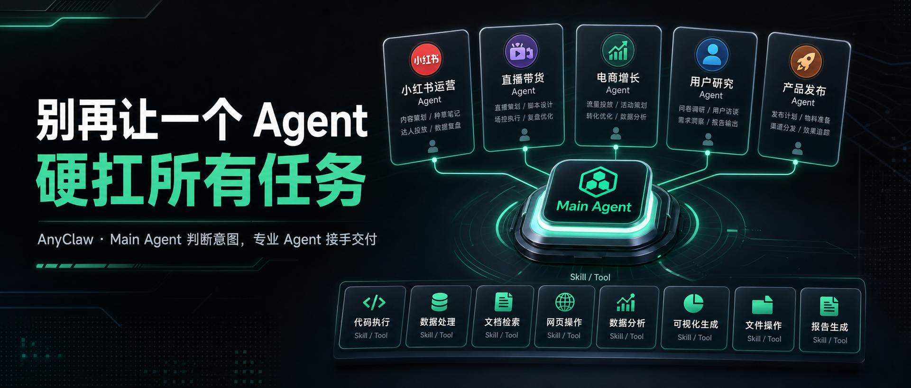
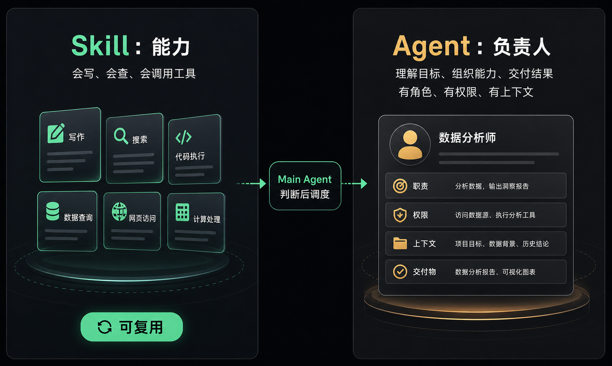
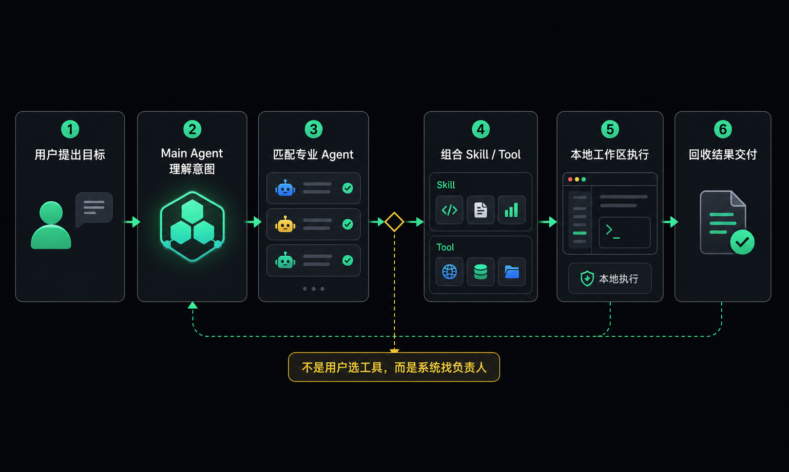
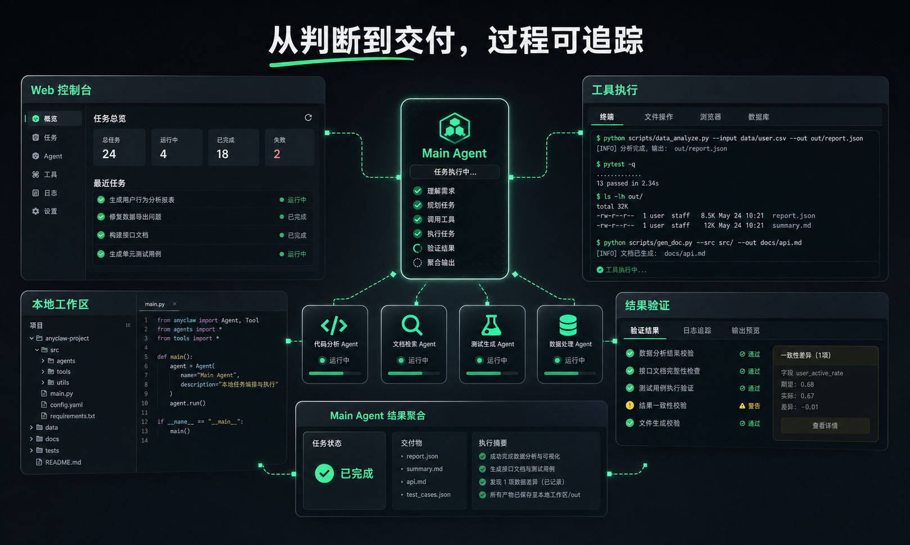

# 别再让一个 Agent 硬扛所有任务

## 发布配置

标题：别再让一个 Agent 硬扛所有任务

副标题：AnyClaw 想让 Main Agent 判断意图，再从专业 Agent 市场里找到合适的任务负责人。

摘要：很多 AI Agent 还停留在“一个聊天框 + 一堆工具”。AnyClaw 更想做的是：由 Main Agent 理解用户意图，判断任务应该由谁负责，再让专业 Agent 组合 Skill、工具和本地工作区完成交付。

封面海报：`./assets/anyclaw-cover.png`

内文配图：

- `./assets/anyclaw-flow.png`：AnyClaw 从目标提出到结果交付的任务流
- `./assets/skill-vs-agent.png`：Skill 与 Agent 的区别
- `./assets/local-workspace.png`：本地工作区里的执行、验证和结果聚合

排版建议：

- 可使用 `md2wechat-skill` 将本文 Markdown 转成微信公众号样式，并在导入前检查图片是否已上传到公众号素材库。
- `wechat_article_skills` 更适合作为写作与发布流程参考，不是本文发布的必需依赖。
- 公众号导入时建议保留文中的短句换行和加粗句，它们是为手机阅读节奏设计的。

---

过去一年，AI Agent 很热。

但如果你认真用过一轮，就会发现一个问题：

很多所谓的 Agent，本质上还是“一个 Agent + 一堆工具”。

它可以聊天，可以写代码，可以搜索网页，也可以执行一些动作。

但一旦任务开始变复杂，问题就出来了。

它要同时理解需求、规划步骤、选择工具、处理异常、记住上下文、验证结果，最后还要把一切整理成用户能看懂的交付。

听起来很强。

但真实工作不是这样发生的。

真实工作里，我们不会让一个人同时承担运营、设计、数据分析、程序员、测试和项目经理的全部职责。

我们会找专业的人做专业的事。

这也是 AnyClaw 想尝试的方向：

**别再让一个 Agent 硬扛所有任务。**

## 问题不是 AI 不够强，而是组织方式太单一

很多 AI 产品还围绕一个聊天框展开。

用户提出需求，AI 给出回答。

需求复杂一点，用户就继续补充背景、指定角色、拆解步骤、告诉它该调用什么工具。

这其实把很多判断压力交回给了用户。

比如你说：

> 帮我做一套小红书新品推广内容。

这句话背后不只是“写一篇文案”。

它可能需要判断产品卖点，选择种草角度，设计标题，组织正文，规划发布时间，给出封面建议，甚至还要结合后续数据继续优化。

这时候，给一个通用 Agent 临时加一个“小红书 Skill”，当然能解决一部分问题。

但它未必能承担完整任务。

因为 Skill 解决的是“会什么”。

而 Agent 解决的是“谁负责”。

## Skill 是能力，Agent 是负责人

这是 AnyClaw 想区分的一件事。

Skill 更像工具箱里的工具。

它可以帮 AI 搜索、写作、总结、处理数据、操作文件、调用浏览器。

但 Agent 更像一个任务负责人。

一个“小红书运营 Agent”，不只是会写小红书文案。

它应该理解平台语气，知道内容结构，判断选题角度，组合标题、正文、封面建议和发布时间，并在需要时调用写作、搜索、图片、数据分析等 Skill。

一个“直播带货 Agent”，也不只是会生成直播话术。

它要看商品卖点，设计货盘节奏，拆分开场、转场、逼单和答疑话术，还要根据转化数据调整下一轮脚本。

一个“电商增长 Agent”，也不只是会做数据分析。

它要理解渠道、活动、商品、转化漏斗和用户反馈，判断问题出在流量、点击、详情页、优惠机制，还是复购链路。

这些任务的难点，不是“会不会某个单点能力”。

而是有没有一个角色持续做判断、组织能力、承担交付。

所以 AnyClaw 不是只想让 AI 多装几个 Skill。

我们更想做的是：

**让 Main Agent 知道，这件事应该交给谁负责。**

## Main Agent 是入口，也是调度者

在 AnyClaw 里，Main Agent 不是一个万能助手。

它更像一个任务入口和调度者。

用户不需要一开始就知道自己该用哪个 Agent，也不需要记住一堆 Skill 和工具名字。

用户只需要描述目标。

Main Agent 去理解这句话背后的意图：

这是内容运营任务？

这是直播带货任务？

这是电商增长任务？

这是用户研究任务？

这是产品发布任务？

还是一个需要拆解给多个专业 Agent 的复杂业务任务？

判断之后，它再决定怎么做。

简单问题，可以直接回答。

明确能力，可以调用 Skill。

专业任务，可以交给对应 Agent。

复杂任务，可以进一步拆解和编排。

重点不是 Agent 越多越好。

重点是系统知道：

**什么时候该自己做，什么时候该调用 Skill，什么时候该找专业 Agent。**

## Agent 市场，是专业角色的入口

这也是 AnyClaw 做 Agent 市场的原因。

我们希望 Agent 可以像应用一样被发现、安装和配置。

比如：

小红书运营 Agent。

直播带货 Agent。

电商增长 Agent。

用户研究 Agent。

产品发布 Agent。

私域社群运营 Agent。

客户成功续费 Agent。

这些不是简单的 prompt 模板，也不只是某个 Skill 的包装。

因为它们面对的不是单点动作，而是一组持续变化的业务目标。

比如“小红书运营 Agent”要负责选题、内容、封面、发布时间、竞品观察和数据复盘。

“直播带货 Agent”要负责货盘、话术、节奏、场控动作、优惠机制和复盘指标。

“用户研究 Agent”要负责访谈设计、样本线索、记录归纳、洞察提炼和产品建议。

每个 Agent 都可以有自己的角色设定、领域、技能组合、权限、工作目录，甚至模型配置。

这样 AI 的能力就不再只是堆在一个聊天框里。

它可以被组织成一个个可调度的专业角色。

用户看到的是一个统一入口。

背后则是一组可以持续扩展的专业 Agent。

## 多 Agent 协作，是结果，不是噱头

AnyClaw 支持把复杂任务交给子 Agent。

Orchestrator 可以根据 Agent 的能力、Skill、工具类别和权限，把任务拆成子任务，并分配给更合适的执行单元。

子任务之间可以有依赖。

前一个子任务的输出可以传给后一个子任务。

多个 Agent 也可以并发执行。

但我们并不想把“多 Agent”本身当成噱头。

真正重要的是任务能不能被更合理地交付。

如果一个 Agent 能完成，就不需要强行拆分。

如果一个 Skill 能解决，就直接调用 Skill。

如果一个任务需要专业角色负责，就交给对应 Agent。

如果任务足够复杂，再进入多 Agent 编排。

AnyClaw 关心的不是“用了几个 Agent”。

而是：

**任务有没有被交给合适的负责人。**

## 本地工作区，让 Agent 真正能做事

只有角色还不够。

如果 Agent 只是换个身份继续聊天，它仍然停留在内容生成层。

AnyClaw 选择本地优先，是因为真实任务往往发生在本地工作区。

素材在本地。

文件在本地。

命令在本地运行。

浏览器和桌面操作也发生在本地。

上下文、历史轨迹和执行结果，都需要被保存和验证。

所以 AnyClaw 同时在做 CLI、Gateway、Web 控制台、本地工作区、工具执行、Skill 加载、Agent 配置和市场入口。

这些能力背后，其实服务于同一个目标：

**让专业 Agent 不只是“扮演角色”，而是真的能接手任务。**

它可以读文件。

可以跑命令。

可以调用浏览器。

可以使用桌面自动化。

可以加载 Skill。

可以留下历史和上下文。

可以把执行结果回到 Main Agent，再交付给用户。

## AnyClaw 想做的事

AnyClaw 不是想再做一个更会聊天的 AI 助手。

我们想尝试的是一种更接近真实工作的 Agent 组织方式：

一个 Main Agent 入口。

一个专业 Agent 市场。

一套可复用 Skill。

一个本地优先的执行环境。

一条从意图判断到任务交付的闭环。

用户不需要先想“我要用哪个工具”。

用户只需要说：

> 帮我做一套小红书运营方案。

> 帮我为下周直播设计货盘、话术和节奏。

> 帮我分析这次活动转化下滑的原因，并给出下一轮增长动作。

> 帮我整理用户访谈记录，提炼需求和产品机会。

然后 Main Agent 判断任务类型，找到合适的专业 Agent。

专业 Agent 再组合 Skill、工具和本地上下文，把事情继续做下去。

这才是我们觉得 Agent 产品真正有意思的地方。

不是让一个聊天框越来越强。

而是让 AI 开始具备一种更像真实工作的组织方式：

**有人判断任务，有人负责交付，有能力可以调用，有过程可以追踪。**

AnyClaw 还在持续演进。

有些能力已经形成了底座，有些体验还需要继续产品化。

但方向是清楚的：

**别再让一个 Agent 硬扛所有任务。**

如果未来的 AI 不再只是回答问题，而是能判断任务、找到负责人、调用能力，并在本地工作区里完成交付。

那 AnyClaw 想成为这个方向上的一次认真尝试。

---

GitHub：

https://github.com/1024XEngineer/anyclaw

