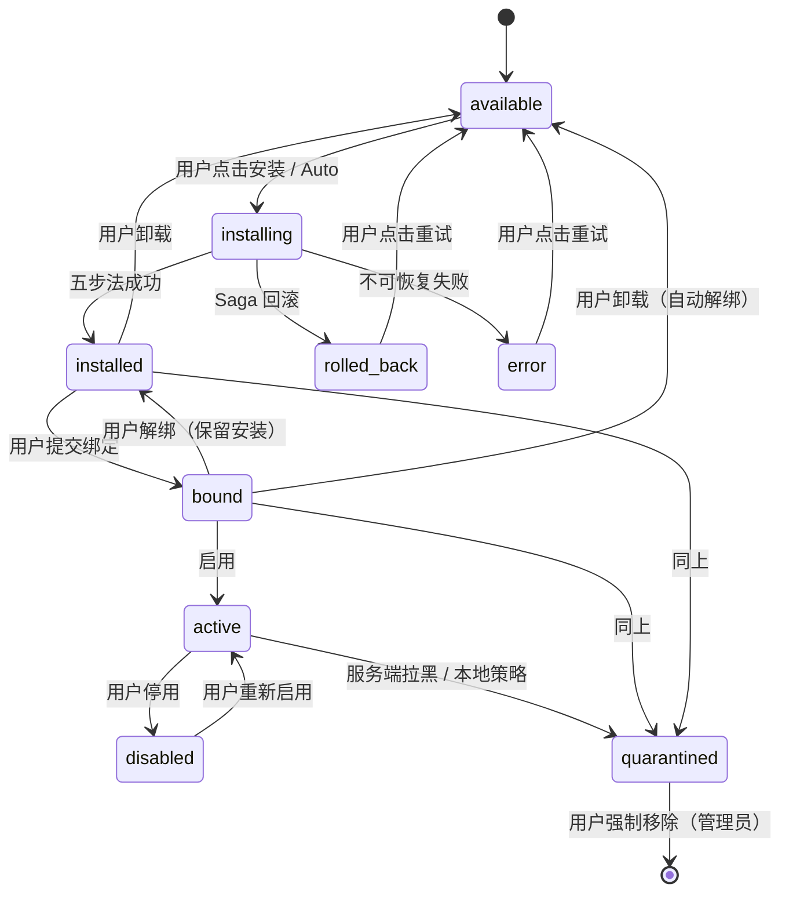
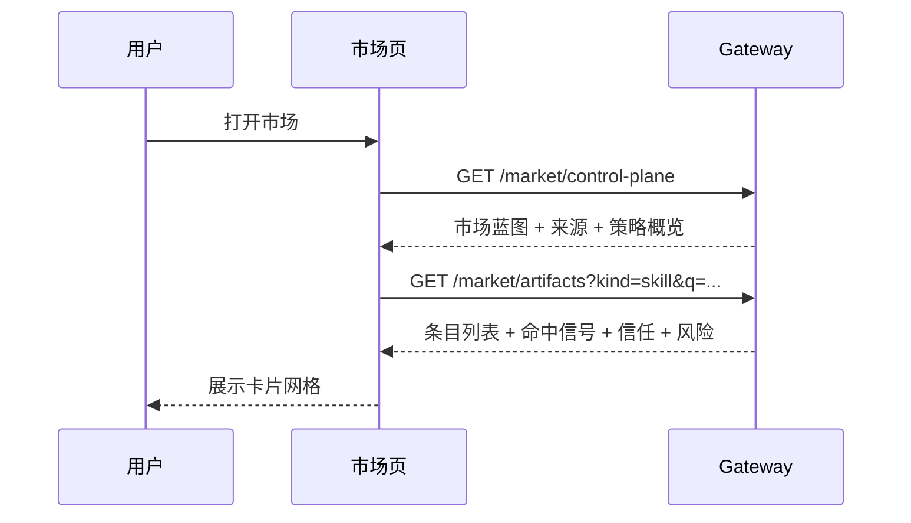
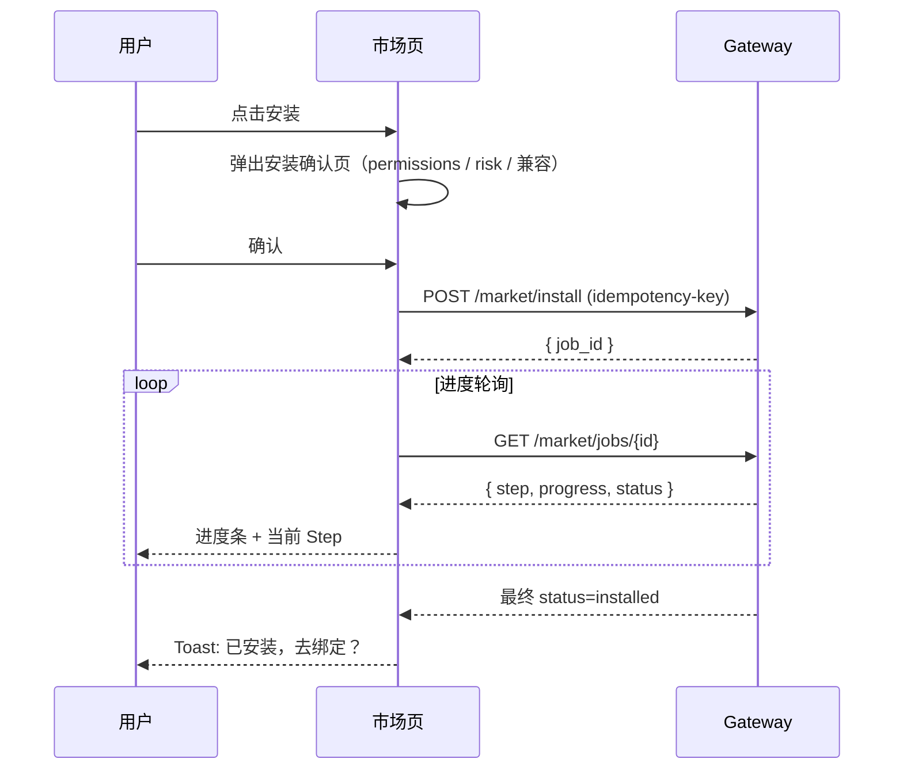
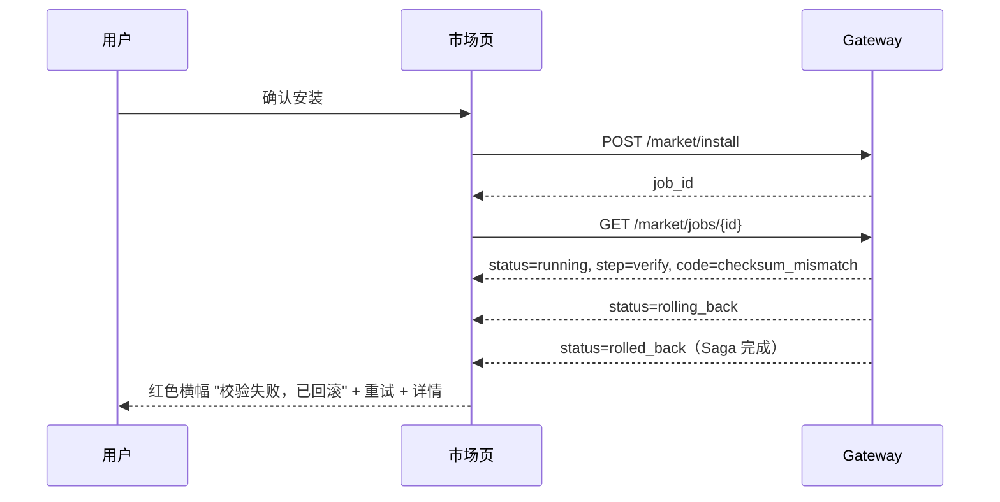
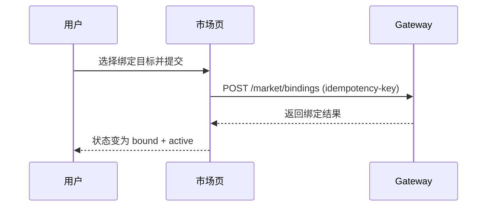
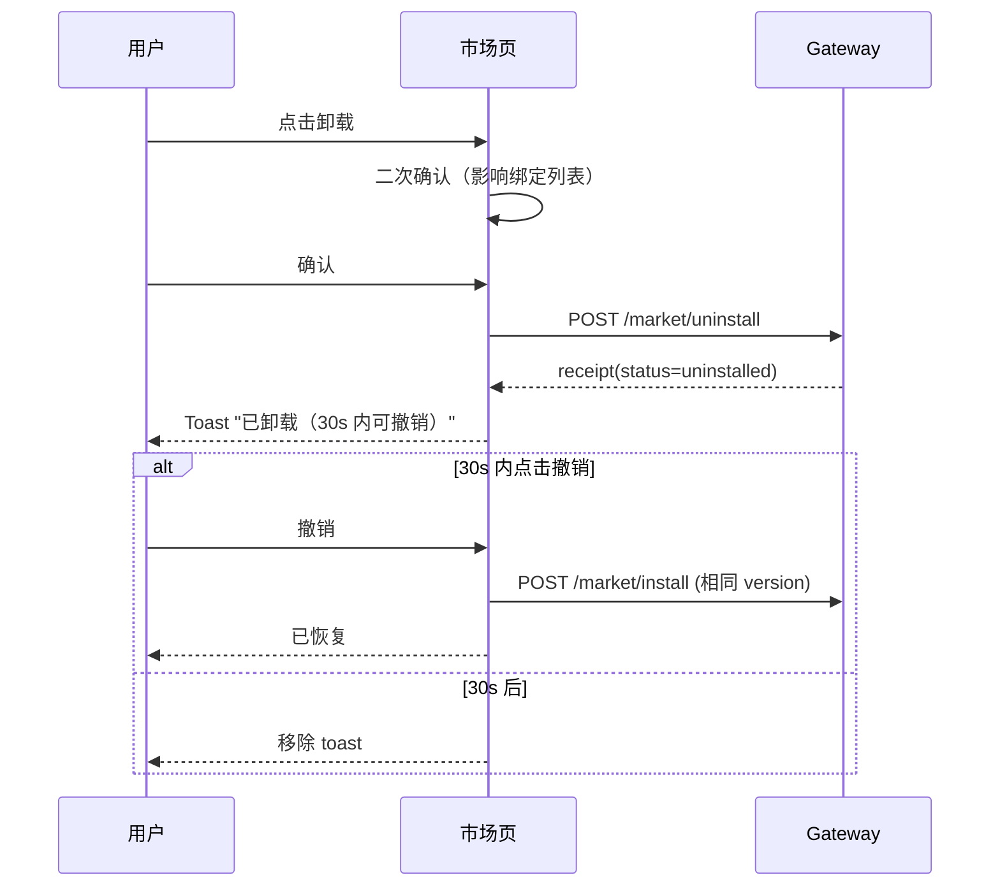
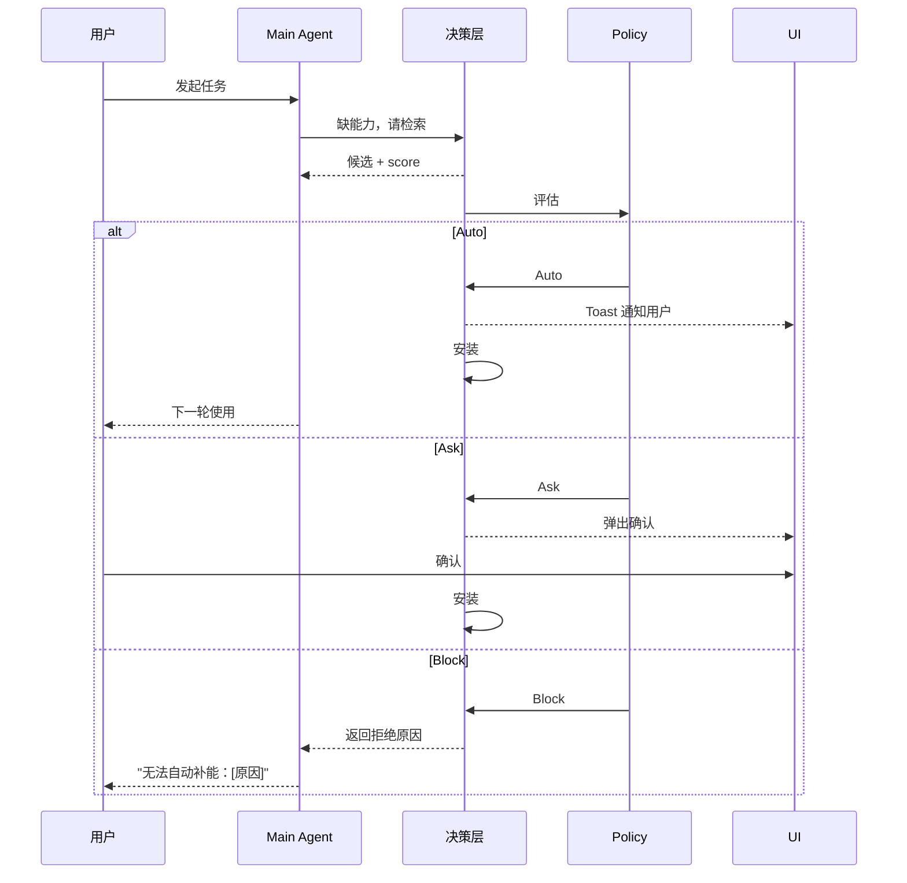

# AnyClaw 云端市场产品设计

> 这是 AnyClaw 云端市场的**产品设计文档**，给产品 / 设计师 / 前端阅读。
> 回答：**用户是谁、用户能做什么、看到什么、怎么使用、状态如何流转**。
> 不展开代码、协议、模块契约。代码与协议见 `云端市场架构设计.md` / `云端市场模块规格.md` / `云端市场技术规范.md`。
>
> **契约一致性**：本文只描述用户可见语义与 UI 文案。涉及枚举值（如 `Artifact.Status` / `decision` / `installed_by`）、事件名、API 字段时，以 `云端市场技术规范.md` §0 为准。冲突时以 §0 为准。

---

## 一、一句话定义

AnyClaw 云端市场是一个统一的能力接入入口，用来浏览、搜索、安装、绑定和启用 `agent / skill / cli` 三类能力资源。

它**不是单纯的下载页**，而是把**查找 → 安装 → 绑定 → 接入运行时 → 自动补能**串起来的能力接入产品。

---

## 二、产品目标

### 2.1 核心目标

- 让用户在一个统一入口中查找 `agent / skill / cli`
- 降低用户理解"能力从哪里来、装到哪里、怎么接进当前运行时"的成本
- 让已安装能力进入 AnyClaw 本地运行时
- 为未来 `自动补能 / 静默安装 / 智能推荐` 提供产品入口

### 2.2 非目标

当前阶段不以这些为主要目标：

- 完整的开发者发布平台
- 完整社区运营系统
- 复杂审核后台
- 在产品层暴露底层检索算法细节（fulltext / vector / hybrid 由云端内部决定）

---

## 三、目标用户

### 3.1 普通用户

- 主要使用桌面壳
- 关注"怎么快速找到需要的能力"
- 不想理解底层配置、目录结构、协议

### 3.2 高阶用户

- 关注安装来源、绑定目标、运行状态
- 希望明确知道这个能力接到了哪个 Agent 或哪个运行范围
- 关注权限与风险

### 3.3 研发 / 运维 / 方案设计者

- 关注能力如何落到本地
- 关注绑定规则、安装策略、运行时刷新
- 关注未来自动补能与策略治理

---

## 四、产品核心心智

用户对云端市场的理解被压缩成 3 步：

```text
1. 先找    Discover
2. 再装    Install
3. 再绑    Bind
```

### 4.1 安装 ≠ 绑定（产品最核心原则）

- **安装成功** = 资源已经落到本地
- **绑定成功** = 资源已经接入某个运行目标

用户不能被误导成"安装完就一定已经作用在当前 Agent 上"。

UI 必须**始终显式区分**这两个状态，不允许把它们合并成"启用"按钮。

### 4.2 同轮使用 ≠ 下一轮使用

- **Phase 1 / 2**：安装后**下一轮对话开始时**新能力才生效
- **Phase 3 起**：当前轮内即可使用

UI 必须**明确告知用户**当前是哪种模式，避免用户困惑"我刚装了为什么没用"。

---

## 五、产品对象模型

### 5.1 Artifact / 市场条目

市场中的统一卡片对象叫做 `Artifact`，内部仍区分三类：

- `agent`
- `skill`
- `cli`

每个条目至少展示：

- 名称
- 类型（kind）
- 来源（source）
- 摘要
- 版本
- 状态（见状态机）
- 是否已安装
- 是否已绑定
- 可绑定目标提示
- 风险等级（low / medium / high）
- 信任等级（unverified / verified / trusted）
- 关键 permissions（前 3 项 + "更多"）

### 5.2 Source / 市场来源

来源是用户能看懂的市场渠道，例如：

- `Agents Catalog`
- `SkillHub.cn`
- `CLI-Anything`
- `本地`
- `企业私有源`（Phase 4）

来源在产品中的作用：

- 帮助用户理解"这个能力从哪里来"
- 区分本地已有 vs 云端市场条目

### 5.3 Binding / 绑定

绑定表示一个条目接入目标。支持 4 类目标：

- `主 Agent`：当前 workspace 下的主控制器（持久化时落为当前 active main-agent profile）
- `持久子 Agent`：常驻领域专家
- `Workspace`：当前项目作用域
- `运行时全局`：整个 AnyClaw 实例

> **"运行时全局"产品文案要求**：在 UI 上不能直接写"运行时全局"，应使用"AnyClaw 全局"或"对所有项目生效"，让普通用户能理解。
> **实现约束**：UI 不要求用户理解 `main_agent profile id`，由 Gateway 在提交时自动解析。

### 5.4 SelectionDecision / 选择决策

本地最终安装决策，三态：

- `Auto`：静默安装（仅低风险 Skill + verified + 高分 + 兼容）
- `Ask`：弹窗确认（默认）
- `Block`：拒绝（high risk / 校验失败 / 不兼容 / 黑名单）

详细规则与 UI 见 §10。

---

## 六、状态机

### 6.1 Artifact 状态枚举

| 状态 | 含义 | 用户感知 |
| --- | --- | --- |
| `available` | 云端可见但本地未安装 | 显示"安装"按钮 |
| `installing` | 正在安装（含下载、校验、落地） | 显示进度条 |
| `installed` | 已落到本地，未绑定到任何目标 | 显示"已安装，去绑定" |
| `bound` | 已绑定到至少一个目标 | 显示绑定目标列表 |
| `active` | 已绑定且当前生效（启用） | 显示绿色"启用中" |
| `disabled` | 已绑定但被用户主动停用 | 显示灰色"已停用" |
| `error` | 安装 / 绑定 / 加载失败 | 显示红色 + 错误原因 + 重试按钮 |
| `rolled_back` | 安装失败已回滚 | 显示"安装失败已回滚" + 重试 |
| `quarantined` | 被服务端拉黑或本地隔离 | 显示警告 + 不允许重新安装 |

> `Artifact` 状态是系统按 `receipt + bindings + quarantined` 聚合出来的**派生状态**，不是单条 binding 的原始值。前端只消费聚合结果，不自行重算。

### 6.2 状态转移图



### 6.3 状态显示要求

- **`installed` vs `bound` vs `active` 必须用三种不同视觉**（颜色 / 图标 / 文案）
- **`bound + disabled` 必须明显区别于 `bound + active`**
- **`error / rolled_back / quarantined` 必须用警告色**
- **每个失败状态都必须有可恢复动作**（重试 / 换版本 / 联系支持）

---

## 七、功能总览

云端市场产品包含 11 组功能：

1. 市场总览
2. 条目浏览
3. 搜索与筛选
4. 条目详情
5. 安装功能
6. 绑定与启用
7. 已安装与状态查看
8. 卸载与回滚
9. 升级与版本管理
10. 决策与权限确认（`Auto / Ask / Block` UI）
11. 自动补能预留

下面分别展开。

---

## 八、功能 1–4：发现与浏览

### 8.1 市场总览

#### 功能目标

让用户快速理解：

- 当前有哪些市场来源
- 当前市场支持哪些类型
- 当前系统大致能装什么
- 当前的安装策略是什么（Manual / Ask / Auto）

#### 核心展示

- 市场蓝图（Blueprint）
- 来源列表（含本地与远端）
- 支持的资源类型
- 绑定目标说明
- 当前策略概览
- 基础统计（已装数量、绑定数量、有更新的数量）

### 8.2 条目浏览

#### 功能目标

统一方式浏览三类能力。

#### 核心功能

- 统一卡片式展示 `Artifact`
- 切换 `agent / skill / cli`
- 切换 `cloud / local`
- 显示：名称、来源、版本、摘要、状态、风险、信任、target hints

### 8.3 搜索与筛选

#### 功能目标

帮助用户快速找到需要的能力。

#### 用户输入

- 关键词搜索框（自然语言或关键词）
- 类型筛选
- 来源筛选
- 本地 / 云端切换
- 状态筛选
- 高级筛选（Phase 2 起）
  - 风险等级
  - 信任等级
  - 是否已验证
  - 兼容性

#### 搜索行为

前端**不让用户手动选择** `fulltext / vector / hybrid`，统一走"智能搜索"，云端内部决定具体方式。

#### "为什么命中"呈现

每个搜索结果卡片上必须显示：

- **命中标签**（小标签）：`关键词 / 标签 / 语义 / 推荐`
  - `关键词` = fulltext 命中
  - `标签` = tag 命中
  - `语义` = vector 命中
  - `推荐` = 编辑或算法推荐
- **匹配字段高亮**：标题与摘要中命中关键词高亮
- **来源标识**（小图标）：来源 logo + 名称
- **信任标识**：`✓ verified` / `★ trusted` / 无标识 = unverified

不让用户感到"为什么这个会出现"是搜索体验的关键差异化。

### 8.4 条目详情

#### 功能目标

让用户在安装前理解一个能力到底是什么、适合做什么、装完会怎样。

#### 必显字段

- 完整摘要
- 长描述（Markdown）
- 来源
- 类型
- 当前版本 + 历史版本列表
- 建议绑定目标
- 安装提示
- 当前状态
- 是否已安装、已绑定、已启用
- **完整 permissions 列表**（见 §10）
- **风险等级**（含解释）
- **信任等级**（含解释）
- **兼容性说明**（含当前环境是否兼容）
- 依赖列表（其他需要的 artifact）
- 安装大小
- 上次更新时间

---

## 九、功能 5–9：安装、绑定、卸载、升级

### 9.1 安装功能

#### 功能目标

让用户把远端条目落到本地。

#### 用户操作

- 点击"安装"按钮
- 弹出**安装确认页**（除非用户在设置中选择了"Skill 自动安装"且本次符合 Auto 条件）
- 安装确认页见 §10.2
- 用户确认后进入 `installing` 状态
- 显示进度（5 步：Resolve / Download / Verify / Install / Receipt）
- 完成后显示结果

#### 进度展示要求

- **5 步进度**显式展示，不只是一个圆圈
- 当前在哪一步用强调色
- 每一步的耗时
- 失败时**指明在哪一步失败**

#### 安装结果

成功：

- 状态变为 `installed`
- 弹出"已安装，去绑定？"引导
- 加入"已安装"列表

失败：

- 状态变为 `error` 或 `rolled_back`
- 显示**错误原因**与**可恢复动作**（详见 §11）
- 自动写入 audit 事件

### 9.2 绑定与启用

#### 功能目标

让用户把已安装能力接入运行目标。

#### 用户操作

- 在已安装条目上点击"绑定"
- 弹出绑定目标选择
- 4 类目标按当前条目 kind 过滤
  - Skill 通常绑定到 主 Agent / 持久子 Agent / Workspace
  - Agent 通常绑定到 持久子 Agent 槽位 / Workspace
  - CLI 通常绑定到 Workspace / 运行时全局
- 选择 `主 Agent` 时，系统自动解析为当前 workspace 的 active main-agent profile
- 用户选择后提交
- 状态变为 `bound`，默认同时进入 `active`

#### 启用 / 停用

- `bound` 状态下可手动 `disabled`
- `disabled` 状态下可恢复 `active`
- **bound + disabled 与 bound + active 用不同视觉区分**

### 9.3 已安装与状态查看

#### 功能目标

让用户管理本地能力。

#### 必显信息

- 本地条目列表
- 已安装状态
- 已绑定状态与目标
- 启用 / 停用状态
- 来源
- 当前版本
- 是否有可升级版本
- 最近一次安装时间
- receipt 摘要（点击查看完整）

### 9.4 卸载与回滚

#### 功能目标

让用户安全地移除已安装能力，或者把误装回滚。

#### 卸载流程

- 在已安装条目上点击"更多 → 卸载"
- **二次确认对话框**显示：
  - 影响哪些绑定（列出绑定目标）
  - 影响哪些 Workspace
  - 是否一并清除配置
- 用户确认后进入 `uninstalling`
- 同步执行：解绑 → 清理文件 → 写 receipt（uninstalled）→ 刷新 runtime
- **30 秒撤销窗口**：卸载完成后顶部 toast 显示"已卸载，撤销"按钮
- 30 秒内点击撤销 → 重新安装相同版本

#### 回滚流程（自动）

- 安装失败时 Saga 自动回滚
- UI 状态从 `installing` → `rolled_back`
- 不需要用户操作
- 显示"安装失败，已回滚到原状态"

#### 回滚流程（手动）

- 用户在升级后发现新版本不好用
- 在条目详情点击"回滚到 X.Y.Z"
- 系统读取 receipt 中的 `previous_version`
- 回滚到上一个版本

### 9.5 升级与版本管理

#### 功能目标

让用户跟上新版本，且失败可逆。

#### 通知机制

- 已安装条目有可升级版本时显示**蓝点徽标**
- 市场总览页显示"X 个能力可升级"横幅
- 不主动弹窗，避免打扰

#### 升级流程

- 在条目详情点击"升级到 X.Y.Z"
- 弹出**升级确认页**显示：
  - 版本变化（X.Y.Z → A.B.C）
  - changelog 摘要
  - permissions 是否有变化（**变化必须高亮**）
  - 风险等级是否变化
  - 兼容性是否仍满足
- 用户确认后走完整五步法
- 失败自动 Saga 回滚到原版本
- 成功保留绑定关系

#### 多版本共存

- **第一阶段不支持多版本共存**
- 一个 artifact_id 同时只有一个版本生效
- 升级会替换旧版本（旧版本 receipt 保留为 `previous_version`）
- Phase 4 起视需求支持多版本（带版本约束的 binding）

---

## 十、功能 10：决策与权限确认（Auto / Ask / Block UI）

这是产品中最敏感的部分，单独一节。

### 10.1 默认策略

| 条件 | 决策 |
| --- | --- |
| `kind=skill + verified + risk=low + 高分 + 兼容 + Workspace 允许 auto` | `Auto` |
| `kind=agent` 默认 | `Ask` |
| `kind=cli` 默认 | `Ask` |
| `risk=medium` | `Ask` |
| `risk=high` | `Block` |
| 校验失败 / 签名失败 / 不兼容 / 黑名单 / 来源不可信 | `Block` |

详细规则见 `云端市场架构设计.md` 决策层。

### 10.2 Ask 弹窗设计

弹出**安装确认页**，必须包含：

#### 顶部

- 大标题：`即将安装 [name]`
- 副标题：`[publisher] · [version] · [source]`

#### 信任与风险（突出）

- **信任徽标**：`✓ verified` / `★ trusted` / 无
- **风险徽标**：`低风险` / `中风险` / `高风险`（颜色：绿 / 黄 / 红）
- 风险等级说明文案（一句话）

#### Permissions（必显）

- 标题："此能力将获得以下权限"
- **逐项列出**所有 permissions
- 高风险权限（`process.exec / desktop.control / browser.control / network.any / secrets.read`）用**警告色**标记
- 每个权限有人话解释（不是 `process.exec` 这种英文）：
  - `process.exec` → "执行系统命令"
  - `network.any` → "访问任意网络地址"
  - `desktop.control` → "控制鼠标键盘"
  - 等等
- 如果是升级且 permissions 变化，**变化项加 `[新增]` 标签**

#### 兼容性

- 当前 AnyClaw 版本是否满足
- 当前 OS / arch 是否满足
- 不满足则禁用"安装"按钮并说明原因

#### 来源透明

- 来源 Registry 名称
- 包大小
- checksum 后 8 位
- 一行小字："此包将从 [registry_endpoint] 下载并校验"

#### 操作按钮

- 主按钮：`确认安装`
- 次按钮：`取消`
- 角落小链接：`查看完整详情`

### 10.3 Auto（静默安装）UI

#### 进入条件

- 用户在设置中开启了"允许 Skill 自动安装"
- 本次决策结果是 `Auto`

#### 用户感知

不采用完全静默方式，必须有：

- **顶部 toast 通知**：`已自动安装 [name]（低风险 Skill）` + 撤销按钮
- 通知中心进入一条记录
- 30 秒撤销窗口
- 通知中心可查看所有 Auto 安装历史

#### 反悔通道

- 通知中心点条目可"撤销"或"查看详情"
- 设置中可关闭"允许自动安装"
- 设置中可查看哪些条件触发了 Auto

### 10.4 Block UI

#### 触发场景

- 风险过高
- 校验失败
- 签名失败
- 不兼容
- 黑名单
- 来源不可信

#### 提示形式

- 不弹弹窗（避免阻塞）
- 在条目卡片上**显示锁图标 + "无法安装"**
- 点击查看具体原因
- 给出**可行的替代动作**（换版本 / 换源 / 联系管理员）

#### 不可绕过

Block 不可被普通配置覆盖。如果用户确实需要绕过，需走管理员命令行 + 双重确认（设计上可以，但不在 Phase 1 范围）。

### 10.5 决策状态机的 UI 反映

- 决策结果必须**写入 receipt**
- "已安装"列表中每条都显示 `installed_by` 与 `decision`：
  - `installed_by=用户` = 用户手动触发
  - `installed_by=Agent` = Main Agent 工具触发
  - `installed_by=系统` = 系统后台触发
  - `decision=Ask / Auto` = 已安装条目的实际决策结果
- 失败安装或被拒绝的尝试在 audit / 错误详情中显示 `decision=Block`
- `Auto` 是决策，不是触发方；不能再和 `installed_by` 混用

让用户能事后审计"这是怎么装上的"。

---

## 十一、错误态产品设计

本节补充此前未展开的错误态设计。

### 11.1 错误分类

| 错误码 | 用户文案 | 可恢复动作 |
| --- | --- | --- |
| `network_unreachable` | 无法连接到市场服务 | 检查网络 / 稍后重试 |
| `registry_unavailable` | 市场服务暂时不可用 | 稍后重试 |
| `artifact_not_found` | 能力已下架或不存在 | 返回搜索 |
| `no_compatible_version` | 当前 AnyClaw 版本不兼容 | 升级 AnyClaw / 换版本 |
| `download_failed` | 下载失败 | 重试 / 换源 |
| `checksum_mismatch` | 包损坏（校验失败） | 重试 / 联系发布者 |
| `signature_invalid` | 签名验证失败 | 不允许重试 / 联系管理员 |
| `disk_full` | 本地磁盘空间不足 | 清理空间 |
| `permission_denied` | 本地权限不足 | 以管理员身份重试 |
| `dependency_missing` | 缺少依赖 [X] | 一键安装依赖 |
| `version_conflict` | 与已装版本冲突 | 升级 / 卸载旧版 |
| `quarantined` | 此包被服务端拉黑 | 不允许安装 |
| `policy_blocked` | 当前策略禁止安装 | 联系管理员 |
| `runtime_refresh_failed` | 安装成功但运行时刷新失败 | 重启 AnyClaw |
| `unknown` | 未知错误 | 重试 + 反馈 |

### 11.2 错误展示位置

- **安装中失败**：进度条顶部红色横幅 + 详情可点开
- **列表项失败**：卡片显示红色边 + 错误图标
- **弹窗中失败**：弹窗顶部红条
- **Toast**：高优先级错误 toast 持续 10 秒不自动消失

### 11.3 错误详情页

每个错误都可点击"查看详情"跳转到错误详情页：

- 完整错误码
- 错误时间
- 触发的 artifact / version
- 当前所在 Step
- 完整堆栈（折叠默认隐藏）
- "复制错误信息"按钮（方便反馈）
- "查看 audit 事件"链接

---

## 十二、空 / 加载 / 离线状态

之前缺失的另一块。

### 12.1 首次进入空状态

第一次打开市场页：

- 大插图 + 一句话引导："欢迎使用 AnyClaw 市场，从这里发现 Agent / Skill / CLI"
- 推荐能力 6 个（编辑精选）
- 引导按钮："浏览全部"
- 不显示空白列表

### 12.2 已安装但无云端能力

如果用户没装任何东西且云端无能力：

- 显示来源列表 + "暂无可用能力，请联系管理员配置市场源"

### 12.3 加载中

- **首次加载**：骨架屏（卡片占位）
- **搜索中**：搜索框右侧菊花
- **安装中**：进度条 + 5 步状态
- 加载超过 5 秒：显示"正在加载，可能稍慢"

### 12.4 离线状态

- 顶部横幅："网络受限，仅显示本地已装能力"
- 云端 tab 灰化但不隐藏（保持入口）
- 已装能力仍可正常使用

### 12.5 Registry 不可达

- 顶部黄色横幅："市场服务暂时不可用，请稍后重试"
- 已装能力不受影响
- 显示重试按钮

---

## 十三、页面结构

### 13.1 市场页 4 区

```text
+---------------------------------------------------------+
| 顶部工具区  类型切换 | 来源切换 | 搜索框 | 设置入口      |
+----------+--------------------------+--------------------+
| 左侧概览 | 中间条目列表             | 右侧详情区         |
|         |                          |                    |
| 来源摘要 | 卡片网格 / 列表          | 详情               |
| 统计     | 命中标签 / 信任标识      | permissions        |
| 筛选条件 | 状态徽标                 | 安装 / 绑定操作    |
|         |                          | 升级 / 卸载        |
+----------+--------------------------+--------------------+
```

### 13.2 已安装管理页

```text
+---------------------------------------------------------+
| 顶部 已安装 (n) | 有更新 (m) | 已停用 (k)                |
+---------------------------------------------------------+
| 列表（按 kind 分组）                                     |
|   Agent (a)                                              |
|     - 条目 + 状态 + 绑定目标 + 操作                      |
|   Skill (b)                                              |
|     - 条目 + 状态 + 绑定目标 + 操作                      |
|   CLI (c)                                                |
|     - 条目 + 状态 + 绑定目标 + 操作                      |
+---------------------------------------------------------+
```

### 13.3 通知中心

- 入口：右上角铃铛图标
- 内容：
  - Auto 安装记录
  - 升级提醒
  - 错误未读
  - 应急下架通知

### 13.4 页面状态枚举

- `loading_first`
- `loading_search`
- `empty_initial`
- `empty_no_result`
- `offline`
- `registry_down`
- `installing`
- `install_success`
- `install_failed`
- `binding`
- `bind_success`
- `bind_failed`
- `uninstalling`
- `uninstall_success`
- `error_global`

---

## 十四、关键用户流程

### 14.1 浏览市场



### 14.2 手动安装（Ask 路径）



### 14.3 安装失败回滚



### 14.4 绑定



### 14.5 卸载（含撤销窗口）



### 14.6 自动补能（Phase 2）



---

## 十五、三类资源的产品语义

### 15.1 Agent（角色包）

- 长期职责包 / 持久子 Agent 模板
- 产品上强调：
  - 适合什么长期任务
  - 是否用于持久子 Agent 槽位
  - 默认推荐绑定目标
  - 携带哪些 prompt 与默认 skill
- 默认决策：`Ask`
- 安装确认页**必显** persona 与 system prompt 摘要

### 15.2 Skill（局部能力件）

- 主 Agent 或子 Agent 可调用的能力增强
- 产品上强调：
  - 它解决什么局部问题
  - 装完后主要给谁使用
  - 输入输出
- 默认决策：低风险 + verified → `Auto`，否则 `Ask`

### 15.3 CLI（工具能力，正式市场类型）

- 不是附属品
- 产品上强调：
  - 是工具能力
  - 安装后进入本地 CLI / runtime 能力目录
  - 是否需要后续授权或暴露给 Agent
- 默认决策：`Ask`（永不 Auto）
- 安装确认页**必显**：
  - 落地路径策略（user-bin / workspace-bin）
  - 是否会修改 PATH
  - 安装脚本来源
  - 卸载方式

#### CLI 二次授权

CLI 安装后**默认不暴露给 Agent**。需要二次授权：

- 用户在已安装 CLI 详情页点击"允许 Agent 调用"
- 选择允许的 Agent 范围（主 Agent / 持久子 Agent）
- 选择允许的命令白名单
- 二次确认风险

---

## 十六、自动补能预留功能

### 16.1 Phase 1 阶段

- 本阶段不启用自动补能
- 但产品中**预留入口**：
  - 设置中显示"自动补能模式：Manual / Ask / Auto"
  - 通知中心保留位置
  - "Agent 可调用市场"开关默认关闭
- 让用户**知道未来会有**，不给错误期望

### 16.2 Phase 2 阶段

完整链路：

1. 主 Agent 执行中发现缺能力
2. 调云端检索拿候选
3. 本地 Filter + Policy 决策
4. `Auto / Ask / Block`
5. 安装后**下一轮使用**

UI 体验：

- Auto：toast + 通知中心
- Ask：在对话流中嵌入候选选择
- Block：对话中显式说明"无法自动补能：[原因]"

### 16.3 Phase 3 阶段

升级为：

- 同轮内自动补能并继续执行
- 用户在对话中看到"已自动安装并应用 [X]，继续执行..."
- 仍然受 `Auto / Ask / Block` 约束

---

## 十七、迁移路径

老用户从 `plugin / store / skills` 旧入口过渡：

- **旧入口保留**至少 2 个版本（兼容性）
- 旧入口顶部加横幅："市场已升级，新入口在 [新位置]"
- 老安装能力**自动迁移**到新 `Artifact` 模型，状态保留
- 新 UI 中给"从 [旧入口] 迁移而来"标签

---

## 十八、成功标准

本阶段产品成功标准：

- 用户能在同一入口浏览 `agent / skill / cli`
- 用户能清楚区分**安装**与**绑定**
- 安装 / 绑定 / 卸载状态在 UI 上正确反馈
- Permissions 在安装前**100% 展示**
- 失败有明确**错误码 + 可恢复动作**
- Auto 安装有**用户感知 + 撤销通道**
- 不需要理解旧 `plugin / store / skills` 结构也能完成接入
- 通知中心能查看所有自动安装历史

---

## 十九、总结

AnyClaw 云端市场的正确产品形态不是远端下载页，而是：

> **一个把查找、搜索、安装、绑定、接入运行时和后续自动补能串成闭环的统一能力接入入口；状态机清晰、决策可见、权限透明、失败可恢复、Auto 有撤销。**

当这些功能形成完整闭环，并具备清晰的状态机、错误态、权限确认、回滚与撤销机制后，市场才能从目录能力发展为可用、可审计、可恢复的产品能力。
