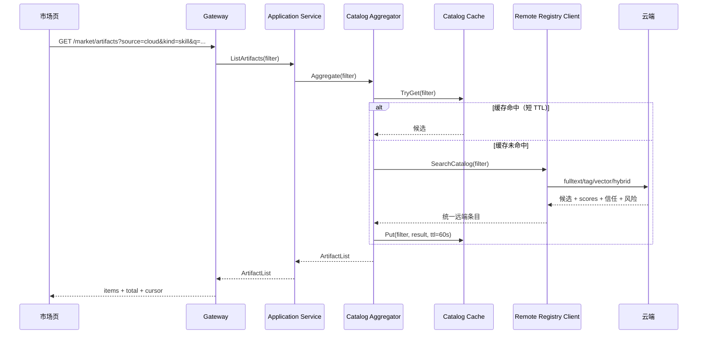
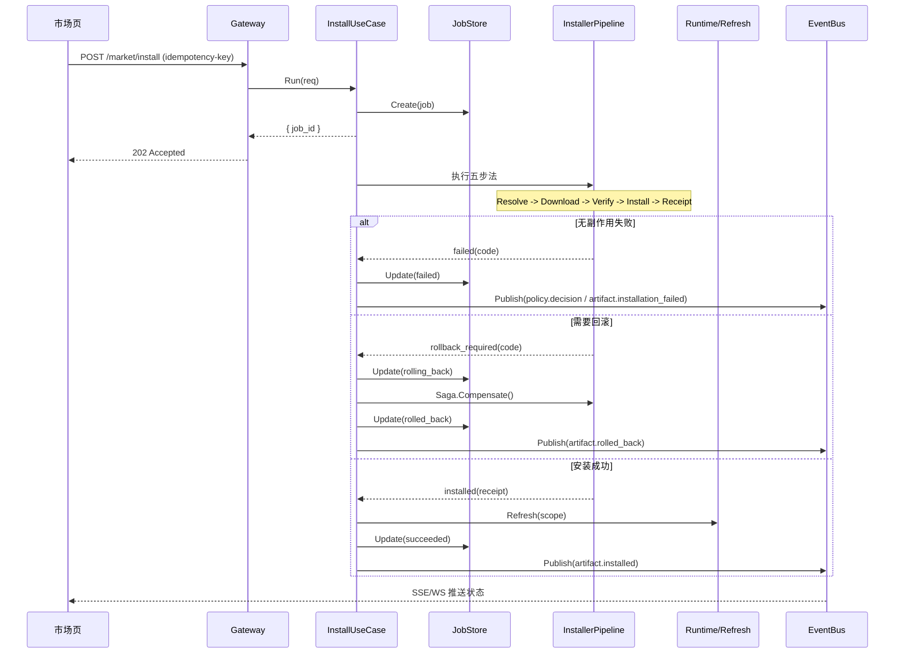
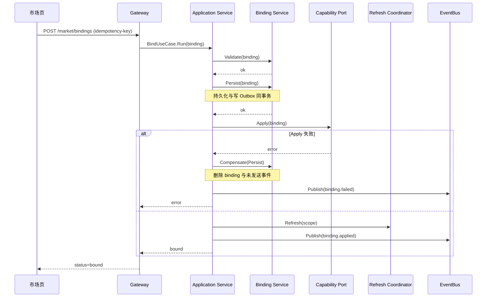
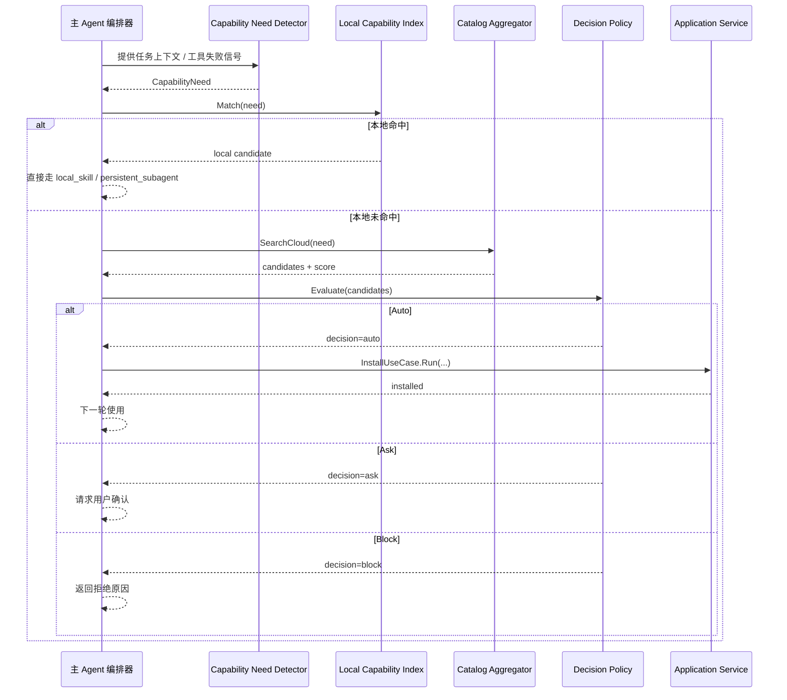
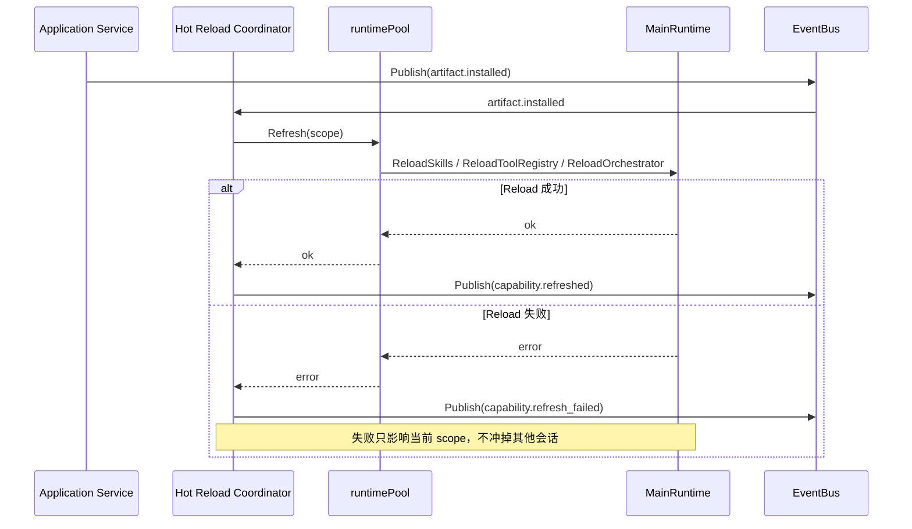
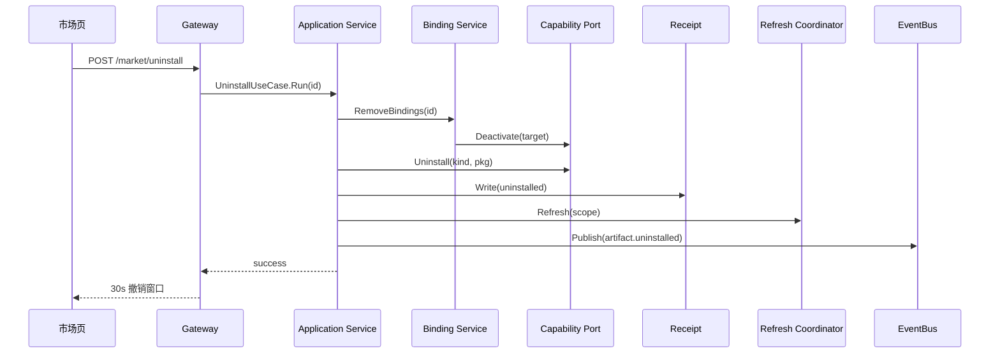

# AnyClaw 云端市场架构设计

> 这是 AnyClaw 云端市场的**架构设计文档**，给架构师 / 技术负责人阅读。
> 回答：**系统怎么分层、有哪些模块、数据流怎么走、与 1.4 现状如何映射、如何演进**。
> 模块详细契约见 `云端市场模块规格.md`；协议 / API / 数据 / 实施见 `云端市场技术规范.md`。
>
> **契约一致性**：API 路径 / JSON 字段 / DB schema / 枚举值 / 事件名 / 错误码以 `云端市场技术规范.md` §0 为唯一权威来源。本文负责分层 / 模块边界 / 时序图，与 §0 冲突时以 §0 为准。

---

## 一、文档定位

本文档是**新增功能架构设计文档**，不是 AnyClaw 项目的完整架构图。聚焦：

1. AnyClaw 1.4 当前已有哪些市场相关结构
2. 云端市场新增了哪些架构模块
3. 这些模块如何与现有 Gateway / Runtime / Skills / Profiles / CLI 体系适配
4. 数据流和调用流如何走（含失败分支）
5. 跨模块协调（Application Service / EventBus / Job / Saga）如何工作
6. 如何向多 Registry / 多 runtime 演进

---

## 二、设计范围

### 2.1 覆盖

- 统一市场入口
- 统一条目模型
- 远端协议契约位置
- 云端检索接入位
- 本地选择与决策接入位
- 安装与绑定链路（含失败分支与 Saga）
- 运行时刷新链路
- 跨模块协调（Application Service / EventBus / Job）
- 可观测性架构
- 与 1.4 现状的复用 / 扩展 / 新增映射
- 演进性（多 Registry / 多 runtime）

### 2.2 不覆盖

- 完整 AnyClaw 项目架构
- 完整数据库 schema（见 `云端市场技术规范.md` 第 4 章）
- 完整对象存储设计（见技术规范）
- 独立云端 Registry 的服务端实现细节
- 协议 v1 完整 schema（见技术规范第 1 章）

---

## 三、AnyClaw 1.4 基线现状

### 3.1 已具备

#### Gateway 层

- 路由：
  - `GET /market/control-plane`
  - `GET /market/artifacts`
  - `POST /market/install`
  - `GET /market/bindings`
  - `POST /market/bindings`
- 兼容旧路由：
  - `/market/search`
  - `/market/plugins`
  - `/market/installed`
  - `/market/categories`

#### marketplace 域层

- `pkg/marketplace/control_plane.go`：控制面构建
- `pkg/marketplace/artifacts.go`：条目聚合
- 核心对象：`Artifact / ArtifactKind / Binding / Source / ControlPlaneView`
- 三类条目：`agent / skill / cli`

#### 本地能力层

- `pkg/skills` SkillsManager
- Agent Profiles / Config
- `pkg/clihub` CLIHub
- `pkg/runtime` MainRuntime / runtimePool
  - `runtimePool.InvalidateAll()`
  - `runtimePool.InvalidateByAgent(agentID)`

#### Runtime 与路由

- `pkg/runtime/delegation.go`：`delegate_task` Main-Agent only 工具
- `pkg/route/handoff/service.go`：persistent / temporary / main 三态 handoff
- `pkg/runtime/orchestrator/`：`AgentPool / FindAgentForSkills / FindAgentForDomain`

#### UI

- `ui/src/pages/Market` 已消费 `/market/*`
- 区分 `agent / skill / cli` 与 `local / cloud`

### 3.2 缺什么

| 缺口 | 后果 |
| --- | --- |
| 远端 Registry 客户端 | 远端来源接入分散、协议无契约 |
| 远端检索 | "向量命中 / 混合检索"无落点 |
| 本地最终决策层 | 只能列出和安装，做不到 `Auto / Ask / Block` |
| 安装回执与已安装索引 | 升级 / 回滚 / 审计缺少统一状态来源 |
| Application Service 层 | 业务流程分散在多个底层模块 |
| EventBus | 跨模块通知依赖手动调用，审计覆盖不完整 |
| Capability Port / Adapter | 市场层强耦合 1.4 实现，演进困难 |
| Job 模型 | 长任务靠 HTTP 阻塞，超时即丢状态 |
| Saga 事务 | 跨模块写失败留半状态 |
| Capability Need Detector + Index | 自动补能链路缺少入口 |
| 远端协议契约 v1 | 客户端 / 服务端无对齐基础 |
| 错误码体系 | 失败语义不统一 |
| 可观测性挂点 | 安装链路无法调试 |

### 3.3 当前实现替换项

- `cloudAgentArtifacts()` 当前是将本地 catalog 映射为 cloud 来源的过渡实现，P1 替换为 `RemoteRegistryAgentAdapter`
- 旧 `/market/search` `/market/plugins` 路由保留兼容，但**不作为新链路扩展点**

---

## 四、设计原则

### 4.1 增量接入

新增功能优先新增"组合层"，不重写已有底层模块。

### 4.2 本地最终控制

远端负责目录与召回；本地负责筛选 / 安装 / 绑定 / 配置写回 / runtime 刷新。

**边界约定**：

- 云端的 `must_upgrade` 标记**仅作建议**，本地保留拒绝权
- 云端拉黑（`quarantined`）触发本地停用流程，但卸载仍需用户确认

### 4.3 安装与绑定分离

- 安装 = 资源到本地
- 绑定 = 资源接入运行目标

### 4.4 `main_agent` 绑定落地语义

- `main_agent` 不是短暂 UI 概念，而是**当前 workspace 下 active main-agent profile** 的持久化别名
- UI 可以只提交 `type=main_agent`，但 Gateway 必须在入库前解析并补齐 `target_id`
- 刷新粒度中的 `session` 只服务于 P3 热加载，不参与 binding 持久化

### 4.5 统一条目，异构落地

外部统一为 `Artifact`，内部按 kind 路由：

- `skill` → SkillCapabilityPort → SkillsManager
- `agent` → AgentCapabilityPort → Profiles / Config
- `cli` → CLICapabilityPort → CLIHub

### 4.6 云端检索，本地决策

向量与混合检索在远端；过滤与 `Auto / Ask / Block` 在本地。

> **向量命中在云端，最终筛选在本地。**

### 4.7 协议与适配分离（演进性）

- 远端协议演进不影响本地能力层
- 本地能力层重构不影响远端协议
- 通过 `RemoteRegistryProtocol v1` 显式契约 + `Capability Port` 抽象实现

---

## 五、新增功能总体架构

### 5.1 分层

```text
+------------------------------------------------------------------+
| 展示层  UI / 桌面壳                                              |
+--------------------------------+---------------------------------+
                                 ↓ HTTP
+--------------------------------+---------------------------------+
| 接入层  Gateway：路由 / 鉴权 / 限流 / 协议适配                  |
+--------------------------------+---------------------------------+
                                 ↓
+==================================================================+
| 市场桥接层  Marketplace Bridge（新增，云端市场主编排层）         |
|------------------------------------------------------------------|
| 应用服务子层  Install / Bind / Uninstall / AutoSupplement        |
|                JobStore / Saga 编排                              |
|------------------------------------------------------------------|
| 领域服务子层  Catalog Aggregator / Installer Pipeline /          |
|                Decision / Binding / Refresh / Receipt / Index    |
|------------------------------------------------------------------|
| 事件索引子层  EventBus / Outbox / Audit / Stats / UI Push /     |
|                Local Capability Index                            |
|------------------------------------------------------------------|
| 端口子层      SkillPort / AgentPort / CLIPort / RuntimePort      |
+==================================================================+
                                 ↓
+--------------------------------+---------------------------------+
| 适配层  Adapters：AnyClaw14 / 未来 OpenClaw                      |
+--------------------------------+---------------------------------+
                                 ↓
+--------------------------------+---------------------------------+
| 本地能力与运行时层  SkillsManager / Profiles / CLIHub / Runtime  |
+--------------------------------+---------------------------------+

+------------------------------------------------------------------+
| 远端访问层  Remote Registry Client（合并 Catalog + Retrieval）   |
|  协议 v1 契约 + 错误码 + 缓存 + retry + circuit breaker          |
+--+----+----+-----------------------------------------------------+
   ↓
[ 云端 Registry / Search / Distribution ]

+------------------------------------------------------------------+
| 智能补能层  pkg/runtime/capability（P2 新增）                     |
|  Need Detector / Local Capability Index / Capability Router      |
+------------------------------------------------------------------+

+------------------------------------------------------------------+
| 热加载层  pkg/runtime/hotreload（P3 新增）                        |
|  Hot Reload Coordinator / RefreshScope                           |
+------------------------------------------------------------------+
```

### 5.2 关键说明

- **Gateway 是薄的接入层**，只做协议适配，不承载业务语义
- **市场桥接层** 是云端市场的主编排层，它不是单个模块，而是 `Application Service + Domain Services + Event/Index + Capability Port` 四个子层的统称
- **Application Service 子层**承担业务流程编排职责，包括 Saga 与 Job
- **领域服务子层**保留各模块的单一职责，不做跨模块协调
- **Capability Port 子层** 隔离市场层与本地能力层，1.4 / 未来 OpenClaw 各提供 Adapter
- **EventBus + Outbox** 解耦跨模块通知，审计与统计走订阅
- **适配层** 负责把桥接层的统一动作翻译成 1.4 本地能力层可以执行的动作
- **远端访问层独立**，协议契约 + 缓存 + 熔断
- **智能补能层**与**热加载层**独立成包，按阶段引入

---

## 六、数据流设计（含失败分支）

### 6.1 浏览市场



### 6.2 手动安装（含五步法 + Saga + Job）

为保证架构文档可读性，这里只保留**编排级参与者**；`Resolve / Download / Verify / Install / Receipt` 的模块细节下沉到 `云端市场模块规格.md` 与 `云端市场技术规范.md`。



说明：

- 安装是**异步 Job**，HTTP 立即返回 `job_id`
- 五步法每步**独立失败分支**
- 任意一步失败走 **Saga 反向补偿**
- 所有终态都**写 receipt + 发带域前缀事件**

### 6.3 绑定（含事务边界）



说明：

- 持久化先于运行态（Outbox 模式）
- 持久化失败：直接返回，无副作用
- 运行态失败：补偿持久化（删除）
- 刷新失败：不补偿（Refresh 是幂等的，下次重试即可）

### 6.4 自动补能（Phase 2，含 Need 与 Resume）



说明：

- 头部 `Capability Need Detector` 解决"谁判断缺能力"
- 中部 `Local Capability Index` 解决"本地有什么"
- 尾部明确 Phase 1/2 是**下一轮使用**

### 6.5 同轮热加载（Phase 3）



说明：

- `RefreshScope` 替代粗粒度 `InvalidateAll`
- 失败隔离到具体 scope，不冲掉其他 workspace

### 6.6 卸载与回滚



---

## 七、核心抽象层

本节说明 8 个关键架构补充项。

### 7.1 Application Service 层

#### 职责

- 把跨模块业务流程封装成 UseCase
- 编排 Saga（每步定义 Forward + Compensate）
- 与 Job Store 交互，长任务异步化
- Gateway 只调 UseCase，不直调底层

#### 4 个 UseCase

```text
InstallUseCase
  Resolve → Decide → Download → Verify → Install → Receipt → Refresh
  Saga: 每步可补偿
  输入: InstallRequest
  输出: JobID（异步）+ Receipt（终态）

BindUseCase
  Validate → Persist → Apply → Refresh
  事务: Outbox 模式
  输入: BindingRequest
  输出: BindingResult

UninstallUseCase
  Unbind → Cleanup → Receipt → Refresh
  输入: ArtifactID
  输出: Receipt（同步）

AutoSupplementUseCase（P2）
  Detect → Index → Search → Filter → Decide → Install → Refresh
  输入: CapabilityNeed
  输出: ExecutionPlan
```

#### 包路径

`pkg/marketplace/app/`

### 7.2 EventBus + Outbox

#### 职责

- 解耦跨模块通知
- 审计 / 统计 / UI / 索引 / 热加载 都通过订阅获取消息
- 关键事件经 Outbox 表保证至少一次送达

#### 核心事件清单

| 事件名 | 触发时机 | 主要订阅者 |
| --- | --- | --- |
| `artifact.installed` | InstallUseCase 成功 | Audit / Stats / UI / Index / HotReload |
| `artifact.installation_failed` | InstallUseCase 失败 | Audit / Stats / UI |
| `artifact.rolled_back` | Saga 完成回滚 | Audit / Stats / UI |
| `artifact.uninstalled` | UninstallUseCase 成功 | Audit / Stats / UI / Index |
| `artifact.uninstallation_failed` | UninstallUseCase 失败 | Audit / Stats / UI |
| `binding.applied` | BindUseCase 成功 | Audit / UI / Index |
| `binding.failed` | BindUseCase 失败 | Audit / UI |
| `binding.removed` | RemoveBinding 成功 | Audit / UI / Index |
| `capability.refreshed` | RefreshCoordinator 完成 | Index / HotReload |
| `capability.refresh_failed` | Refresh / HotReload 失败 | Audit / Stats / UI |
| `policy.decision` | Decision Policy 输出决策 | Audit / Stats |
| `agent.market_tool_called` | Main Agent 调用市场工具 | Audit / Stats |
| `job.state_changed` | JobStore 状态迁移 | UI（SSE 推送） |

#### Outbox 模式

- 关键事件先写本地 SQLite outbox 表
- 异步 publisher 读 outbox 推 EventBus
- 至少一次送达
- 订阅者必须**幂等处理**

#### 包路径

`pkg/marketplace/events/`

### 7.3 Capability Port + Adapter

#### 职责

- 隔离市场层与本地能力层具体实现
- 1.4 / 未来 OpenClaw 各提供一组 Adapter

#### 4 个 Port

```go
type SkillCapabilityPort interface {
    Install(ctx, pkg) (*InstalledSkill, error)
    Activate(ctx, skill, target) error
    Deactivate(ctx, skill, target) error
    Uninstall(ctx, skillID) error
    List() []InstalledSkill
}

type AgentCapabilityPort interface {
    Install(ctx, pkg) (*InstalledAgent, error)
    Bind(ctx, agentID, target) error
    Unbind(ctx, agentID, target) error
    Uninstall(ctx, agentID) error
    List() []InstalledAgent
}

type CLICapabilityPort interface {
    Install(ctx, pkg) (*InstalledCLI, error)
    Authorize(ctx, cliID, scope) error
    Uninstall(ctx, cliID) error
    List() []InstalledCLI
}

type RuntimeCapabilityPort interface {
    Refresh(ctx, scope RefreshScope) error
    InvalidateAll(ctx) error          // 兼容路径，P3 后不作为首选
    InvalidateByAgent(ctx, agentID string) error
    AvailableAgents() []string
}
```

#### Adapter

- `pkg/marketplace/adapters/anyclaw14/`：1.4 实现
- 未来 `adapters/openclaw/`：OpenClaw 实现

#### 包路径

- 接口：`pkg/marketplace/ports/`
- 适配：`pkg/marketplace/adapters/`

### 7.4 Job 模型

#### 职责

- 长任务异步化
- 可查询进度、可取消、可重试
- 状态持久化，断网不丢

#### 状态机

```text
pending → running → succeeded
                  ↘ failed
                  ↘ canceled
                  ↘ rolling_back → rolled_back
```

#### API

- `POST /market/install` 立即返回 `{ "job_id": "..." }`
- `GET /market/jobs/{id}` 查询进度
- `POST /market/jobs/{id}/cancel`
- `GET /market/jobs?status=running` 查询本地活跃 Job
- `POST /market/uninstall` 同步返回 Receipt，不进入 Job

#### 持久化

- 本地 SQLite `jobs` 表
- 进程重启可恢复 / 标记 `interrupted`

#### 包路径

`pkg/marketplace/jobs/`

### 7.5 Capability Need + Index + Router

#### Need Detector

从对话 / 任务上下文抽 `CapabilityNeed`：

```go
type CapabilityNeed struct {
    Keywords    []string
    Domain      string
    TaskType    string
    FailedTool  string  // 工具调用失败时
    Constraints CapabilityConstraints
}
```

来源：

- 工具调用失败信号
- Main Agent 主动声明
- 用户对话语义提取（Phase 2 起）

#### Local Capability Index

订阅 `capability.refreshed` 事件，维护本地能力索引：

- key：`tag / domain / capability_keyword / risk_level`
- value：`SkillID / AgentID / CLIID`

提供 `Match(need) → []Candidate`。

#### Capability Router

基于 `CapabilityNeed + Index + Cloud Search` 输出 `ExecutionPlan`：

```go
type ExecutionPlan struct {
    Mode       string // main | persistent_subagent | temp_subagent | skill_call | cloud_market | ask_user | block
    TargetID   string
    Confidence float64
    Reason     string
    Candidates []Candidate
}
```

与 `pkg/runtime/delegation.go` 和 `pkg/route/handoff/service.go` 显式对接。

#### 包路径

`pkg/runtime/capability/`

### 7.6 Saga 事务模型

#### Forward 与 Compensate 矩阵（安装链路）

| Step | Forward | Compensate | 幂等 |
| --- | --- | --- | --- |
| Resolve | 拿元数据 | 无 | 是 |
| Decide | 决策 | 无 | 是 |
| Download | 落临时文件 | 删临时文件 | 是 |
| Verify | sha256 / 签名 | 删临时文件 | 是 |
| Install | 落正式目录 + Port.Install | Port.Uninstall + 清理 | 否 |
| Receipt(installing) | 写中间状态 | 改 status=rolled_back | 是 |
| Refresh | 触发刷新 | 不补偿（Refresh 幂等） | 是 |
| Receipt(installed) | 终态 | 无 | 是 |

#### 异常路径

- 中间步骤失败 → 反向调用前面所有步骤的 `Compensate`
- 最终 receipt status：`rolled_back`
- Refresh 失败不影响主流程，因为 Refresh 是幂等的，下次手动重试即可

#### 包路径

`pkg/marketplace/app/saga.go`

### 7.7 远端协议契约

#### 协议位置

- 完整 schema 与错误码：`云端市场技术规范.md` 第 1、2 章
- 客户端实现：`pkg/marketplace/registry/`
- 服务端协议（独立仓库）

#### 关键约束

- HTTP header `X-Protocol-Version: 1.0`（必选）
- HTTP header `X-Client: anyclaw/0.9.3 (windows; amd64)`
- 所有写接口要求 `Idempotency-Key`
- 统一错误格式 `{ error: { code, message, details, retryable, request_id } }`
- 版本演进：minor 向后兼容、major 走 `/v2/`

#### 客户端模块

`Remote Registry Client` 合并原 Catalog Client + Retrieval Client：

- 一套 HTTP client / auth / retry / circuit breaker
- 内部暴露两个接口：`CatalogAPI`（列表 / 详情 / Resolve）+ `RetrievalAPI`（混合检索）
- 缓存层（短 TTL + Stale-While-Revalidate）

### 7.8 可观测性架构

#### Tracing

每个 UseCase 起 trace span，每个 Step 子 span：

```text
marketplace.install
├── marketplace.install.resolve
├── marketplace.install.decide
├── marketplace.install.download
├── marketplace.install.verify
├── marketplace.install.install
├── marketplace.install.receipt
└── marketplace.install.refresh
```

#### Metric 最小集

- `marketplace_install_total{kind, result}`
- `marketplace_install_duration_seconds{kind, step}`
- `marketplace_resolve_duration_seconds{cache_hit}`
- `marketplace_download_bytes_total`
- `marketplace_decision_total{decision}`
- `marketplace_capability_route_total{mode}`
- `marketplace_job_active`
- `marketplace_event_publish_total{event_name}`

#### 结构化日志字段

`request_id / job_id / artifact_id / version / kind / step / decision / user_id / workspace_id`

#### 审计事件

与 EventBus 事件清单保持一致，由 `Audit Logger` 订阅落库。**模块不直接写审计**。

#### 包路径

`pkg/marketplace/observability/`

---

## 八、复用 / 扩展 / 新增三态映射（吸收适配分析）

### 8.1 可复用模块

| 模块 | 当前所在位置 | 复用方式 | 为什么可以直接复用 |
| --- | --- | --- | --- |
| Gateway `/market/*` 入口 | `pkg/gateway` | 直接复用 | 已有统一市场 HTTP 入口 |
| `Artifact / Binding / Source` | `pkg/marketplace` | 直接复用 | 已有统一对象模型 |
| `SkillsManager` | `pkg/skills` | 通过 SkillPort Adapter 复用 | skill 落地仍走原系统 |
| `Agent Profiles / Config` | 配置层 | 通过 AgentPort Adapter 复用 | agent 落地仍走 profile/config |
| `CLIHub` | `pkg/clihub` | 通过 CLIPort Adapter 复用 | cli 落地仍由 CLIHub 管理 |
| `runtimePool` | `pkg/runtime` | 通过 RuntimePort Adapter 复用 | 已有刷新能力 |
| 市场 UI 骨架 | `ui/src/pages/Market` | 直接复用 + 增强 | 已有市场展示与交互壳 |
| `delegate_task` 工具 | `pkg/runtime/delegation.go` | 与 CapabilityRouter 对接 | 现有 Main-Agent 工具 |
| handoff 三态 | `pkg/route/handoff/service.go` | 与 CapabilityRouter 对接 | 现有 persistent / temporary / main |

### 8.2 需扩展模块

| 模块 | 原职责 | 扩展点 | 影响范围 |
| --- | --- | --- | --- |
| `Catalog Aggregator` | 聚合 local/cloud 条目 | 增加 RemoteRegistryClient + Cache + score/trust/risk 字段 | `/market/artifacts` cloud 聚合 |
| `Market API Facade` | 返回市场条目 | 新增 Job 接口、错误码、Idempotency | 前端 / 协议层 |
| `Binding Service`（原 Repository + Applier 合并） | 存储与应用 binding | Outbox + 来源/version/receipt_ref | binding 持久化 |
| `Refresh Coordinator` | 安装 / 绑定后刷新 | 增加 RefreshScope（替代粗粒度 InvalidateAll） | runtime 刷新 |
| `Source Adapter` 三个 | 来源映射成 Artifact | 增加远端协议映射 | cloud 条目质量 |
| 市场 UI | 展示 | 增加 permissions / risk / trust / 状态机视觉 / Auto 撤销 | UI |

### 8.3 需新增模块

| 模块 | 新增原因 | 包路径 | 阶段 |
| --- | --- | --- | --- |
| Application Service / 4 UseCase | 业务流程编排 | `pkg/marketplace/app/` | P1 |
| EventBus + Outbox | 跨模块通知与审计解耦 | `pkg/marketplace/events/` | P1 |
| Capability Ports | 隔离 1.4 本地实现 | `pkg/marketplace/ports/` | P1 |
| Anyclaw14 Adapters | Port 的 1.4 实现 | `pkg/marketplace/adapters/anyclaw14/` | P1 |
| Job Store + Runner | 长任务异步化 | `pkg/marketplace/jobs/` | P1 |
| Remote Registry Client | 远端协议 + 缓存 | `pkg/marketplace/registry/` | P1 |
| Catalog Cache | 短 TTL 缓存 | 同上 | P1 |
| Installer Pipeline | 五步法骨架 | `pkg/marketplace/installer/` | P1 |
| Package Downloader | 第 2 步独立 | 同上 | P1 |
| Package Verifier | 第 3 步独立 | 同上 | P1 |
| Install Receipt（事件） | 安装事件日志 | `pkg/marketplace/receipt/` | P1 |
| Installed Index（快照） | 已安装状态查询 | `pkg/marketplace/installed/` | P1 |
| Candidate Filter | 硬过滤 | `pkg/marketplace/decision/` | P2 |
| Decision Policy | Auto/Ask/Block | 同上 | P2 |
| Capability Need Detector | 自动补能入口识别 | `pkg/runtime/capability/` | P2 |
| Local Capability Index | 本地能力索引 | 同上 | P2 |
| Capability Router | 路由决策 | 同上 | P2 |
| Audit Logger | 订阅事件落库 | `pkg/marketplace/observability/` | P1 |
| Stats Collector | 订阅事件统计 | 同上 | P1 |
| UI Pusher | SSE/WS 推送 | `pkg/gateway/` | P1 |
| Hot Reload Coordinator | 同轮可用 | `pkg/runtime/hotreload/` | P3 |

---

## 九、与 1.4 的兼容性说明

新增功能在以下 4 个方面保持与 1.4 的兼容：

### 9.1 入口保持兼容

仍然是：

- `/market/control-plane`
- `/market/artifacts`
- `/market/install`
- `/market/bindings`

新增的 `/market/jobs/*` `/market/uninstall` `/market/refresh` 是**新路径**，不破坏旧路径。

### 9.2 核心对象保持兼容

仍然是 `Artifact / Binding / Source / ArtifactKind`。新增字段（score / trust / risk / receipt_ref / job_id）向后兼容。

### 9.3 能力落地方式保持兼容

- `skill → SkillsManager`
- `agent → Agent Profiles / Config`
- `cli → CLIHub`

仅在中间增加 `Capability Port`，落地实现保持原有接入方式。

### 9.4 刷新机制保持兼容演进

- Phase 1 / 2 仍用 `runtimePool.InvalidateAll() / InvalidateByAgent(...)`
- Phase 3 才在外层补 `Refresh*` 系列，**底层刷新机制不动**

> 归纳：新增云端市场功能时，无需重写 Gateway / Runtime / Skills / Agent / CLI 主体系统，可在既有扩展点上新增模块，并通过 Port 隔离演进。

---

## 十、对现有 1.4 的影响

### 10.1 不应大改

- `MainRuntime` 结构
- `Gateway` 作为统一入口的地位
- `SkillsManager`
- `Agent Profiles`
- `CLIHub`
- `runtimePool`
- 旧 `/market/search` `/market/plugins` 兼容接口

### 10.2 需要补强

- `pkg/marketplace` 内部按 §8.3 拆出新模块
- `/market/install` 改异步 Job
- 新增 `/market/jobs/*` 与同步 `/market/uninstall`
- UI 增加 permissions / risk / 状态机 / Auto 撤销 / 错误态
- `cloudAgentArtifacts()` 替换为 `RemoteRegistryAgentAdapter`

### 10.3 影响评估

| 模块 | 影响程度 | 风险 |
| --- | --- | --- |
| Gateway | 低 | 新增路由 + 已有路由内部走 UseCase |
| MainRuntime | 低 | P1/P2 不变；P3 加 Reload* |
| SkillsManager / Profiles / CLIHub | 低 | 通过 Port 调用，无改动 |
| runtimePool | 中 | P3 增加 Refresh*，替换 InvalidateAll |
| UI | 高 | 新增多种状态、确认页、错误态 |

---

## 十一、协议与契约位置

- **协议 v1 schema**：`云端市场技术规范.md` 第 1 章
- **错误码表**：`云端市场技术规范.md` 第 2 章
- **API 详细**：`云端市场技术规范.md` 第 3 章
- **数据模型**：`云端市场技术规范.md` 第 4 章
- **包规范**：`云端市场技术规范.md` 第 5 章

本架构文档**只引用不复述**。

---

## 十二、演进性

### 12.1 多 Registry 接入

- 引入 `RegistrySource` 抽象（接口）
- `Catalog Aggregator` 内部维护 `[]RegistrySource`
- 每个 Source 独立配置（endpoint / token / weight / priority）
- 用户可见的"来源"与每个 RegistrySource 一一对应

### 12.2 多 runtime 接入

- 通过 `Capability Port` 接口
- AnyClaw 1.4 / OpenClaw / 未来 X 各提供一组 Adapter
- 市场层只面向 Port 编程

### 12.3 替换底层实现

- `BindingStore` 接口：可换 JSON / SQLite / 远端
- `JobStore` 接口：可换 SQLite / Redis
- `EventBus` 接口：可换内存 / NATS / Kafka

### 12.4 协议演进

- minor：向后兼容字段新增
- major：新路径 `/v2/`
- 字段删除：先 deprecated 至少 2 个 minor 版本

---

## 十三、控制面仅使用本地元数据

`Control Plane Builder` **只读本地元数据**，不调远端：

- 来源列表（来自配置）
- 支持的 kind
- 当前策略
- 本地统计（从 Installed Index 读）

不在控制面里调云端目录，避免 `/market/control-plane` 性能不可控。

---

## 十四、关键约束

### 14.1 `main_agent` 与 RefreshScope 语义

- `main_agent` 的持久化含义是：当前 workspace 下 active main-agent profile
- UI 可以只传 `main_agent`，但 Gateway 必须在进入 BindingService 前补齐 `target_id`
- `RefreshScope.Kind` 统一为 `global | workspace | agent | session`
- 其中 `session` 仅供 P3 热加载内部使用，不参与 binding 持久化

### 14.2 InvalidateByAgent 语义

`InvalidateByAgent(agentID)` 中的 `agentID` 指**当前已绑定的 Agent profile id**：

- 安装/升级 Agent → `InvalidateByAgent(该 Agent 的 id)`
- 安装/升级 Skill 但绑定到 Workspace → `RefreshByWorkspace`（P3 起）
- 全局配置变更 → `InvalidateAll`（兼容路径）

### 14.3 Job 语义

- 同一个 `Idempotency-Key` 多次提交：返回同一个 `JobID`
- 同一个 ArtifactID + Version 重复安装：第二次直接成功（receipt 已存在）
- Job 取消：尚未到 Verify 步骤可取消，已落地不可取消（只能卸载）
- 进入 Saga 补偿时，Job 必须先转 `rolling_back`，补偿完成后再转 `rolled_back`
- `POST /market/uninstall` 为同步接口，不创建 Job

### 14.4 Outbox 与一致性

- 写持久化与写 Outbox **同事务**
- 异步 publisher 失败可重试
- 订阅者必须**幂等**

---

## 十五、架构归纳

AnyClaw 云端市场采用以下接入方式：

> 以 1.4 现有 `Gateway + pkg/marketplace + 本地能力模块` 为接入基线，
> 在 `pkg/marketplace` 内部新增 **Application Service + EventBus + Capability Port + Job 模型 + 五步法 Saga + Decision Policy**，
> 在 `pkg/runtime/capability` 新增 **Need Detector + Local Capability Index + Capability Router**，
> 在 `pkg/marketplace/registry` 通过 **Remote Registry Client + 协议 v1 契约** 接入云端，
> 形成"**云端召回、本地决策、本地落地、事务安装、事件解耦、可观测、可演进**"的新增功能架构。

在 1.4 主骨架上增量接入，并保留多 Registry、多 runtime、平台化的演进空间。
