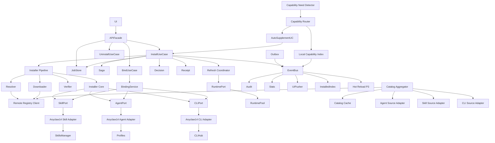

# AnyClaw 云端市场模块规格

> 这是 AnyClaw 云端市场的**模块规格文档**，给后端研发阅读。
> 回答：**每个模块的职责、接口、输入、输出、上下游、失败语义、可观测挂点、包路径**。
> 整体架构与数据流见 `云端市场架构设计.md`；协议与 API 见 `云端市场技术规范.md`。
>
> **契约一致性**：API 路径 / JSON 字段 / DB schema / 枚举值 / 事件名 / 错误码以 `云端市场技术规范.md` §0 为唯一权威来源，本文与 §0 冲突时以 §0 为准。本文只定 Go 类型与接口签名，不重复定义契约。

---

## 一、文档约定

### 1.1 三态分类

每个模块都标注接入方式：

- `复用` 直接使用 1.4 现有模块
- `扩展` 在 1.4 现有模块上加扩展点
- `新增` 全新模块

### 1.2 接口分两类

- `HTTP 接口` 模块对外的 REST API
- `代码接口` 模块之间的 Go 函数 / 方法签名

### 1.3 失败语义统一表达

- **可重试**：是 / 否
- **是否需补偿**：是 / 否
- **触发的事件**：失败时通过 EventBus 发布的事件名
- **错误码映射**：详见 `云端市场技术规范.md` 第 2 章

### 1.4 可观测挂点

每个模块至少声明：

- **trace span 名**
- **关键 metric**
- **结构化日志 key**

### 1.5 跨文档约束

- 枚举、事件名、请求 / 响应 JSON 字段以 `云端市场技术规范.md` §0 与对应章节为准
- 本文中的 Go 类型与接口服从技术规范，不单独定义第二套契约

---

## 二、统一对象模型

### 2.1 Artifact

```go
type Artifact struct {
    ID            string
    Kind          ArtifactKind
    Source        string
    Name          string
    Summary       string
    Description   string
    Version       string
    LatestVersion string
    Installed     bool           // 由 receipt 聚合得出
    Bound         bool           // 由 bindings 聚合得出
    Active        bool           // 由 bindings 聚合得出
    Status        ArtifactStatus // 派生字段，由聚合器统一计算
    RiskLevel     string
    TrustLevel    string
    Permissions   []string
    Compatibility Compatibility
    HitSignals    []string
    Score         float64
    TargetHints   []string
    InstallHint   string
    IconURL       string
    UpdatedAt     time.Time
}
```

### 2.2 BindingTarget / Binding

```go
type BindingTarget struct {
    Type string  // main_agent | persistent_subagent | workspace | runtime_global （§0.1）
    ID   string  // 归一化后必填；main_agent 由 Gateway 解析为 active main_agent_profile_id
}

type Binding struct {
    ID            string
    ArtifactID    string
    ArtifactKind  ArtifactKind
    TargetType    string  // BindingTargetType（§0.1）
    TargetID      string  // 持久化非空
    Version       string
    Source        string
    ReceiptRef    string
    InstalledVia  string  // user | agent | system（§0.4）
    Decision      string  // auto | ask | block（§0.4）
    Status        string  // bound | active | disabled
    CreatedAt     time.Time
    UpdatedAt     time.Time
}
```

### 2.3 Receipt

```go
type Receipt struct {
    ID              string
    ArtifactID      string
    Kind            ArtifactKind
    Version         string
    PreviousVersion string
    Operation       string  // install | upgrade | restore（§0.6；事件 payload 从这里取）
    Source          string
    InstalledAt     time.Time
    InstalledBy     string  // user | agent | system（§0.4）
    Decision        string  // auto | ask | block（§0.4）
    Checksum        string
    Signature       string
    LocalPath       string
    BindingTargets  []BindingTarget  // 对象数组，不是 []string（§0.4）
    RiskLevel       string
    TrustLevel      string
    Compatibility   Compatibility
    Permissions     []string
    Status          string  // 存储态：installing | installed | rolled_back | failed | uninstalled | quarantined；领域态派生见 §0.3
    SagaSteps       []SagaStep
}
```

### 2.4 Job

```go
type Job struct {
    ID             string
    Type           string  // install | upgrade | auto_supplement（uninstall / bind / unbind 同步，不入 Job，§0.7）
    State          string  // pending | running | rolling_back | succeeded | failed | canceled | rolled_back | interrupted（§0.5）
    CurrentStep    string
    Progress       float64
    Error          *JobError
    IdempotencyKey string
    ArtifactID     string
    Version        string
    CreatedAt      time.Time
    UpdatedAt      time.Time
    FinishedAt     *time.Time
}

type JobError struct {
    Code    string                 // 见技术规范 §2.2 / §2.3
    Message string
    Step    string
    Details map[string]interface{} // COMPENSATION_FAILED 时必含 original_code / compensation_step / partial_state（§0.5）
}
```

### 2.5 ExecutionPlan

```go
type ExecutionPlan struct {
    Mode       string
    TargetID   string
    Confidence float64
    Reason     string
    Candidates []Candidate
}
```

### 2.6 Decision

```go
type Decision struct {
    Result    string
    Reason    string
    Score     float64
    BlockedBy string
}
```

---

## 三、模块总览

### 3.1 接入层

| 模块 | 接入方式 | 包路径 | 阶段 |
| --- | --- | --- | --- |
| Market Shell UI | 扩展 | `ui/src/pages/Market` | P1 |
| Market API Facade | 扩展 | `pkg/gateway/gateway_market_*.go` | P1 |
| UI Pusher | 新增 | `pkg/gateway/sse/` | P1 |

### 3.2 应用服务层

| 模块 | 接入方式 | 包路径 | 阶段 |
| --- | --- | --- | --- |
| InstallUseCase | 新增 | `pkg/marketplace/app/install_usecase.go` | P1 |
| BindUseCase | 新增 | `pkg/marketplace/app/bind_usecase.go` | P1 |
| UninstallUseCase | 新增 | `pkg/marketplace/app/uninstall_usecase.go` | P1 |
| AutoSupplementUseCase | 新增 | `pkg/marketplace/app/auto_supplement_usecase.go` | P2 |
| Saga Engine | 新增 | `pkg/marketplace/app/saga.go` | P1 |
| Job Store | 新增 | `pkg/marketplace/jobs/store.go` | P1 |
| Job Runner | 新增 | `pkg/marketplace/jobs/runner.go` | P1 |

### 3.3 领域服务层

| 模块 | 接入方式 | 包路径 | 阶段 |
| --- | --- | --- | --- |
| Control Plane Builder | 扩展 | `pkg/marketplace/control_plane.go` | P1 |
| Catalog Aggregator | 扩展 | `pkg/marketplace/aggregator.go` | P1 |
| Catalog Cache | 新增 | `pkg/marketplace/cache/` | P1 |
| Installer Pipeline | 新增 | `pkg/marketplace/installer/pipeline.go` | P1 |
| Resolver | 新增 | `pkg/marketplace/installer/resolver.go` | P1 |
| Package Downloader | 新增 | `pkg/marketplace/installer/downloader.go` | P1 |
| Package Verifier | 新增 | `pkg/marketplace/installer/verifier.go` | P1 |
| Installer Core | 扩展 | `pkg/marketplace/installer/core.go` | P1 |
| Receipt Writer | 新增 | `pkg/marketplace/receipt/writer.go` | P1 |
| Installed Index | 新增 | `pkg/marketplace/installed/index.go` | P1 |
| Candidate Filter | 新增 | `pkg/marketplace/decision/filter.go` | P2 |
| Decision Policy | 新增 | `pkg/marketplace/decision/policy.go` | P2 |
| Binding Service | 扩展 | `pkg/marketplace/binding/service.go` | P1 |
| Refresh Coordinator | 扩展 | `pkg/marketplace/refresh/coordinator.go` | P1 |

### 3.4 来源适配层

| 模块 | 接入方式 | 包路径 | 阶段 |
| --- | --- | --- | --- |
| Agent Source Adapter | 扩展 | `pkg/marketplace/sources/agent.go` | P1 |
| Skill Source Adapter | 扩展 | `pkg/marketplace/sources/skill.go` | P1 |
| CLI Source Adapter | 扩展 | `pkg/marketplace/sources/cli.go` | P1 |

### 3.5 远端访问层

| 模块 | 接入方式 | 包路径 | 阶段 |
| --- | --- | --- | --- |
| Remote Registry Client | 新增 | `pkg/marketplace/registry/client.go` | P1 |

### 3.6 端口与适配层

| 模块 | 接入方式 | 包路径 | 阶段 |
| --- | --- | --- | --- |
| SkillCapabilityPort | 新增 | `pkg/marketplace/ports/skill.go` | P1 |
| AgentCapabilityPort | 新增 | `pkg/marketplace/ports/agent.go` | P1 |
| CLICapabilityPort | 新增 | `pkg/marketplace/ports/cli.go` | P1 |
| RuntimeCapabilityPort | 新增 | `pkg/marketplace/ports/runtime.go` | P1 |
| AnyClaw14 Adapters | 新增 | `pkg/marketplace/adapters/anyclaw14/` | P1 |

### 3.7 事件与可观测层

| 模块 | 接入方式 | 包路径 | 阶段 |
| --- | --- | --- | --- |
| EventBus | 新增 | `pkg/marketplace/events/bus.go` | P1 |
| Outbox | 新增 | `pkg/marketplace/events/outbox.go` | P1 |
| Audit Logger | 新增 | `pkg/marketplace/observability/audit.go` | P1 |
| Stats Collector | 新增 | `pkg/marketplace/observability/stats.go` | P1 |
| Tracing Helper | 新增 | `pkg/marketplace/observability/trace.go` | P1 |

### 3.8 智能补能层（P2）

| 模块 | 接入方式 | 包路径 | 阶段 |
| --- | --- | --- | --- |
| Capability Need Detector | 新增 | `pkg/runtime/capability/detector.go` | P2 |
| Local Capability Index | 新增 | `pkg/runtime/capability/index.go` | P2 |
| Capability Router | 新增 | `pkg/runtime/capability/router.go` | P2 |
| Main-Agent 市场工具 | 新增 | `pkg/capability/agents/market_tools.go` | P2 |

### 3.9 热加载层（P3）

| 模块 | 接入方式 | 包路径 | 阶段 |
| --- | --- | --- | --- |
| Hot Reload Coordinator | 新增 | `pkg/runtime/hotreload/coordinator.go` | P3 |
| RefreshScope | 新增 | `pkg/runtime/hotreload/scope.go` | P3 |

---

## 四、接入层模块规格

### 4.1 Market Shell UI

#### 职责

- 展示 `agent / skill / cli` 与 `local / cloud`
- 触发搜索 / 安装 / 绑定 / 卸载 / 升级
- 状态机视觉化（available / installing / installed / bound / active / disabled / error / rolled_back / quarantined）
- 安装确认页（permissions / risk / 兼容）
- Auto 撤销窗口与通知中心
- 错误态分类展示

#### 上下游

- 上游：用户交互、聊天 / 任务入口
- 下游：Market API Facade（HTTP）+ UI Pusher（SSE/WS）

#### 接入方式

`扩展`

#### 扩展点

- `Auto / Ask / Block` 决策态展示
- score / trust / risk / hit_signals 字段
- Job 进度条（5 步）
- 通知中心
- 错误码到用户文案的映射表

#### 失败语义

- 网络错误：3 次指数退避
- 服务端错误：toast + 详情入口

#### 可观测挂点

- 前端 metric：`market_ui_action_total{action}`
- 错误上报：通过 audit endpoint

---

### 4.2 Market API Facade

#### 职责

- 统一市场 HTTP 入口
- 鉴权 / 限流 / 协议适配 / 审计 header 处理
- 转发到 Application Service 或查询型 Domain Service（**不直调存储 / 适配器层**）

#### HTTP 接口

| Method | Path | 说明 |
| --- | --- | --- |
| GET | `/market/control-plane` | 市场蓝图 |
| GET | `/market/artifacts` | 列表（含远端） |
| GET | `/market/artifacts/{id}` | 详情 |
| GET | `/market/artifacts/{id}/versions` | 版本列表 |
| POST | `/market/install` | 异步安装，返回 job_id |
| POST | `/market/uninstall` | 同步卸载，返回 Receipt |
| POST | `/market/upgrade` | 异步升级 |
| GET | `/market/jobs/{id}` | 查询 Job |
| POST | `/market/jobs/{id}/cancel` | 取消 Job |
| GET | `/market/jobs?status=running` | 列表活跃 Job |
| GET | `/market/bindings` | 绑定列表 |
| POST | `/market/bindings` | 创建绑定 |
| DELETE | `/market/bindings/{id}` | 删除绑定 |
| GET | `/market/installed` | 已安装索引 |
| POST | `/market/refresh` | 手动刷新 runtime |
| GET | `/market/events` | SSE 事件流 |

#### 代码接口

```go
type MarketAPIFacade interface {
    HandleControlPlane(w, r)
    HandleArtifacts(w, r)
    HandleArtifactDetail(w, r)
    HandleArtifactVersions(w, r)
    HandleInstall(w, r)
    HandleUninstall(w, r)
    HandleUpgrade(w, r)
    HandleBindings(w, r)
    HandleJob(w, r)
    HandleJobsList(w, r)
    HandleJobCancel(w, r)
    HandleInstalled(w, r)
    HandleRefresh(w, r)
    HandleEvents(w, r)
}
```

#### 上下游

- 上游：UI、Main-Agent 工具
- 下游：Application Service 各 UseCase、Catalog / Versions 查询服务、Job Store、UI Pusher

#### 失败语义

- 输入校验失败：400 + `INVALID_QUERY` / `INVALID_BODY`
- 鉴权失败：401 / 403
- 限流：429 + retry-after
- 服务端错误：500 + `INTERNAL_ERROR`

#### 可观测挂点

- trace span：`marketplace.api.{handler}`
- metric：`marketplace_api_request_total{path, status}`
- 日志 key：`request_id, idempotency_key, artifact_id, job_id`

---

### 4.3 UI Pusher

#### 职责

- 订阅 EventBus，向已连接 UI 推送状态变化
- 支持 `job.state_changed / artifact.installed / artifact.installation_failed / artifact.rolled_back / artifact.uninstalled / binding.failed / capability.refresh_failed`

#### 代码接口

```go
type UIPusher interface {
    Connect(ctx, w, r)
    Subscribe(eventNames []string)
    Push(event Event)
}
```

#### 失败语义

- 连接断开：客户端重连
- 推送失败：丢弃，不影响主流程

#### 可观测挂点

- metric：`marketplace_ui_push_total{event}`、`marketplace_ui_active_connections`

---

## 五、应用服务层模块规格

### 5.1 InstallUseCase

#### 职责

封装安装的完整业务流程，编排 Saga：

```text
Resolve → Decide → Download → Verify → Install → Receipt(installing) → Refresh → Receipt(installed)
```

#### 代码接口

```go
type InstallUseCase struct {
    saga      *Saga
    jobStore  JobStore
    registry  RegistryClient
    installer *InstallerPipeline
    decision  *DecisionPolicy
    receipts  *ReceiptWriter
    refresh   *RefreshCoordinator
    bus       EventBus
    tracer    trace.Tracer
}

func (u *InstallUseCase) Run(ctx, req InstallRequest) (JobID, error)
func (u *InstallUseCase) RunSync(ctx, req InstallRequest) (*Receipt, error)
```

#### 输入输出

```go
type InstallRequest struct {
    ArtifactID     string
    Version        string
    UserConfirmed  bool             // UI Ask 已确认（DecisionPolicy 输入之一），不直接等于 decision（§0.4）
    IdempotencyKey string
    RequestedBy    string           // user | agent | system（§0.4）
    BindingTargets []BindingTarget  // §0.4；main_agent 由 Gateway 提前归一化
}
```

#### 上下游

- 上游：Market API Facade、AutoSupplementUseCase、Main-Agent 工具
- 下游：Saga / JobStore / Registry / Installer / Decision / Receipt / Refresh / EventBus

#### 失败语义

> 详细矩阵以技术规范 §12.1 为准；事件名按 §0.6；可重试按 §0.8；Job 状态按 §0.5。

| 失败位置 | 可重试 | 补偿 | 事件 | 错误码 |
| --- | --- | --- | --- | --- |
| Resolve | 按 §0.8 错误码 | 无 | `artifact.installation_failed` | `ARTIFACT_NOT_FOUND / NO_COMPATIBLE_VERSION / NETWORK_UNREACHABLE / UPSTREAM_TIMEOUT / RATE_LIMITED` |
| Decide=Block | 否 | 无 | `policy.decision` + `artifact.installation_failed` | `POLICY_BLOCKED` |
| Download | 是 | 删 tmp | `artifact.installation_failed` | `DOWNLOAD_FAILED` |
| Verify | 否 | 删 tmp | `artifact.rolled_back` | `CHECKSUM_MISMATCH / SIGNATURE_INVALID` |
| Install | 否 | Port.Uninstall | `artifact.rolled_back` | `INSTALL_FAILED` |
| Receipt | 否 | status=rolled_back | `artifact.rolled_back` | `RECEIPT_FAILED` |
| 补偿失败 | 否 | 无（人工恢复） | `artifact.installation_failed` | `COMPENSATION_FAILED`（§0.5） |
| Refresh | 是 | 无（幂等） | `capability.refresh_failed` | `RUNTIME_REFRESH_FAILED` |

#### 可观测挂点

- trace：`marketplace.install` + 7 个子 span
- metric：`marketplace_install_total{kind, result}`、`marketplace_install_duration_seconds{kind, step}`
- 日志：`request_id, job_id, artifact_id, version, kind, step, decision`

---

### 5.2 BindUseCase

#### 职责

封装绑定流程，使用 Outbox 模式保证持久化与运行态一致性：

```text
Validate → Persist(transactional with Outbox) → Apply → Refresh
```

#### 代码接口

```go
func (u *BindUseCase) Run(ctx, req BindRequest) (*Binding, error)
func (u *BindUseCase) Remove(ctx, bindingID string) error
```

#### 输入输出

```go
type BindRequest struct {
    ArtifactID     string
    Version        string
    TargetType     string
    TargetID       string
    IdempotencyKey string
    InstalledVia   string
}
```

#### 失败语义

| 失败位置 | 可重试 | 补偿 | 事件 |
| --- | --- | --- | --- |
| Validate | 否 | 无 | `binding.failed` |
| Persist | 是 | 无（事务回滚） | `binding.failed` |
| Apply | 否 | 删 binding 行 | `binding.failed` |
| Refresh | 是 | 无（幂等） | `capability.refresh_failed` |

#### 可观测挂点

- trace：`marketplace.bind` + 4 子 span
- metric：`marketplace_bind_total{kind, target_type, result}`

---

### 5.3 UninstallUseCase

#### 职责

```text
RemoveBindings → CleanupFiles → Receipt(uninstalled) → Refresh
```

#### 代码接口

```go
func (u *UninstallUseCase) Run(ctx, artifactID string) (*Receipt, error)
```

#### 失败语义

- RemoveBindings 失败：回滚 binding 持久化
- Cleanup 失败：写 receipt(failed) + audit
- Refresh 失败：可重试
- HTTP 语义：**同步返回**，不进入 JobStore

#### 可观测挂点

- trace：`marketplace.uninstall`
- metric：`marketplace_uninstall_total{result}`

---

### 5.4 AutoSupplementUseCase（P2）

#### 职责

封装自动补能完整链路：

```text
Detect → IndexLookup → CloudSearch → Filter → Decide → Install → Refresh
```

#### 代码接口

```go
func (u *AutoSupplementUseCase) Run(ctx, need CapabilityNeed) (*ExecutionPlan, error)
```

#### 失败语义

- 任意一步失败：返回 `ExecutionPlan{ Mode: block, Reason: ... }`
- 安装失败：标记 `Mode: ask_user, Candidates: ...`

#### 可观测挂点

- trace：`marketplace.auto_supplement`
- metric：`marketplace_auto_supplement_total{decision, result}`

---

### 5.5 Saga Engine

#### 职责

通用 Saga 模式实现：

- Step 串行执行
- 每步定义 Forward / Compensate / IsIdempotent
- 失败时反向调用 Compensate
- 支持暂停 / 续作（与 JobStore 配合）

#### 代码接口

```go
type SagaStep interface {
    Name() string
    Forward(ctx, state SagaState) error
    Compensate(ctx, state SagaState) error
    IsIdempotent() bool
}

type Saga struct{}
func (s *Saga) Run(ctx, steps []SagaStep, state SagaState) error
```

#### 失败语义

- Forward 失败：反向 Compensate 已成功的步骤
- Compensate 失败：log + audit，状态置 `compensation_failed`，需人工介入

#### 可观测挂点

- trace：`marketplace.saga.{name}.{step}.forward / compensate`
- metric：`marketplace_saga_step_total{name, step, result}`

---

### 5.6 Job Store + Job Runner

#### 职责

- 长任务持久化（SQLite `jobs` 表）
- 状态机：`pending → running → rolling_back → rolled_back | succeeded | failed | canceled`
- 进程重启可恢复 `running` → `interrupted`
- Idempotency key 去重

#### 代码接口

```go
type JobStore interface {
    Create(ctx, job Job) (JobID, error)
    Update(ctx, id JobID, patch JobPatch) error
    Get(ctx, id JobID) (Job, error)
    List(ctx, filter JobFilter) ([]Job, error)
    FindByIdempotencyKey(ctx, key string) (*Job, error)
    Cancel(ctx, id JobID) error
}

type JobRunner interface {
    Submit(ctx, runner func() error) JobID
}
```

#### 失败语义

- Job 失败：写 `error` 字段 + 触发 EventBus
- Saga 补偿成功：`running → rolling_back → rolled_back`，发 `artifact.rolled_back`
- **Saga 补偿本身失败**：仍落 `failed`，`error.code = COMPENSATION_FAILED`，`error.details` 必含 `original_code / compensation_step / partial_state`（§0.5）
- 进程崩溃恢复：扫描 `running` 标记为 `interrupted`，由用户决定重试

#### 可观测挂点

- metric：`marketplace_job_active`、`marketplace_job_total{type, state}`
- trace：每个 Job 起独立 trace context

---

## 六、领域服务层模块规格

### 6.1 Control Plane Builder

#### 职责

构建市场控制面视图（**只读本地**，不调远端）：

- 来源列表（来自配置）
- 支持的 kind
- 当前策略
- 本地统计（从 Installed Index 读）

#### 代码接口

```go
func BuildControlPlaneView(ctx, mainRuntime *runtime.MainRuntime) (ControlPlaneView, error)
```

#### 接入方式

`扩展`

#### 上下游

- 上游：Market API Facade
- 下游：Installed Index、Source 配置

#### 失败语义

- 配置缺失：返回默认空 ControlPlane
- 不调用远端接口

#### 可观测挂点

- trace：`marketplace.control_plane.build`

---

### 6.2 Catalog Aggregator

#### 职责

聚合 local + cloud 条目，统一输出 `ArtifactList`：

- local：从 Source Adapter 拿
- cloud：经 Catalog Cache → Remote Registry Client

#### 代码接口

```go
func ListArtifactsWithTotal(ctx, mainRuntime, filter ArtifactFilter) (ArtifactList, error)
func GetArtifactDetail(ctx, mainRuntime, id string) (*Artifact, error)
func ListArtifactVersions(ctx, id string) ([]ArtifactVersion, error)
```

#### 接入方式

`扩展`

#### 上下游

- 上游：Market API Facade
- 下游：Source Adapter（Agent / Skill / CLI）、Catalog Cache、Remote Registry Client

#### 失败语义

- 远端不可达：降级仅返回 local，UI 显示横幅
- 缓存命中：直接返回

#### 可观测挂点

- trace：`marketplace.aggregator.list`
- metric：`marketplace_aggregator_total{source, result}`、`marketplace_aggregator_cache_hit_total`

---

### 6.3 Catalog Cache

#### 职责

短 TTL（默认 60s）+ Stale-While-Revalidate：

- 命中且新鲜：直接返回
- 命中但过期：返回旧数据 + 异步刷新
- 未命中：阻塞拉取并缓存

#### 代码接口

```go
type CatalogCache interface {
    TryGet(key string) (*CachedResult, bool)
    Put(key string, result interface{}, ttl time.Duration)
    Invalidate(key string)
}
```

#### 实现

- 内存 LRU（默认 1000 条）
- key = `kind|source|q|filter_hash`

#### 失败语义

- 缓存写入失败：不影响主流程

#### 可观测挂点

- metric：`marketplace_cache_hit_total{kind}`、`marketplace_cache_miss_total{kind}`

---

### 6.4 Installer Pipeline（五步法）

#### 职责

把五步串成可观测、可补偿的流水线。

#### 子模块

##### 6.4.1 Resolver

```go
func Resolve(ctx, req ResolveRequest) (ResolvedArtifact, error)
```

- 输入：`ArtifactID + 客户端环境`
- 输出：`version / download_url / checksum / signature / compatibility / dependencies / risk_level / trust_level`
- 上游：Remote Registry Client
- 失败：可重试

##### 6.4.2 Package Downloader

```go
func Download(ctx, url string, expectedSize int64) (tmpFile string, error)
```

- 输入：URL + 预期大小
- 输出：临时文件路径
- 上游：Distribution Service（302 → 对象存储）
- 失败：可重试，**失败必删 tmp 文件**

##### 6.4.3 Package Verifier

```go
func Verify(ctx, file string, expected Verification) error
```

- Phase 1：sha256
- Phase 4：签名
- 失败：**不可重试**，触发 Saga 反向

##### 6.4.4 Installer Core

按 kind 分流到 Capability Port：

```go
func Install(ctx, kind, file string, manifest Manifest) (*InstalledItem, error)
```

- 失败：**不可重试**（已有部分落地），触发 Saga 反向

#### 失败语义

详见 §5.1 InstallUseCase 失败语义表。

#### 可观测挂点

- 每个子步骤独立 trace span：
  - `marketplace.install.resolve`
  - `marketplace.install.download`
  - `marketplace.install.verify`
  - `marketplace.install.install`
- metric：`marketplace_install_step_duration_seconds{step}`、`marketplace_install_step_total{step, result}`

---

### 6.5 Receipt Writer

#### 职责

写入安装回执（事件日志，append-only）：

- 路径：`~/.anyclaw/marketplace/receipts/<kind>/<publisher>__<name>/<version>.json`
- 状态机：`installing → installed / rolled_back / failed / uninstalled / quarantined`

#### 代码接口

```go
type ReceiptWriter interface {
    Begin(ctx, req ReceiptBeginRequest) (*Receipt, error)
    Update(ctx, id string, patch ReceiptPatch) error
    Finalize(ctx, id string, status string) error
    Get(ctx, id string) (*Receipt, error)
}
```

#### 失败语义

- 写入失败：retry 3 次，失败则降级到内存（同时 audit）
- 不影响主流程

#### 可观测挂点

- metric：`marketplace_receipt_write_total{status, result}`

---

### 6.6 Installed Index

#### 职责

已安装快照（与 Receipt 对应：Receipt 是事件日志、Index 是状态快照）：

- 当前每个 artifact 的最新版本
- 当前绑定状态
- 聚合派生 `Artifact.Status / Bound / Active`
- 用于 UI 列表与 Capability Index

#### 代码接口

```go
type InstalledIndex interface {
    Add(ctx, item InstalledItem) error
    Update(ctx, id string, patch InstalledPatch) error
    Remove(ctx, id string) error
    Get(ctx, id string) (*InstalledItem, error)
    List(ctx, filter InstalledFilter) ([]InstalledItem, error)
}
```

#### 实现

- 本地 SQLite `installed` 表
- 订阅 EventBus 自动维护
- 对外统一经聚合器按 `receipt + bindings + quarantined` 规则派生状态，UI / Gateway / Adapter 不重复计算

#### 失败语义

- 写入失败：从 receipt 重建
- 索引可由 receipt 重放

#### 可观测挂点

- metric：`marketplace_installed_index_size`

---

### 6.7 Candidate Filter（P2）

#### 职责

确定性硬过滤：

- 兼容性（OS / arch / AnyClaw 版本）
- 黑白名单
- 已装版本去重
- 依赖检查

#### 代码接口

```go
func Filter(ctx, candidates []Candidate, env Env) []Candidate
```

#### 失败语义

- 设计上不引入业务失败路径（纯函数）
- 输入异常时返回空列表

#### 可观测挂点

- metric：`marketplace_filter_total{reason_drop}`

---

### 6.8 Decision Policy（P2）

#### 职责

基于 risk / trust / score / kind / 用户策略输出 `Auto / Ask / Block`：

- `kind=skill + verified + risk=low + score>=阈值 + 兼容 + Workspace 允许 auto` → `Auto`
- `risk=high / 校验失败 / 黑名单 / 不兼容` → `Block`
- 其他 → `Ask`

#### 代码接口

```go
type DecisionPolicy interface {
    Evaluate(ctx, candidate Candidate, env Env, userPolicy UserPolicy) Decision
}
```

#### 失败语义

- 设计上不引入业务失败路径（纯函数 + 配置）
- 配置缺失：默认 `Ask`

#### 可观测挂点

- metric：`marketplace_decision_total{result, kind, risk}`
- 事件：`policy.decision`（每次决策记录）

---

### 6.9 Binding Service

#### 职责

合并原 `Binding Repository` + `Binding Applier`，提供统一服务：

- 持久化（SQLite + Outbox）
- 校验
- 应用到 runtime（通过 Capability Port）

#### 代码接口

```go
type BindingService interface {
    Validate(ctx, req BindRequest) error
    Persist(ctx, binding Binding) error
    Apply(ctx, binding Binding) error
    Remove(ctx, id string) error
    List(ctx, filter BindingFilter) ([]Binding, error)
    LoadBindings(ctx, mainRuntime) ([]Binding, error)
}
```

#### 接入方式

`扩展`（合并原拆开的 2 个模块）

#### 失败语义

详见 §5.2 BindUseCase 失败语义表。

#### 可观测挂点

- trace：`marketplace.binding.{validate|persist|apply|remove}`
- metric：`marketplace_binding_total{op, result}`

---

### 6.10 Refresh Coordinator

#### 职责

- 接收 Refresh 请求 + RefreshScope
- 调用 RuntimeCapabilityPort
- 失败隔离

#### 代码接口

```go
type RefreshCoordinator interface {
    Refresh(ctx, scope RefreshScope) error
}

type RefreshScope struct {
    Kind        string  // global | workspace | agent | session
    WorkspaceID string
    AgentID     string
    SessionID   string
}
```

#### 行为

- P1 / P2：对外只允许 `global | workspace | agent`
- `session` 仅供 P3 热加载内部使用，不写入 binding / receipt
- Phase 1：Skill / Agent 安装 → `InvalidateAll`；Binding 写到具体 Agent → `InvalidateByAgent`
- Phase 3：精细化 RefreshScope 替代 InvalidateAll

#### 失败语义

- Refresh 失败：可重试
- 失败发布 `capability.refresh_failed` 事件

#### 可观测挂点

- trace：`marketplace.refresh`
- metric：`marketplace_refresh_total{scope, result}`

---

## 七、来源适配层模块规格

### 7.1 Agent Source Adapter

#### 职责

把"Agent 来源"映射成统一 `Artifact`：

- local：从 Agent Profiles 列出
- cloud：从 Remote Registry Client 列出，并替换原 `cloudAgentArtifacts()` 过渡实现

#### 代码接口

```go
type AgentSource interface {
    ListLocal(ctx) ([]Artifact, error)
    ListCloud(ctx, filter) ([]Artifact, error)
    GetDetail(ctx, id) (*Artifact, error)
    ListVersions(ctx, id string) ([]ArtifactVersion, error)
}
```

#### 接入方式

`扩展`

#### 失败语义

- 远端失败：降级仅返回 local
- local 失败：返回空

---

### 7.2 Skill Source Adapter

#### 职责

把"Skill 来源"映射成 `Artifact`：

- local：从 SkillsManager 列出
- cloud：从 Remote Registry Client 列出

#### 代码接口

```go
type SkillSource interface {
    ListLocal(ctx) ([]Artifact, error)
    ListCloud(ctx, filter) ([]Artifact, error)
    GetDetail(ctx, id) (*Artifact, error)
    ListVersions(ctx, id string) ([]ArtifactVersion, error)
}
```

#### 失败语义

同 §7.1。

---

### 7.3 CLI Source Adapter

#### 职责

把"CLI 来源"映射成 `Artifact`：

- local：从 CLIHub 列出
- cloud：从 Remote Registry Client 列出

#### 代码接口

```go
type CLISource interface {
    ListLocal(ctx) ([]Artifact, error)
    ListCloud(ctx, filter) ([]Artifact, error)
    GetDetail(ctx, id) (*Artifact, error)
    ListVersions(ctx, id string) ([]ArtifactVersion, error)
}
```

#### 失败语义

同 §7.1。

---

## 八、远端访问层模块规格

### 8.1 Remote Registry Client

#### 职责

合并原 `Catalog Client` + `Retrieval Client`，统一负责所有与云端 Registry 的通信：

- 协议 v1 契约（X-Protocol-Version、Idempotency-Key、错误码）
- HTTP client / auth / retry / circuit breaker / timeout
- 缓存（与 Catalog Cache 协同）
- 错误码映射

#### 代码接口

```go
type RegistryClient interface {
    // Catalog
    SearchCatalog(ctx, filter) (*CatalogPage, error)
    GetArtifact(ctx, id string) (*Artifact, error)
    ListVersions(ctx, id string) ([]ArtifactVersion, error)

    // Resolve & Download
    Resolve(ctx, req ResolveRequest) (*ResolvedArtifact, error)
    DownloadURL(ctx, id, version string) (*DownloadInfo, error)

    // Retrieval
    SearchHybrid(ctx, query HybridQuery) ([]ScoredCandidate, error)
}
```

#### 内部组成

- `httpClient` 带超时与 keepalive
- `auth` 处理 token / refresh
- `retry` 指数退避（仅对可重试错误码）
- `circuitBreaker` 故障隔离
- `errorMapper` 协议错误码 → 本地错误码

#### 失败语义

| 服务端错误码 | 客户端处理 |
| --- | --- |
| `404 ARTIFACT_NOT_FOUND` | 不可重试 |
| `409 NO_COMPATIBLE_VERSION` | 不可重试 |
| `403 ARTIFACT_BLOCKED / DOWNLOAD_DENIED` | 不可重试 |
| `422 CHECKSUM_MISMATCH / SIGNATURE_INVALID` | 不可重试，触发 Saga |
| `429 RATE_LIMITED` | 可重试（带 retry-after） |
| `504 UPSTREAM_TIMEOUT` / `500 INTERNAL_ERROR` | 可重试 |
| 网络错误 | 可重试 |

#### 可观测挂点

- trace：`marketplace.registry.{op}`
- metric：`marketplace_registry_request_total{op, status_code}`、`marketplace_registry_duration_seconds{op}`、`marketplace_registry_circuit_state`

---

## 九、端口与适配层模块规格

### 9.1 SkillCapabilityPort

#### 接口

```go
type SkillCapabilityPort interface {
    Install(ctx, pkg SkillPackage) (*InstalledSkill, error)
    Activate(ctx, skillID string, target BindingTarget) error
    Deactivate(ctx, skillID string, target BindingTarget) error
    Uninstall(ctx, skillID string) error
    List() []InstalledSkill
}
```

#### 1.4 Adapter

`pkg/marketplace/adapters/anyclaw14/skill_adapter.go`：

- `Install` → `SkillsManager.Register(...)`
- `Activate` → 在 binding 表关联 + 触发 `InvalidateByAgent`
- `Deactivate` → 反向

#### 失败语义

- Install 失败：清理已落地文件
- Activate 失败：回滚 binding

---

### 9.2 AgentCapabilityPort

#### 接口

```go
type AgentCapabilityPort interface {
    Install(ctx, pkg AgentPackage) (*InstalledAgent, error)
    Bind(ctx, agentID string, target BindingTarget) error
    Unbind(ctx, agentID string, target BindingTarget) error
    Uninstall(ctx, agentID string) error
    List() []InstalledAgent
}
```

#### 1.4 Adapter

- `Install` → 写入 Agent Profile 目录 + Config
- `Bind` → 注册到 main_agent / persistent_subagent / workspace
- `Unbind` → 反向

#### 失败语义

- 写 profile 失败：可重试
- bind 失败：触发 binding 补偿

---

### 9.3 CLICapabilityPort

#### 接口

```go
type CLICapabilityPort interface {
    Install(ctx, pkg CLIPackage) (*InstalledCLI, error)
    Authorize(ctx, cliID string, scope CLIAuthScope) error
    Uninstall(ctx, cliID string) error
    List() []InstalledCLI
}
```

#### 1.4 Adapter

- `Install` → CLIHub 注册 + 落地到 user-bin / workspace-bin
- `Authorize` → 写 CLI 二次授权配置（白名单命令 + 允许的 Agent）

#### 失败语义

- 落地失败：清理路径
- 授权失败：回滚 CLI 注册

---

### 9.4 RuntimeCapabilityPort

#### 接口

```go
type RuntimeCapabilityPort interface {
    Refresh(ctx, scope RefreshScope) error
    InvalidateAll(ctx) error
    InvalidateByAgent(ctx, agentID string) error
    AvailableAgents() []string
}
```

#### 1.4 Adapter

- Phase 1：调 `runtimePool.InvalidateAll() / InvalidateByAgent(...)`
- Phase 3：调 Hot Reload Coordinator

#### 失败语义

- 失败可重试
- 失败发布 `capability.refresh_failed` 事件

---

## 十、事件与可观测层模块规格

### 10.1 EventBus

#### 职责

进程内事件总线（基于 channel）：

- 注册订阅者
- 发布事件
- 同步或异步分发（默认异步）

#### 代码接口

```go
type EventBus interface {
    Subscribe(eventName string, handler func(Event)) Unsubscribe
    Publish(event Event) error
}

type Event struct {
    Name      string
    Timestamp time.Time
    Payload   interface{}
    TraceID   string
}
```

#### 关键事件清单

| 事件名 | 触发时机 | 主要订阅者 |
| --- | --- | --- |
| `artifact.installed` | InstallUseCase 成功 | Audit / Stats / UI / Index / HotReload |
| `artifact.installation_failed` | InstallUseCase 失败 | Audit / Stats / UI |
| `artifact.rolled_back` | Saga 完成回滚 | Audit / Stats / UI |
| `artifact.uninstalled` | UninstallUseCase 成功 | Audit / Stats / UI / Index |
| `artifact.uninstallation_failed` | UninstallUseCase 失败 | Audit / Stats / UI |
| `binding.applied` | BindUseCase 成功 | Audit / UI / Index |
| `binding.failed` | BindUseCase 失败 | Audit / UI |
| `binding.removed` | RemoveBinding 成功 | Audit / UI / Index |
| `capability.refreshed` | RefreshCoordinator 完成 | Index / HotReload |
| `capability.refresh_failed` | Refresh / HotReload 失败 | Audit / Stats / UI |
| `policy.decision` | Decision Policy 输出决策 | Audit / Stats |
| `agent.market_tool_called` | Main Agent 调用市场工具 | Audit / Stats |
| `job.state_changed` | JobStore 状态迁移 | UI |

`artifact.installed` 的 payload 必须带 `operation: install | upgrade | restore`。

#### 失败语义

- 订阅者 panic：捕获 + log，不影响发布
- 推送失败：丢弃（关键事件走 Outbox）

#### 可观测挂点

- metric：`marketplace_event_publish_total{event}`、`marketplace_event_handler_duration_seconds{event}`

---

### 10.2 Outbox

#### 职责

关键事件持久化（SQLite `outbox` 表）+ 异步发布：

- 写持久化与写 Outbox **同事务**
- 后台 publisher 扫描未发布事件，调 EventBus
- 至少一次送达（订阅者按幂等方式处理）

#### 代码接口

```go
type Outbox interface {
    Append(ctx, tx, event Event) error
    Drain(ctx) (int, error)  // 返回本次推送的事件数
}
```

#### 失败语义

- 写 Outbox 失败 = 主事务失败（rollback）
- Publisher 失败：保留未发布标记，下次重试
- 重启后扫描所有 `pending` 事件

#### 可观测挂点

- metric：`marketplace_outbox_pending`、`marketplace_outbox_drain_total{result}`

---

### 10.3 Audit Logger

#### 职责

订阅 EventBus，落库审计：

- 路径：`~/.anyclaw/marketplace/audit/<yyyy-mm>/audit.jsonl`
- 字段：事件名、时间、artifact_id、version、user_id、workspace_id、decision、result、trace_id

#### 代码接口

```go
type AuditLogger interface {
    Subscribe(bus EventBus)
    Query(ctx, filter AuditFilter) ([]AuditEntry, error)
}
```

#### 失败语义

- 写文件失败：retry 3 次后 fallback stderr
- 不影响主流程

#### 可观测挂点

- metric：`marketplace_audit_write_total{event, result}`

---

### 10.4 Stats Collector

#### 职责

订阅 EventBus 维护本地统计（已装数 / 安装次数 / 失败率 / Auto 决策率）。

#### 代码接口

```go
type StatsCollector interface {
    Subscribe(bus EventBus)
    Snapshot() StatsSnapshot
}
```

#### 失败语义

- 内存计数 + 周期 flush
- 失败时不阻塞事件分发

---

### 10.5 Tracing Helper

#### 职责

封装 OpenTelemetry trace API，提供模块级 helper：

- `StartUseCase / StartStep`
- 自动注入 `request_id, job_id, artifact_id` 到 attrs
- trace 输出：默认 stdout（开发）/ OTLP（生产）

#### 代码接口

```go
func StartSpan(ctx, name string, attrs ...Attribute) (context.Context, Span)
```

---

## 十一、智能补能层模块规格（P2）

### 11.1 Capability Need Detector

#### 职责

从对话 / 任务上下文抽 `CapabilityNeed`：

- 工具调用失败信号
- Main Agent 主动声明
- 用户对话语义提取（Phase 2 起）

#### 代码接口

```go
type CapabilityNeedDetector interface {
    DetectFromTaskContext(ctx, taskCtx TaskContext) (*CapabilityNeed, bool)
    DetectFromToolFailure(ctx, failure ToolFailure) (*CapabilityNeed, bool)
}

type CapabilityNeed struct {
    Keywords    []string
    Domain      string
    TaskType    string
    FailedTool  string
    Constraints CapabilityConstraints
}
```

#### 失败语义

- 不识别需求：返回 `(nil, false)`，主流程继续

#### 可观测挂点

- metric：`marketplace_capability_need_detected_total{source}`

---

### 11.2 Local Capability Index

#### 职责

订阅 `capability.refreshed`，维护本地能力索引：

- key：tag / domain / capability_keyword / risk_level
- value：SkillID / AgentID / CLIID

#### 代码接口

```go
type LocalCapabilityIndex interface {
    Match(ctx, need CapabilityNeed) []Candidate
    Refresh(ctx) error
}
```

#### 实现

- 内存倒排索引
- 启动时从 Installed Index 重建

#### 失败语义

- 索引重建失败：从空索引启动 + audit
- 查询路径仅依赖内存数据结构，不引入额外 I/O 失败

#### 可观测挂点

- metric：`marketplace_capability_index_size`、`marketplace_capability_index_match_total{hit}`

---

### 11.3 Capability Router

#### 职责

基于 `CapabilityNeed + Index + Cloud Search` 输出 `ExecutionPlan`：

- 本地命中：返回 mode=`local_skill / persistent_subagent`
- 本地未命中：调 AutoSupplementUseCase

#### 代码接口

```go
type CapabilityRouter interface {
    Route(ctx, need CapabilityNeed) (*ExecutionPlan, error)
}
```

#### 与现有代码对接

- `pkg/runtime/delegation.go` 的 `delegate_task` 调 Router
- `pkg/route/handoff/service.go` 的 handoff 决策可咨询 Router

#### 失败语义

- 路由失败：返回 `Mode: ask_user` 让用户介入

#### 可观测挂点

- trace：`marketplace.capability.route`
- metric：`marketplace_capability_route_total{mode}`

---

### 11.4 Main-Agent 市场工具

#### 职责

给 Main Agent 暴露的市场工具（与 `delegate_task` 同级）：

- `market_search_artifacts`
- `market_install_artifact`
- `market_bind_artifact`

#### 调用模式

- 工具调用 → MarketAPIFacade → 对应 UseCase
- 通过 Decision Policy 走 `Auto / Ask / Block`

#### 失败语义

- Block：返回拒绝原因给 Agent
- Ask：返回需要用户确认的状态

---

## 十二、热加载层模块规格（P3）

### 12.1 Hot Reload Coordinator

#### 职责

把粗粒度 `InvalidateAll` 替换为精细化 `RefreshScope`：

- 订阅 `artifact.installed / binding.applied / artifact.uninstalled`
- 决定 RefreshScope
- 调用 `MainRuntime.ReloadSkills / ReloadToolRegistry / ReloadOrchestrator`
- 失败隔离到具体 scope

#### 代码接口

```go
type HotReloadCoordinator interface {
    Subscribe(bus EventBus)
    Refresh(ctx, scope RefreshScope) error
}
```

#### 失败语义

- 失败发布 `capability.refresh_failed`
- 不影响其他 scope 的会话

#### 可观测挂点

- trace：`marketplace.hotreload.{step}`
- metric：`marketplace_hotreload_total{scope, result}`

---

### 12.2 RefreshScope

#### 定义

```go
type RefreshScope struct {
    Kind        string  // global | workspace | agent | session
    WorkspaceID string
    AgentID     string
    SessionID   string
}
```

`session` 仅在 P3 内部热加载使用，不是对外 binding target。

#### 选择规则

| 安装/绑定来源 | 推荐 Scope |
| --- | --- |
| Skill 装到 Workspace | `workspace` |
| Skill 装到 主 Agent | `agent` |
| Agent 装并绑定到 persistent_subagent | `agent` |
| CLI 装到 user-bin（runtime_global） | `global` |
| 全局配置变更 | `global` |

---

## 十三、模块依赖关系（精简版）



---

## 十四、模块说明汇总

完整模块清单按四层组织：

- **应用服务层**（4 个 UseCase + Saga + Job）：业务流程在这里编排
- **领域服务层**（Aggregator / Cache / Pipeline / Decision / Binding / Receipt / Index / Refresh）：单一职责
- **端口与适配层**（4 个 Port + 1.4 Adapters）：隔离市场层与本地能力层
- **事件与可观测层**（EventBus + Outbox + Audit + Stats + Trace）：解耦通知 + 全程可观测

每个模块都明确了职责、接口、上下游、失败语义、可观测挂点、包路径，**研发可独立按模块认领开发**。
