# AnyClaw 架构设计文档（重构版）

> 目标：
>
> AnyClaw 的目标，是构建一个基于openclaw并实现二级路由持久子代理的，具有云端 skill 库、自动路由机制和静默安装能力的，本地优先、可控执行、可扩展协作的 AI Agent 系统。用户只需要面向一个主 Agent 提出任务，系统就在背后统一完成，并最终把结果回流给用户，让 AI 真正能够在真实工作区和真实渠道中完成任务，让用户更便捷。

## 1. 分层总览

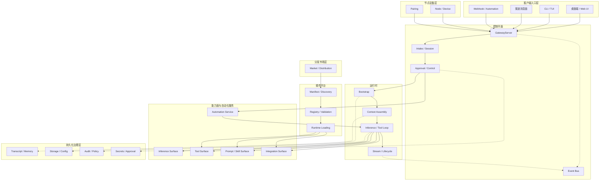

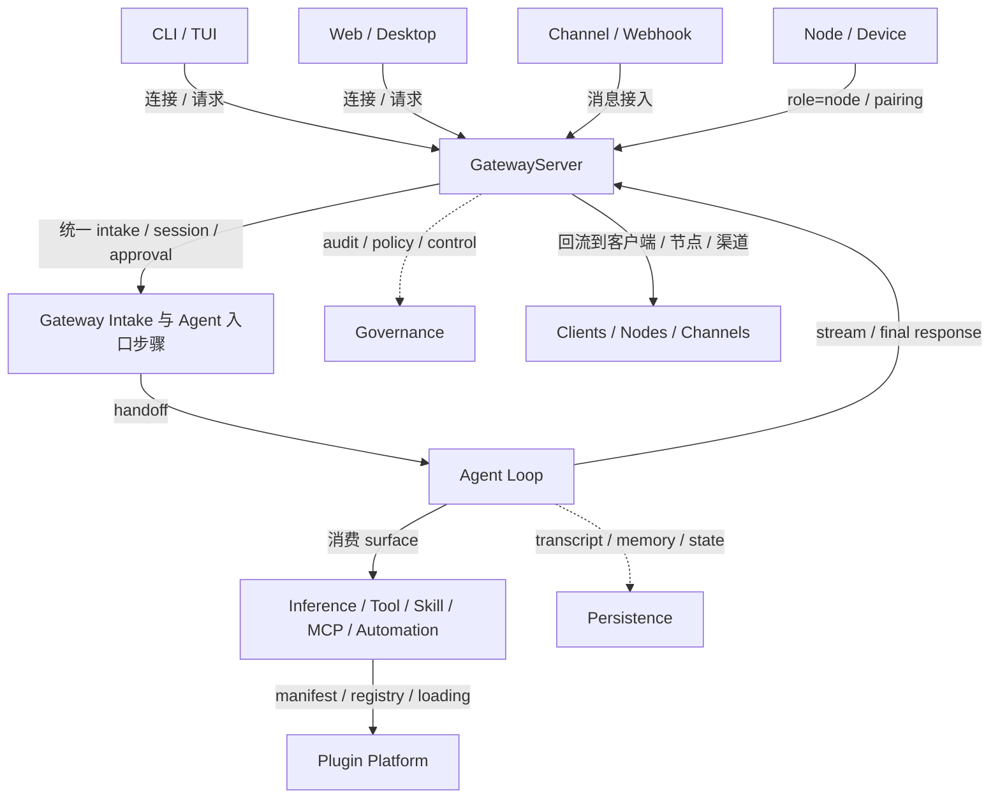

### 1.1 客户端与入口角色层

这一层回答的问题是：**谁以什么角色连接 Gateway，如何把动作送进系统。**

这一层只负责“连接”和“发起请求”，不负责系统内部的 session、执行和治理。  
它的任务是把用户、外部系统和自动化入口接入到同一个 Gateway，让系统知道是谁发起了动作、动作来自哪一类 surface，再由控制平面统一承接。

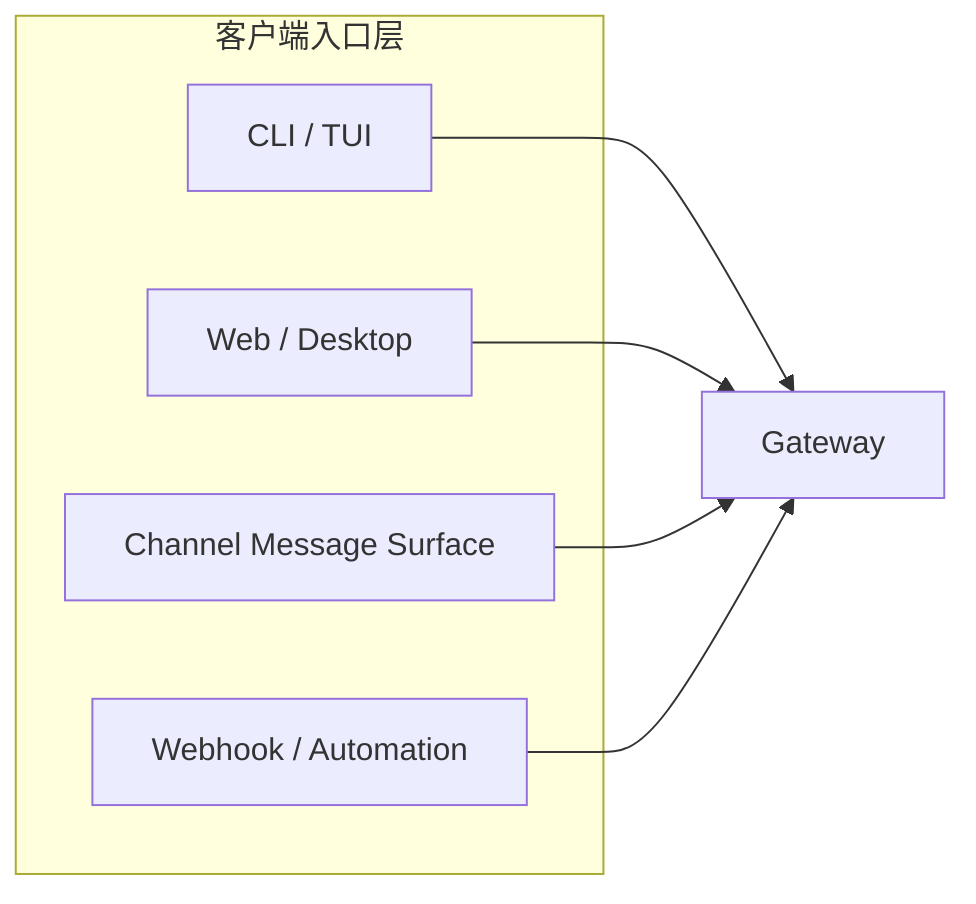

| 子模块                     | 为什么要单独存在                                           | 核心职责                                                     |
| -------------------------- | ---------------------------------------------------------- | ------------------------------------------------------------ |
| CLI / TUI 接入模块         | 终端入口稳定、轻量，适合开发调试、脚本化调用和本地使用     | 接收命令行输入、交互式输入和本地控制命令，作为 operator client 连接 Gateway |
| Web 控制台接入模块         | 浏览器入口面向普通用户和控制台操作，需要独立承载可视化交互 | 接收聊天输入、页面操作、配置动作和审批动作，将浏览器行为转为 Gateway 请求 |
| Channel Adapter 接入模块   | 飞书、微信、Telegram、Slack 等渠道协议不一致，必须单独适配 | 接收第三方渠道消息，保留渠道原生结构和来源标记，并把消息送入 Gateway intake |
| Webhook / 外部触发接入模块 | 机器触发和人工触发是两类入口，需要单独抽象                 | 接收第三方系统回调、Webhook 和自动化触发请求，并作为 automation role 接入 Gateway |

### 1.2 Gateway / 控制平面

这一层回答的问题是：**所有请求进入系统后，如何被统一接住、治理、落会话、绑定工作区，并交给 Agent Loop。**

Gateway 是 AnyClaw 的中心控制平面。  
它不负责真正的推理执行，但负责持有消息面和控制面连接，完成接入治理、会话控制、资源绑定、审批控制、事件广播和向 Agent Loop 的 handoff。

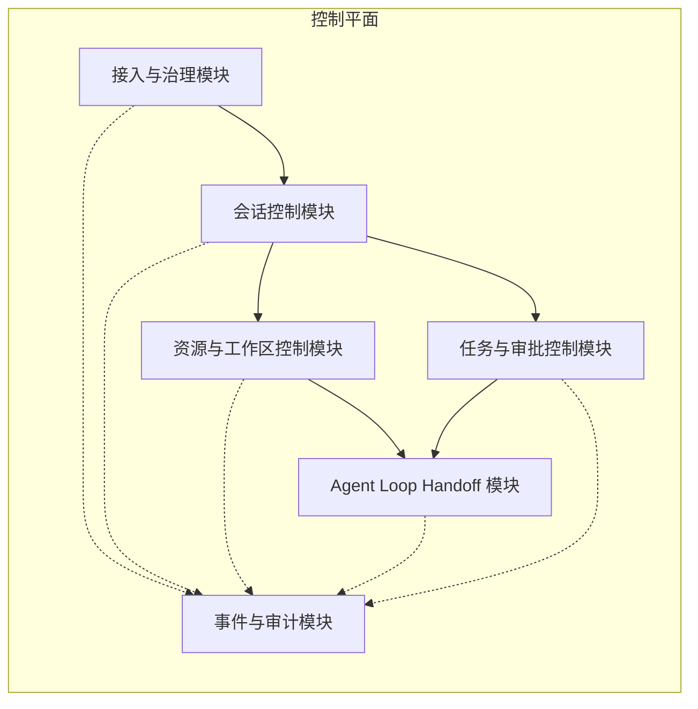

> 事件与审计模块通过事件总线被动订阅各模块发布的事件，各模块不直接调用审计接口。图中虚线表示事件发布方向。

| 子模块                 | 为什么要单独存在                                             | 核心职责                                                     |
| ---------------------- | ------------------------------------------------------------ | ------------------------------------------------------------ |
| 接入与治理模块         | 不同入口最终都要汇入统一控制面，且治理必须前置，否则危险请求会直接进入主链路 | 统一承接所有入口请求，完成协议归一化，执行鉴权、权限控制、限流、pairing 和安全前置检查 |
| 会话控制模块           | 系统必须知道这条消息属于谁、属于哪段会话、当前处于什么状态   | 负责 session 创建、复用、presence、typing、队列化处理和渠道来源的 session 映射 |
| 资源与工作区控制模块   | 请求最终要落到明确的组织、项目、工作区和上下文边界上         | 负责 org、project、workspace 的选择、绑定、校验和默认资源控制 |
| Agent Loop Handoff 模块 | 请求真正进入执行前，必须先完成 handoff，明确交给哪个 runtime 和哪条 loop 承接 | 负责 runtime 获取、复用、刷新、隔离，并把 Gateway intake 结果交给目标 Agent Loop |
| 任务与审批控制模块     | AnyClaw 不只是聊天，还要支持任务追踪、暂停、恢复和危险操作确认 | 负责任务生命周期、审批单创建、等待审批、审批恢复和任务状态回写 |
| 事件与审计模块         | 控制面必须可追踪、可观测、可回溯                             | 通过事件总线订阅各模块发布的事件，负责事件记录、审计记录、关键动作留痕和控制面观测 |

### 1.3 Gateway Intake 与 Agent 入口步骤

这一部分不是一层独立执行面，而是 Gateway 到 Agent Loop 之间的一条**逻辑入口管道**。

| 模块 | 模块说明 | 当前参考实现 |
|---|---|---|
| 输入归类步骤 | 负责把 CLI、Web、渠道、Webhook、Node 事件整理为可统一处理的 intake object | `pkg/gateway/gateway.go` `pkg/gateway/plugin_channel.go` `pkg/channels/` |
| 绑定匹配步骤 | 负责按 bindings / channel rules / workspace hints 选目标 Agent 与工作区 | `pkg/channels/routing.go` `pkg/gateway/gateway.go` |
| 会话落点解析步骤 | 负责为消息生成 session key、queue mode 和 session 落点 | `pkg/channels/routing.go` `pkg/gateway/state.go` `pkg/gateway/gateway.go` |
| Agent Loop 入口与 Handoff 步骤 | 负责把 intake 结果组装为 runtime request，并交给目标 runtime / orchestrator | `pkg/gateway/runtimes.go` `pkg/gateway/tasks.go` `pkg/routing/router.go` |

### 1.4 Agent Loop / 运行时

这一层回答的问题是：**请求被 Gateway handoff 后，如何在具体 runtime 中完成装配、上下文准备、推理执行、工具调用与结果回传。**

Agent Loop 是 AnyClaw 的统一执行面。  
它不负责外部入口接入，也不负责控制面治理；它负责把 Gateway 交过来的请求变成真正可运行的执行过程，并完成 bootstrap、context assembly、Agent Loop 执行和流式反馈。

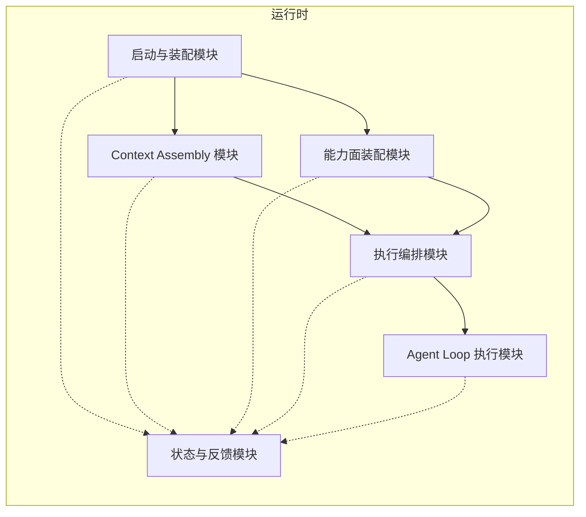

> 状态与反馈模块通过 BootProgress、Observer、流式输出和运行状态回调被动接收各模块产生的信息，各模块不直接耦合界面或审计实现。图中虚线表示状态回传方向。

| 子模块           | 为什么要单独存在                                             | 核心职责                                                     |
| :--------------- | :----------------------------------------------------------- | :----------------------------------------------------------- |
| 启动与装配模块   | 运行时启动链路很长，配置、密钥、存储、工作区、模型客户端等依赖必须按顺序装配，否则后续执行根本无法成立 | 负责加载 config/profile，解析 workDir / workingDir，初始化 secrets、audit、memory、QMD，并创建可执行的 runtime 实例 |
| Context Assembly 模块 | 执行质量依赖稳定的上下文窗口、工作区材料和历史管理，这部分不能散落在 Agent Loop 主流程里 | 负责 bootstrap 文件加载与热更新、历史裁剪与压缩、记忆检索结果装配和上下文独占槽控制 |
| 能力面装配模块   | 工具、技能、集成面和插件面都要在 runtime 内以统一 surface 暴露，不能和推理逻辑混在一起 | 负责注册 tools、skills、plugins、MCP surfaces，注入 sandbox、policy engine、QMD 等执行依赖，并完成能力可见性与权限约束 |
| 执行编排模块     | 请求不一定总是单 Agent 直跑，有时要进入多 Agent 协同、任务分解或恢复执行 | 负责决定单 Agent / orchestrator 执行路径，并承担任务拆分、子代理协同、继续执行与恢复执行 |
| Agent Loop 执行模块 | 真正的推理与工具调用循环是系统核心，需要和装配层、治理层解耦 | 负责组装 system prompt 和 messages，选择工具，调用 LLM，驱动 tool-call loop，并产出流式或最终响应 |
| 状态与反馈模块   | 运行层必须持续把启动进度、工具活动、错误和输出状态回传出去，否则 Gateway 和控制台无法观测执行过程 | 负责 BootEvent、tool activity、stream chunk、错误、指标和执行状态的统一回传 |

### 1.5 运行时能力面与自动化服务

| 模块 | 模块说明 | 当前参考实现 |
|---|---|---|
| 推理能力面 | 负责统一封装模型提供方和调用接口，作为 Agent Loop 的 inference surface | `pkg/llm/` `pkg/providers/` |
| 工具能力面 | 负责内置工具注册、调用、缓存和权限控制 | `pkg/tools/registry.go` `pkg/tools/` |
| Prompt / Skill 能力面 | 负责 skill 装载、筛选、注入和提示增强暴露 | `pkg/skills/` |
| 集成能力面 | 负责 MCP、CLIHub 等可组合能力接入 | `pkg/mcp/` `pkg/clihub/` |
| 自动化服务 | 负责时间驱动作业和自动化触发，为 Gateway 与 Orchestrator 提供调度服务 | `pkg/cron/` |

### 1.6 持久化与治理层

这一层回答的问题是：**系统运行过程中，转录、记忆、配置和关键行为如何被持久化、审计和受控。**

这一层只负责“持久化与治理”，不负责“能力接入”和“主逻辑推理”。  
它的任务是为 AnyClaw / OpenClaw 提供配置、转录、记忆、会话状态、安全控制、审批、审计等基础支撑，让系统不仅能运行，而且能 **恢复、受控、追踪、回溯**。

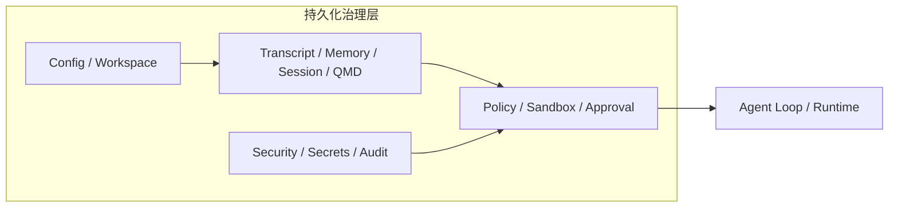

| 子模块                               | 为什么要单独存在                                           | 核心职责                                     |
| ------------------------------------ | ---------------------------------------------------------- | -------------------------------------------- |
| Config / Workspace 模块              | 系统运行前必须先明确配置和工作区边界，否则后续状态无法落地 | 加载配置、解析路径、准备工作区和引导文件     |
| Transcript / Memory / Session / QMD 模块 | 转录、记忆、会话、任务状态都需要独立持久层，不能混在执行链里 | 管理转录、长期记忆、会话状态、结构化状态和任务状态 |
| Security / Secrets / Audit 模块      | 安全信息和审计能力必须独立抽象                             | 管理密钥、运行时安全状态、关键行为审计       |
| Policy / Sandbox / Approval 模块     | 高风险动作必须在执行前被限制、隔离、审批                   | 管理策略判断、沙箱执行和审批前置控制         |

### 1.7 插件平台

这一层回答的问题是：**系统外的能力如何通过 manifest-first 的方式被发现、验证、加载，并暴露给运行时。**

这一层只负责“插件平台与能力分发”，不负责“主链路执行”和“持久化治理”。  
它的任务是把插件、扩展、集成面和市场分发能力接进 AnyClaw，让系统知道有哪些外部能力可以被装载、注册、桥接和使用，再统一送入运行体系。

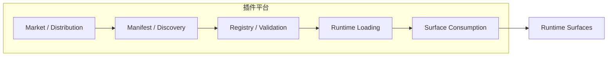

| 子模块                              | 为什么要单独存在                                     | 核心职责                                                     |
| ----------------------------------- | ---------------------------------------------------- | ------------------------------------------------------------ |
| Manifest / Discovery / Registry     | 插件进入系统前，必须先经过统一发现、解析、校验和注册 | 扫描插件、解析 manifest、校验 trust / enabled，并完成能力注册 |
| Surface Adapter / Runtime Loading   | 外部能力进入运行时前，需要统一桥接为可消费的 surface | 运行扩展适配器，把插件、扩展、集成面桥接为 Tool / Skill / Channel / MCP 等运行时 surface |
| Market / Distribution               | 安装、更新、分发是供应链问题，不属于运行时职责       | 提供能力包、插件包和 Agent 包的搜索、安装、更新、本地索引和分发 |

### 1.8 节点与设备层

这一层回答的问题是：**节点、设备和远端执行能力如何通过 Gateway 进入系统，并在受控范围内参与协作。**

这一层在 OpenClaw 风格架构里不是插件层，也不是普通输入层。  
它的任务是承接 node / device 连接、设备配对、权限作用域和远端动作回传，让外设与远端执行节点成为 Gateway 持有的一类连接角色。

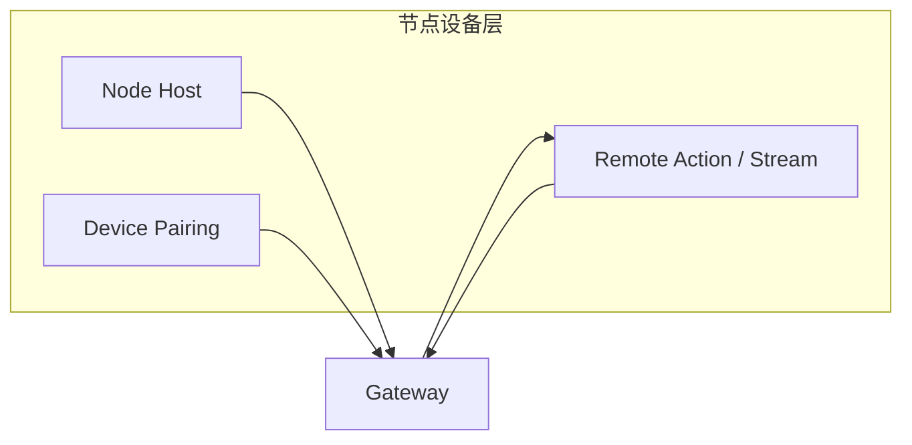

| 子模块                         | 为什么要单独存在                                         | 核心职责                                                     |
| ------------------------------ | -------------------------------------------------------- | ------------------------------------------------------------ |
| Node Host 接入模块             | 节点连接是 Gateway 持有的一类长期连接，不应混入普通插件执行 | 管理 node 连接、role 协商、能力声明和节点生命周期           |
| Device Pairing 模块            | 设备接入必须经过配对和权限作用域约束                     | 负责 pairing code、权限作用域、过期和撤销                   |
| Remote Action / Stream 回传模块 | 节点不只是被动在线，还要承接动作执行与流式回传           | 负责把远端动作、状态和回流结果桥接到 Gateway 与 Agent Loop |

##  

## 2. 客户端与入口角色层模块设计

### 2.1 CLI / TUI 入口模块

**为什么要这样设计**

- CLI / TUI 是最稳定、最低依赖的入口，适合开发调试、脚本化调用和本地直接使用。
- 终端入口天然适合承载快速试验、运维命令和开发态调试，不应该和浏览器入口或渠道入口混在一起。

**模块作用**

- 接收命令行命令和交互式输入。
- 把终端动作转为原始请求送入网关层。
- 为本地使用者提供最直接的系统入口。

**模块边界**

- 负责”终端请求怎么进入系统”。

**子模块示意图**

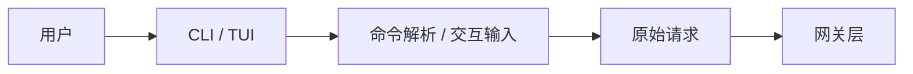

**时序图**

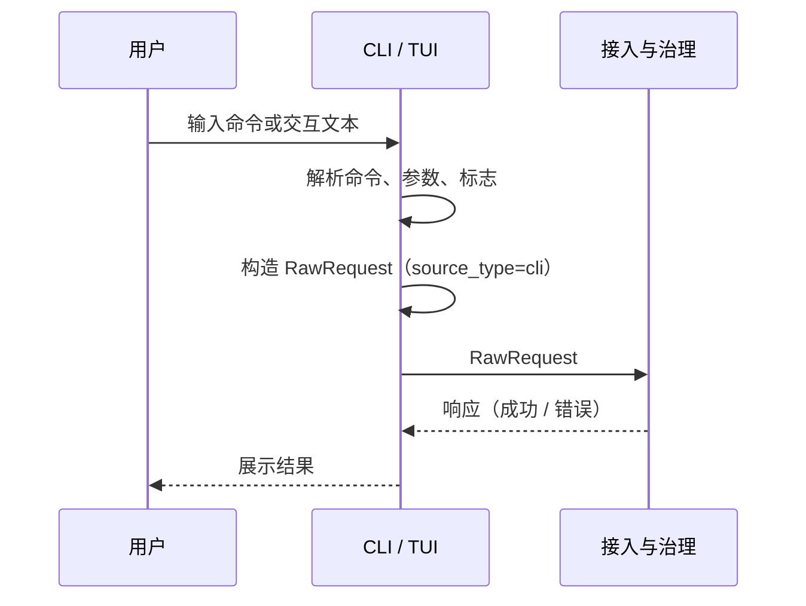


### 2.2 Web 控制台接入模块

**为什么要这样设计**

- Web 控制台是普通用户最直观的入口，承担的是可视化交互职责。
- 浏览器端的聊天、配置、审批和查看状态，和 CLI 的使用方式完全不同，需要单独抽象。

**模块作用**

- 接收浏览器端的聊天输入和页面操作。
- 承载控制台中的配置、审批、会话切换、状态查看等交互行为。
- 把前端用户行为转为原始请求送入网关层。

**模块边界**

- 负责”浏览器中的用户动作如何进入系统”。

**子模块示意图**

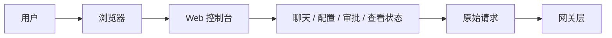

**时序图**

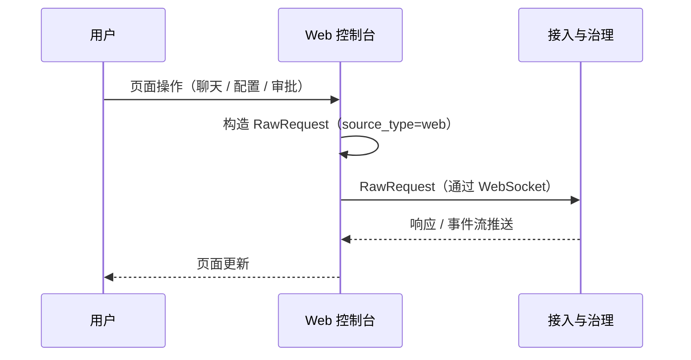

### 2.3 Channel Adapter 接入模块

**为什么要这样设计**

- IM 渠道天然异构，消息格式、用户标识、会话机制和回复方式都不一样。
- 如果没有独立的渠道接入模块，后续所有渠道都会把协议差异直接污染主链路。
- Adapter 只做原始消息接收和来源标记，不做系统内部语义映射，保证输入层不依赖系统内部的会话结构。

**模块作用**

- 接收飞书、微信、Telegram、Slack 等渠道消息。
- 透传渠道原生结构（用户标识、群标识、线程标识、回复目标等），附加来源标记。
- 将渠道原始消息连同来源元数据一起送入网关层，由网关层负责归一化和 session 映射。

**模块边界**

- 负责”外部渠道消息怎么接进系统”。
- 不负责将渠道标识映射到内部 session（这是网关层会话控制模块的职责）。

**子模块示意图**

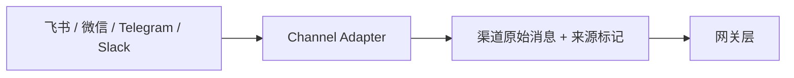

**时序图**

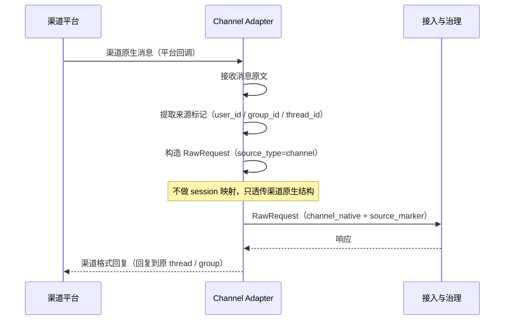

### 2.4 Webhook / 外部触发接入模块

**为什么要这样设计**

- 机器触发和人工触发不是一回事，Webhook 更像系统对系统的输入。
- 这一类入口未来会承接更多自动化、平台集成、事件驱动场景，所以必须单独成模块。

**模块作用**

- 接收第三方系统回调和自动化触发请求。
- 将外部事件转成统一的系统入口请求。
- 作为后续集成平台和自动化平台的标准接入口。

**模块边界**

- 负责”外部系统事件如何进入系统”。

**子模块示意图**

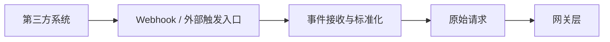

**时序图**

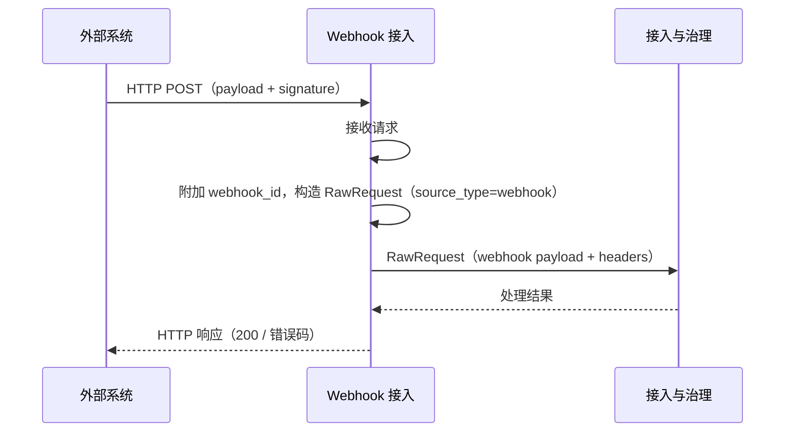

## 

## 3. Gateway / 控制平面模块设计

### 3.1 接入与治理模块

**为什么要这样设计**

- 多个输入源最终都需要汇入同一个控制面，否则系统会出现多套入口协议、多套控制逻辑。
- 治理必须前置，否则危险请求会直接进入系统主链路。
- 协议归一化和接入治理是同一个入口管道的两个阶段，合并后减少透传层，内部分阶段处理即可。

**模块作用**

- 统一承接来自不同入口的请求，完成协议归一化（将 HTTP、WebSocket、渠道原始消息等统一为标准请求格式）。
- 在归一化后执行鉴权、权限控制、限流、租户边界和安全前置检查。
- 作为整个控制面的第一落点，决定请求能不能进入主链路。

**内部阶段**

1. 协议归一化：将不同来源的请求统一为标准格式（包含渠道元数据字段）。
2. 鉴权：从标准格式中提取凭证，验证身份。
3. 权限与限流：检查权限边界、执行限流和安全前置规则。

**模块边界**

- 负责”请求如何进入控制面”和”请求能不能进来”。

**子模块示意图**

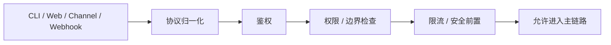

**时序图**

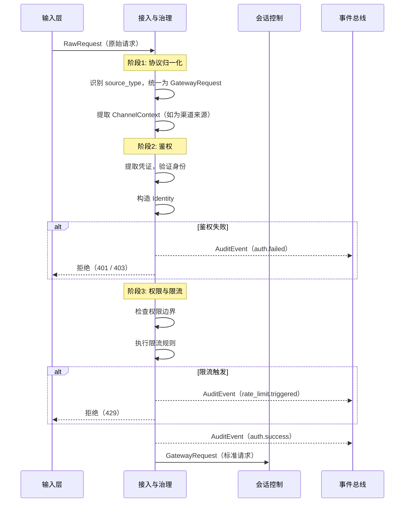

### 3.2 会话控制模块

**为什么要这样设计**

- 系统必须明确每一条消息属于哪段会话，当前会话又处于什么状态。
- 如果没有会话控制，所有输入都会变成一次性请求，无法形成连续交互。
- 渠道来源的 session 映射（将渠道标识、reply target、thread 映射到内部会话）本质上是 session 解析的一种路径，和 CLI/Web 的 session 查找属于同一层职责，不需要独立成模块。

**模块作用**

- 管理 session 的创建、复用、排队和状态。
- 管理 presence、typing、轮次和基础会话元信息。
- 对于渠道来源的请求，将渠道标识（来源、reply target、thread 等）映射到内部 session，完成渠道桥接。
- 保证请求能够稳定挂载到正确会话上，无论来源是 CLI、Web 还是外部渠道。

**模块边界**

- 负责”会话如何被识别和维持”，包括渠道来源的 session 映射。
- 不负责渠道协议适配本身（那是输入层 Channel Adapter 的职责）。

**子模块示意图**

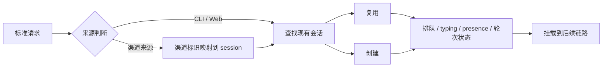

**时序图**

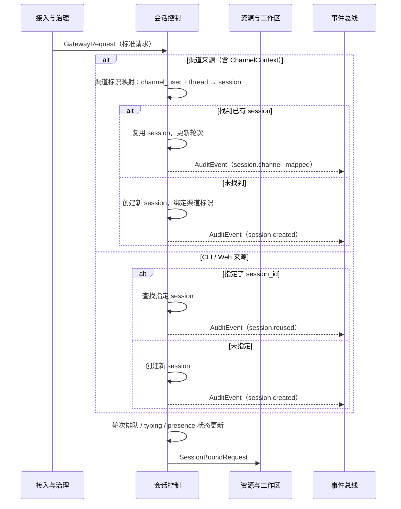

### 3.3 资源与工作区控制模块

**为什么要这样设计**

- 请求最终必须落到清晰的组织、项目和工作区边界上，否则系统无法做资源隔离。
- 后续无论是多工作区、多租户，还是多项目协作，都需要这层控制。

**模块作用**

- 管理资源归属和工作区边界。
- 完成资源选择、绑定、默认值补全和校验。
- 保证请求执行时上下文边界明确。

**模块边界**

- 负责”请求属于哪个资源范围”。

**子模块示意图**

```mermaid
graph LR
    REQ[会话请求] --> RESOLVE[资源解析]
    RESOLVE --> ORG[Org]
    RESOLVE --> PROJECT[Project]
    RESOLVE --> WS[Workspace]
    ORG --> CHECK[资源校验与绑定]
    PROJECT --> CHECK
    WS --> CHECK
    CHECK --> NEXT[形成明确执行边界]
```

**时序图**

```mermaid
sequenceDiagram
    participant SE as 会话控制
    participant RS as 资源与工作区
    participant RT as Runtime 分发
    participant BUS as 事件总线

    SE->>RS: SessionBoundRequest

    RS->>RS: 从 hints 或 session 中提取资源线索
    alt 显式指定了 org / project / workspace
        RS->>RS: 校验指定资源是否存在且有权限
    else 未指定
        RS->>RS: 按默认规则补全（默认 org → 默认 project → 默认 workspace）
    end
    RS->>RS: 绑定 agent（如 hints 中指定）
    RS->>RS: 构造 ResourceRef
    RS-->>BUS: AuditEvent（resource.bound）
    RS->>RT: ResourceBoundRequest
```

### 3.4 Agent Loop Handoff / Runtime 分发模块

**为什么要这样设计**

- 请求在真正进入 Agent Loop 之前，必须先确定交给哪个 runtime 承接。
- 如果没有显式 handoff，Gateway intake 的结果就无法稳定进入执行主链。

**模块作用**

- 决定请求交给哪个 runtime。
- 管理 runtime 的获取、复用、刷新和隔离。
- 作为 Gateway 与 Agent Loop 之间的 handoff 层。

**模块边界**

- 负责“交给哪条 Agent Loop 执行”。
- 不负责“Loop 内部如何执行出来”。

**子模块示意图**

```mermaid
graph LR
    REQ[已绑定请求] --> POLICY[分发策略]
    POLICY --> PICK[选择 Runtime]
    PICK --> REUSE[复用已有实例]
    PICK --> CREATE[创建新实例]
    REUSE --> NEXT[交给执行层]
    CREATE --> NEXT
```

**时序图**

```mermaid
sequenceDiagram
    participant RS as 资源与工作区
    participant RT as Runtime 分发
    participant EX as 执行层
    participant BUS as 事件总线

    RS->>RT: ResourceBoundRequest

    RT->>RT: 根据 workspace + agent 查找分发策略
    alt 存在可复用的 Runtime 实例
        RT->>RT: 复用已有实例
    else 无可用实例
        RT->>RT: 创建新 Runtime 实例
    end
    RT-->>BUS: AuditEvent（runtime.assigned）
    RT->>EX: 交给执行层
```

### 3.5 任务与审批控制模块

**为什么要这样设计**

- AnyClaw 不只是做聊天，还要支持任务追踪、暂停、恢复和危险操作确认。
- 这些能力如果不放在统一控制面上，就无法被前端、渠道和用户稳定感知。

**模块作用**

- 管理任务生命周期。
- 管理审批创建、等待审批、审批恢复和状态回写。
- 保证任务流程可中断、可恢复、可追踪。

**模块边界**

- 负责”任务如何被控制和审批”。

**子模块示意图**

```mermaid
graph LR
    TASKREQ[任务请求] --> PLAN[任务建立 / 状态推进]
    PLAN --> APPROVAL{审批判断}
    APPROVAL -->|需要审批| WAIT[等待审批]
    APPROVAL -->|无需审批| RUN[继续执行]
    WAIT --> RESUME[审批通过后恢复]
    RESUME --> RUN
```

**时序图**

```mermaid
sequenceDiagram
    participant EX as 执行层
    participant TK as 任务与审批控制
    participant SE as 会话控制
    participant U as 用户
    participant BUS as 事件总线

    EX->>TK: 请求审批（tool_name, action, payload）
    TK->>TK: 创建审批单
    TK-->>BUS: AuditEvent（approval.requested）
    TK-->>U: 通知等待审批

    Note over TK: 执行暂停，等待审批决定

    U->>SE: 提交审批决定（approve / reject）
    SE->>TK: 审批决定送达

    alt 审批通过
        TK->>TK: 更新状态为 approved
        TK-->>BUS: AuditEvent（approval.approved）
        TK->>EX: 恢复执行
    else 审批拒绝
        TK->>TK: 更新状态为 rejected
        TK-->>BUS: AuditEvent（approval.rejected）
        TK-->>U: 通知操作已拒绝
    end
```

### 3.6 事件与审计模块

**为什么要这样设计**

- 控制面必须可追踪、可观测、可回溯，否则系统一旦复杂就无法治理。
- 事件与审计是后续运维、排障、安全和展示的基础。
- 审计作为横切关注点，采用事件总线被动订阅模式，避免各模块显式调用审计接口带来的耦合。

**模块作用**

- 通过事件总线订阅各模块发布的事件，被动接收而非主动拉取。
- 记录关键事件和关键操作。
- 留存审计轨迹和控制面状态变化。
- 为可观测性、回溯和治理提供依据。

**事件来源**

| 来源模块         | 典型事件                                  |
| ---------------- | ----------------------------------------- |
| 接入与治理       | 鉴权成功/失败、限流触发、请求拒绝         |
| 会话控制         | session 创建/复用/销毁、渠道 session 映射 |
| 资源与工作区控制 | workspace 选择/切换、资源绑定变更         |
| Runtime 分发     | runtime 分配/复用/刷新、实例创建/销毁     |
| 任务与审批控制   | 任务创建/暂停/恢复、审批发起/通过/拒绝    |

**模块边界**

- 负责”发生了什么，谁做了什么”。
- 不主动调用其他模块，只被动订阅事件总线。

**子模块示意图**

```mermaid
graph LR
    GOV[接入与治理] -.-> BUS[事件总线]
    SESSION[会话控制] -.-> BUS
    RESOURCE[资源与工作区] -.-> BUS
    RUNTIME[Runtime 分发] -.-> BUS
    TASK[任务与审批] -.-> BUS
    BUS --> EVENT[事件与审计模块]
    EVENT --> LOG[事件记录]
    EVENT --> AUDIT[审计留痕]
    EVENT --> OBS[可观测与回溯]
```

**时序图**

```mermaid
sequenceDiagram
    participant MOD as 各网关模块
    participant BUS as 事件总线
    participant EVT as 事件与审计模块
    participant STORE as 存储

    MOD-->>BUS: 发布 AuditEvent
    BUS->>EVT: 推送事件

    EVT->>EVT: 解析 event_type 和 source_module
    EVT->>STORE: 写入事件记录
    EVT->>STORE: 写入审计留痕
    EVT->>EVT: 更新可观测指标
```


## 4. Gateway Intake 与 Agent 入口步骤设计

这一章描述的不是一个独立一级层，而是 **Gateway 在请求进入 Agent Loop 前的入口步骤**。

### 4.1 Inbound Classifier / 输入归类模块

**对应代码**

- `pkg/gateway/gateway.go`
- `pkg/gateway/plugin_channel.go`
- `pkg/channels/`

**为什么要有这个模块**

- 原始入站事件来自 CLI、渠道、Webhook、WS 和 Node，它们的字段结构并不统一。
- OpenClaw 风格的入口处理第一步不是立即选 Agent，而是先把消息整理成“可被 Gateway intake 消费的对象”。

**模块作用**

- 从入站事件中提取 `channel`、`accountId`、`peer`、`parentPeer`、`guildId`、`teamId`、`direct/group` 等关键字段。
- 把原始消息转换成后续入口步骤能够一致处理的输入对象。

**模块边界**

- 负责“提取路由判定所需元数据”。
- 不负责 bindings 匹配，不负责 session key 生成，不负责执行分发。

**架构图**

```mermaid
flowchart LR
    RAW[Raw Inbound Event] --> IC[Inbound Classifier]
    IC --> CH[channel]
    IC --> ACC[accountId]
    IC --> PEER[peer / parentPeer]
    IC --> ORG[guildId / teamId]
    IC --> KIND[direct / group / thread]
```

**流程图**

```mermaid
sequenceDiagram
    participant IN as Inbound Event
    participant IC as Inbound Classifier
    participant BM as Binding Matcher
    IN->>IC: 原始消息 / 事件
    IC->>IC: 提取 channel、peer、thread、guild、team 等字段
    IC->>BM: 输出可路由对象
```

### 4.2 Binding Matcher / 绑定匹配模块

**对应代码**

- `pkg/channels/routing.go`
- `pkg/gateway/gateway.go`

**为什么要有这个模块**

- OpenClaw 风格的核心入口不是“把消息丢给大模型决定”，而是“按 bindings / rules 确定性选 Agent”。
- 如果没有 bindings matcher，Agent 选择会退化成隐式逻辑或硬编码，后续很难治理。

**模块作用**

- 读取绑定规则。
- 按“最具体优先”执行匹配。
- 产出目标 `agentId`，并处理默认回退。

**模块边界**

- 负责“选哪个 Agent”。
- 不负责 session key 解析，不负责消息最终发送。

**架构图**

```mermaid
flowchart LR
    OBJ[Route Object] --> BM[Binding Matcher]
    BIND[Bindings] --> BM
    BM --> P1[peer exact]
    BM --> P2[parentPeer]
    BM --> P3[guildId + roles]
    BM --> P4[guildId / teamId / accountId / channel]
    BM --> FALLBACK[default agent]
    BM --> AG[agentId]
```

**流程图**

```mermaid
sequenceDiagram
    participant IC as Inbound Classifier
    participant BM as Binding Matcher
    participant CFG as Bindings Config
    participant SK as Session Key Resolver
    IC->>BM: 可路由对象
    BM->>CFG: 读取 bindings
    BM->>BM: 按最具体优先匹配
    BM->>SK: 输出目标 agentId
```

### 4.3 Session Key Resolver / 会话键解析模块

**对应代码**

- `pkg/channels/routing.go`
- `pkg/gateway/state.go`
- `pkg/gateway/gateway.go`

**为什么要有这个模块**

- OpenClaw 风格的入口步骤不仅决定“发给哪个 agent”，还决定“落到哪个 session”。
- 如果没有稳定的 session key，同一个 peer、线程、群组的上下文就无法持续复用。

**模块作用**

- 生成或解析 `sessionKey`。
- 区分 DM、群聊、线程和父线程场景。
- 保证 `agentId + peer/thread` 维度上的会话一致性，并决定是否复用已有 session。

**模块边界**

- 负责“会话落点解析”。
- 不负责 Agent 选择和最终执行分发。

**架构图**

```mermaid
flowchart LR
    AG[agentId]
    ROUTEOBJ[Route Object]
    AG --> SKR[Session Key Resolver]
    ROUTEOBJ --> SKR
    SKR --> DM[DM Key]
    SKR --> GROUP[Group Key]
    SKR --> THREAD[Thread Key]
    SKR --> SESSION[Resolved Session]
```

**流程图**

```mermaid
sequenceDiagram
    participant BM as Binding Matcher
    participant SKR as Session Key Resolver
    participant STORE as Session Store
    participant DIS as Dispatch
    BM->>SKR: agentId + route object
    SKR->>SKR: 计算 session key
    SKR->>STORE: 检查是否已有 session
    STORE-->>SKR: session / miss
    SKR->>DIS: 输出 sessionKey 和 sessionId
```

### 4.4 Agent Loop Handoff / 入口交接模块

**对应代码**

- `pkg/gateway/gateway.go`
- `pkg/gateway/runtimes.go`
- `pkg/gateway/tasks.go`
- `pkg/reply/dispatch.go`

**为什么要有这个模块**

- 入口步骤前面三步只算出了 intake 结果，系统还需要把结果真正 handoff 到 Agent Loop。
- 如果没有显式入口交接模块，`agentId` 和 `sessionKey` 只是中间结果，无法形成完整运行闭环。

**模块作用**

- 组装 runtime request / dispatch payload。
- 带上 `agentId`、`sessionKey`、`sessionId`、workspace 和请求体。
- 调用 runtime pool、task manager 或 reply pipeline，推动后续执行和结果回流。

**模块边界**

- 负责“把 intake 结果送入 Agent Loop”。
- 不负责 bindings 匹配和 session key 计算。

**架构图**

```mermaid
flowchart LR
    ROUTED[agentId + sessionKey + payload] --> DIS[Agent Loop Handoff]
    DIS --> POOL[RuntimePool]
    DIS --> CTRL[MainController]
    DIS --> RUNNER[Agent Runner]
    RUNNER --> REPLY[Reply / Stream Pipeline]
```

**流程图**

```mermaid
sequenceDiagram
    participant SKR as Session Key Resolver
    participant DIS as Agent Loop Handoff
    participant POOL as RuntimePool
    participant CTRL as MainController / Agent
    participant OUT as Reply Pipeline
    SKR->>DIS: agentId + sessionKey + payload
    DIS->>POOL: 获取目标 runtime
    DIS->>CTRL: 投递 run request
    CTRL->>OUT: 产生回复 / 流式事件
    OUT-->>DIS: 执行结果
```


## 5. Agent Loop / 运行时模块设计

这一章描述 Gateway handoff 之后，runtime 如何完成 bootstrap、context assembly、推理循环、工具调用和流式回传。

### 5.1 运行时启动与装配模块

- **为什么要这样设计**

  - runtime 不是一次简单函数调用，而是一个需要完整依赖装配的执行实例。
  - 配置、密钥、存储、模型客户端、Agent、Orchestrator 的初始化顺序必须稳定，否则执行链路会变得不确定。

  **模块作用**

  - 加载配置与 agent profile。
  - 解析 workDir 与 workingDir。
  - 初始化 secrets / audit / memory / QMD / LLM / Agent / Orchestrator。

  **模块边界**

  - 负责“runtime 实例如何进入可运行状态”。
  - 不负责“请求是否允许进入系统”与“请求属于哪个 session”，这些已由网关层完成。

架构图

```mermaid
graph LR
    GW[网关层] --> BOOT[运行时启动与装配]
    BOOT --> CFG[配置加载]
    BOOT --> SEC[Secrets / Audit]
    BOOT --> STO[Storage / Memory]
    BOOT --> LLM[LLM Client]
    BOOT --> AG[Agent / Orchestrator]
    AG --> READY[Runtime Ready]

```


### 5.2 Context Assembly / 工作区与上下文模块

**为什么要这样设计**

- 网关层只负责把请求绑定到正确的 workspace，不负责 runtime 内部如何准备执行上下文。
- bootstrap 文件、历史消息、记忆回填、上下文压缩会直接影响执行质量，必须独立治理。

**模块作用**

- 加载工作区 bootstrap 文件与运行时上下文材料。
- 准备历史消息、长期记忆和 context engine 数据。
- 负责上下文槽位、心跳续期、历史裁剪与压缩。

**模块边界**

- 负责“这次执行能看到什么上下文”。
- 不负责外部渠道标识如何映射为内部 session，这属于网关层会话控制模块。

架构图

```mermaid
graph LR
    READY[Runtime Ready] --> WS[工作区加载]
    WS --> BS[Bootstrap 文件]
    READY --> HIS[历史消息]
    READY --> MEM[记忆 / Context Engine]
    BS --> CTX[执行上下文]
    HIS --> CTX
    MEM --> CTX
    CTX --> EXEC[执行编排与 Agent 执行]

```

实训图

```mermaid
sequenceDiagram
    participant GW as 网关层
    participant CTX as 工作区与上下文

    GW->>CTX: RuntimeRequest(session / workspace / task)
    CTX->>CTX: 加载 bootstrap files
    CTX->>CTX: 读取历史与 memory
    CTX->>CTX: 压缩上下文，申请 context slot
    CTX-->>GW: ExecutionContextReady

```

### 5.3 运行时能力面装配与隔离模块

**为什么要这样设计**

- runtime 能做什么，以及这些能力在什么边界下运行，是一组高度耦合的问题。
- tools / skills / plugins 都是动态装载能力，如果不单独管理，安全策略会直接污染执行主流程。

**模块作用**

- 注册内置 tools，加载 skills 与 plugins。
- 注入 sandbox、policy engine、超时、路径与网络边界。
- 暴露统一能力注册表给执行模块使用。

**模块边界**

- 负责“有哪些能力可用，以及这些能力在什么隔离策略下运行”。
- 不负责高层任务规划，也不负责入口鉴权和审批。

架构图

```mermaid
graph LR
    CFG[运行配置] --> CAP[能力注册与隔离]
    BUILTIN[Built-in Tools] --> CAP
    SKILL[Skills] --> CAP
    PLUGIN[Plugins] --> CAP
    CAP --> REG[能力注册表]
    CAP --> SBX[Sandbox / Policy]
    REG --> EXEC[执行编排与 Agent 执行]
    SBX --> EXEC

```

时序图

```mermaid
sequenceDiagram
    participant EXEC as Agent 执行
    participant CAP as 能力注册与隔离
    participant SBX as Sandbox / Policy
    participant TOOL as Tool / Skill / Plugin

    EXEC->>CAP: 发起 tool_call
    CAP->>SBX: 校验权限 / 路径 / 网络策略
    SBX-->>CAP: 放行 / 拒绝
    CAP->>TOOL: 执行能力
    TOOL-->>CAP: 返回结果
    CAP-->>EXEC: 标准化能力结果

```

### 5.4 执行编排与 Agent Loop 模块

**为什么要这样设计**

- 并不是每个请求都应该直接进入单 Agent 对话循环，有些请求需要多 Agent 编排、阶段拆分或恢复执行。
- Prompt 组装、LLM 推理、tool-call loop 是运行层最核心的执行内核，需要和入口治理、运行时装配分开。

**模块作用**

- 判断走单 Agent 路径还是 Orchestrator 路径。
- 组装 system prompt / messages / tool definitions。
- 调用 LLM，驱动 tool-call loop，并产出流式输出或最终结果。

**模块边界**

- 负责“runtime 如何把输入变成回答或动作”。
- 不负责任务审批单、会话映射、外部协议格式转换和最终审计存档。

架构图

```mermaid
graph LR
    REQ[RuntimeRequest] --> ORCH[执行编排]
    CTX[执行上下文] --> ORCH
    REG[能力注册表] --> ORCH
    ORCH --> SINGLE[单 Agent]
    ORCH --> MULTI[Orchestrator]
    SINGLE --> LOOP[LLM / Tool Loop]
    MULTI --> LOOP
    LOOP --> OUT[响应 / 动作 / 中间结果]

```

时许图

```mermaid
sequenceDiagram
    participant GW as 网关层
    participant EXEC as 执行编排与 Agent 执行
    participant LLM as LLM
    participant TOOL as Tool Runtime

    GW->>EXEC: RuntimeRequest + ExecutionContext
    EXEC->>EXEC: 判断 single-agent / orchestrator
    EXEC->>LLM: 发送 messages + tool definitions
    LLM-->>EXEC: 响应 / tool_call
    EXEC->>TOOL: 调用工具
    TOOL-->>EXEC: 工具结果
    EXEC->>LLM: 继续推理
    LLM-->>EXEC: 最终输出
    EXEC-->>GW: FinalResponse / StreamChunk

```


### 状态回传与运行观测模块

**为什么要这样设计**

- 如果 runtime 只是埋头执行而不回传状态，CLI、Web 控制台和渠道侧都无法展示进度、工具活动和错误。
- 启动进度、流式输出、工具调用、失败信息来源不同，需要统一标准化。

**模块作用**

- 收集 BootEvent / ToolActivity / StreamChunk / Error / Metrics。
- 统一封装为 runtime 事件并回传给网关层。
- 为暂停、恢复、故障定位和控制台观测提供基础反馈。

**模块边界**

- 负责“runtime 对外报告什么状态”。
- 不负责最终审计落盘和控制面治理，审计归档仍由网关层和事件层处理。

架构图

```mermaid
graph LR
    BOOT[启动与装配] -.-> FEED[状态回传与运行观测]
    CTX[工作区与上下文] -.-> FEED
    CAP[能力注册与隔离] -.-> FEED
    EXEC[执行编排与 Agent 执行] -.-> FEED
    FEED -.-> GW[网关层]
    GW -.-> UI[CLI / Web / Channel]

```

时序图

```mermaid
sequenceDiagram
    participant MOD as 运行层各模块
    participant FEED as 状态回传与运行观测
    participant GW as 网关层
    participant UI as CLI / Web / Channel

    MOD->>FEED: BootEvent / ToolActivity / StreamChunk / Error
    FEED->>FEED: 标准化为 RuntimeEvent
    FEED->>GW: RuntimeEvent
    GW-->>UI: 推送状态 / 输出 / 错误
    UI-->>用户: 展示执行进度

```


## 6. 运行时能力面与自动化服务模块设计

### 6.1 推理能力面：LLM / Provider / Model Selection 模块

**对应代码**

- `pkg/llm/`
- `pkg/providers/`
- `pkg/routing/routing.go`

**为什么要有这个模块**

- 不同 provider 的 API 和响应格式不同，不能把差异暴露给上层。
- OpenClaw 风格系统不仅要调用模型，还要统一管理 provider 定义、认证状态、标准化和失败回退策略。

**模块作用**

- 屏蔽不同模型提供方差异。
- 提供 `Chat`、`StreamChat`、多模态和 failover 能力。
- 承载 provider/model 目录、选择和失败切换策略。

**模块边界**

- 负责“模型调用适配”。
- 不负责 session、task 和插件治理。

**架构图**

```mermaid
flowchart LR
    ROUTE[Model Routing] --> WRAP[LLM Wrapper]
    WRAP --> P1[Provider A]
    WRAP --> P2[Provider B]
    WRAP --> P3[Provider C]
```

**流程图**

```mermaid
sequenceDiagram
    participant AG as Agent
    participant LLM as Wrapper
    participant PROV as Provider
    AG->>LLM: Chat / StreamChat
    LLM->>PROV: 转换 provider 请求
    PROV-->>LLM: 模型响应
    LLM-->>AG: 统一响应对象
```

### 6.2 工具能力面：Tool Registry 与内置工具模块

**对应代码**

- `pkg/tools/registry.go`
- `pkg/tools/`

**为什么要有这个模块**

- 工具数量多、来源多、权限不同，必须有统一注册表。
- 否则 Agent 无法以统一方式发现、调用和治理工具。

**模块作用**

- 统一注册工具定义和处理函数。
- 管理分类、缓存、重试、审计和超时。

**模块边界**

- 负责“工具侧统一执行接口”。
- 不负责决定何时调用哪个工具。

**架构图**

```mermaid
flowchart LR
    BUILTIN[Built-in Tools]
    SKILLTOOL[Skill Tools]
    PLGTOOL[Plugin Tools]
    BUILTIN --> REG[Tool Registry]
    SKILLTOOL --> REG
    PLGTOOL --> REG
    REG --> AG[Agent]
```

**流程图**

```mermaid
sequenceDiagram
    participant AG as Agent
    participant REG as Registry
    participant TL as Tool
    AG->>REG: 按名称调用工具
    REG->>TL: 执行 handler
    TL-->>REG: 返回结果
    REG-->>AG: 返回统一输出
```

### 6.3 Prompt / Skill 能力面模块

**对应代码**

- `pkg/skills/`

**为什么要有这个模块**

- Skill 的本质更接近 `SKILL.md` 一类“教 agent 在什么场景下、如何使用能力”的指导资源，而不是单纯执行单元。
- 如果技能不做统一管理，Main Agent 就无法稳定获得提示增强和能力选择指导。

**模块作用**

- 加载 builtin 和本地 skills。
- 根据配置过滤启用的 skills。
- 将 skill 作为 Prompt 增强资源注入系统。
- 在需要时把 skill 暴露为 `skill_*` 工具入口。

**模块边界**

- 负责“技能装载、提示增强与能力暴露”。
- 不直接承担插件签名校验、session 管理和底层工具执行。

**架构图**

```mermaid
flowchart LR
    BUILTIN[Built-in Skills]
    LOCAL[Local Skills]
    BUILTIN --> SM[SkillsManager]
    LOCAL --> SM
    SM --> PROMPT[Prompt Injection]
    SM --> TOOL[Skill Tools]
```

**流程图**

```mermaid
sequenceDiagram
    participant RT as Runtime
    participant SM as SkillsManager
    participant REG as Tool Registry
    RT->>SM: Load()
    SM->>SM: 读取 builtin 和本地 skills
    SM->>REG: 注册 skill_* 工具
```

### 6.4 集成能力面：MCP 模块

**对应代码**

- `pkg/mcp/`

**为什么要有这个模块**

- MCP 在 OpenClaw 风格架构里更像协议桥和集成桥，而不是单纯的 agent 内生能力。
- 系统既可能对外暴露 OpenClaw 能力给 MCP 客户端，也可能对内接入外部 MCP server 的能力，因此需要独立模块承载。

**模块作用**

- 统一管理 MCP server/client 定义。
- 暴露和接入 MCP tools、resources、prompts。
- 连接 OpenClaw runtime 与外部 MCP 生态。

**模块边界**

- 负责“MCP 协议桥接与集成”。
- 不负责主代理推理、session 路由和 Cron 调度。

**架构图**

```mermaid
flowchart LR
    EXTCLI[External MCP Client] --> MCPSRV[OpenClaw MCP Server]
    AG[Runtime / Agent] --> MCPCLI[MCP Client Manager]
    MCPCLI --> EXTMS[External MCP Servers]
    MCPSRV --> GW[Gateway / Runtime]
```

**流程图**

```mermaid
sequenceDiagram
    participant AG as Runtime / Agent
    participant MCP as MCP Manager
    participant OUT as External MCP Server
    AG->>MCP: 请求 MCP 资源 / 工具
    MCP->>OUT: 调用外部 MCP server
    OUT-->>MCP: 返回资源 / 工具结果
    MCP-->>AG: 统一返回
```

### 6.5 自动化服务：Cron 调度模块

**对应代码**

- `pkg/cron/`

**为什么要有这个模块**

- Cron 更接近 Gateway / Orchestrator 消费的自动化服务，而不是普通 agent 工具。
- 它负责的是持久化作业、定时唤醒和结果投递，因此应作为运行时可消费的 automation service 存在。

**模块作用**

- 管理持久化作业与调度规则。
- 按时间唤醒 runtime 或 agent 执行任务。
- 将结果投递回聊天渠道、session 或 webhook。

**模块边界**

- 负责“时间驱动的自动化调度服务”。
- 不负责 bindings 路由、不负责 MCP 集成、不负责主代理 prompt 构建。

**架构图**

```mermaid
flowchart LR
    JOB[Persisted Jobs] --> CRON[Scheduler]
    CRON --> RT[Runtime / Agent]
    RT --> OUT[Channel / Webhook / Session]
```

**流程图**

```mermaid
sequenceDiagram
    participant STORE as Job Store
    participant CRON as Scheduler
    participant RT as Runtime / Agent
    participant OUT as Channel / Webhook
    STORE->>CRON: 加载定时作业
    CRON->>RT: 到点触发任务
    RT-->>CRON: 返回执行结果
    CRON->>OUT: 投递结果
```

## 

## 7. 持久化与治理层模块设计

### Config / Workspace 模块

- ### 为什么要这样设计

  - 系统真正运行前，必须先明确配置、路径、profile 和工作区，否则后续运行没有稳定根。
  - 工作区引导文件、默认配置、目录约定都属于启动准备问题，适合放在一个统一模块里。
  - 如果把这部分分散到各运行模块，后续会出现配置来源不一致的问题。

  ### 模块作用

  - 加载系统配置和默认值。
  - 解析运行目录、工作区路径和 profile。
  - 初始化工作区引导文件。
  - 为后续运行链路提供静态上下文。

  ### 模块边界

  - 负责“系统运行前的配置和工作区准备”。
  - 不负责会话推进和实时任务执行。

  ### 子模块示意图

  ```mermaid
  graph LR
      FILE[配置文件] --> CFG[Config Loader]
      CFG --> PROFILE[Profile / 默认值解析]
      PROFILE --> WS[Workspace 初始化]
      WS --> BOOT[提供运行上下文]
  ```

### 时序图

```mermaid
sequenceDiagram
    participant BOOT as Bootstrap
    participant CFG as Config
    participant WS as Workspace

    BOOT->>CFG: 加载配置
    CFG->>CFG: 合并默认值 / profile
    CFG->>WS: 解析 working_dir
    WS->>WS: 初始化引导文件
    WS-->>BOOT: 返回工作区上下文
```

### 7.2 Transcript / Memory / Session / QMD 模块

### 为什么要这样设计

- 系统不是一次性调用，而是持续对话和持续任务，所以必须有状态存储面。
- 记忆、会话、结构化状态、任务状态虽然用途不同，但本质上都属于“系统状态落地”问题。
- 如果把状态读写塞进主执行链，后续恢复、回放和证据链都会变得很难做。

### 模块作用

- 管理长期记忆、会话转录和历史。
- 管理 session 状态和任务状态。
- 管理 QMD / 结构化状态。
- 管理恢复点、工件和事件存储。

### 模块边界

- 负责“状态存哪里，怎么读写”。
- 不负责“运行时如何拼装本次上下文”，那属于 Agent Loop 的 Context Assembly。

### 子模块示意图

```mermaid
graph LR
    AG[Agent / Gateway] --> MEM[Memory]
    AG --> SESSION[Session State]
    AG --> QMD[QMD / Structured State]
    AG --> TASK[Task State / Artifact]
```

时序图

```mermaid
sequenceDiagram
    participant AG as Agent
    participant MEM as Memory
    participant QMD as QMD
    participant SS as Session / Task State

    AG->>MEM: 检索相关记忆
    MEM-->>AG: 返回记忆片段
    AG->>QMD: 写入结构化状态
    AG->>SS: 保存 session / task 状态
    SS-->>AG: 返回最新状态引用
```

### 7.3 Security / Secrets / Audit 模块

为什么要这样设计

- 密钥管理、安全状态、审计记录都属于横切关注点，不属于具体某个执行节点。
- 如果安全能力分散在工具层、运行层、网关层里，后续会很难统一治理。
- 审计能力需要和业务执行解耦，才能保证记录完整且不污染主链路。

### 模块作用

- 管理密钥和 secret 激活。
- 管理运行时安全上下文。
- 记录关键工具调用和系统行为审计。
- 提供安全状态和安全事件支撑。

### 模块边界

- 负责“谁可以安全地做什么，以及做过什么”。
- 不直接调度 session 和任务流程。

### 子模块示意图


```mermaid
graph LR
    BOOT[Bootstrap] --> SECRET[Secrets]
    SECRET --> RUNTIME[Runtime 安全上下文]
    TOOL[Tool / Agent 行为] --> AUDIT[Audit]
    RUNTIME --> AUDIT
```

时序图

```mermaid
sequenceDiagram
    participant RT as Runtime
    participant SEC as Secrets
    participant TOOL as Tool / Agent
    participant AUD as Audit

    RT->>SEC: 激活运行时密钥
    SEC-->>RT: 返回可用凭证
    TOOL->>AUD: 上报关键执行行为
    RT->>AUD: 上报运行状态变化
    AUD->>AUD: 写入审计记录
```

### 7.4 Policy / Sandbox / Approval 模块

### 为什么要这样设计

- 系统不是所有动作都能直接执行，尤其是文件写入、危险命令、外部访问这类操作，必须有前置约束。
- 审批、策略、沙箱其实属于同一类问题：执行前先判断，执行中要隔离，危险时能中断。
- 如果没有这一层，系统虽然能跑，但不可控。

### 模块作用

- 判断工具调用是否符合策略。
- 对高风险行为触发审批。
- 在受限环境中执行高风险动作。
- 为执行层提供受控的工具运行边界。

### 模块边界

- 负责“能不能执行，以及必须在什么限制下执行”。
- 不负责业务规划和状态持久化。

### 子模块示意图

```mermaid
graph LR
    REQ[工具请求] --> POLICY[策略判断]
    POLICY --> DECIDE{是否允许}
    DECIDE -->|允许| SANDBOX[沙箱执行]
    DECIDE -->|需审批| APPROVAL[审批等待]
    APPROVAL --> SANDBOX
    SANDBOX --> TOOL[执行工具]
```

**流程图**

```mermaid
sequenceDiagram
    participant AG as Agent
    participant POL as Policy
    participant AP as Approval
    participant SB as Sandbox
    participant TL as Tool

    AG->>POL: 请求执行工具
    POL->>POL: 检查策略规则

    alt 命中高风险规则
        POL->>AP: 创建审批请求
        AP-->>POL: approve / reject
    end

    alt 允许执行
        POL->>SB: 分配受控执行环境
        SB->>TL: 执行工具
        TL-->>SB: 返回结果
        SB-->>AG: 返回执行产物
    else 拒绝执行
        POL-->>AG: 返回拒绝原因
    end
```

##  

## 8. 插件平台模块设计

### 8.1 Manifest / Discovery / Registry 模块

- ### 为什么要这样设计

  - OpenClaw 风格的插件平台是 manifest-first 的，插件进入系统前必须先经过统一发现、解析和校验。
  - 插件发现、manifest 解析、签名校验、能力注册，本质上是同一类问题，适合放在一个中心模块里。
  - Registry 的职责是“能不能进系统、进来后挂到哪个 surface”，而不是“插件后续怎么被使用”。

  ### 模块作用

  - 扫描插件目录和插件清单。
  - 解析 `openclaw.plugin.json` 或兼容 bundle manifest，识别插件类型和元信息。
  - 校验签名、trust 和启用状态。
  - 将插件注册到工具、提示增强、渠道、集成面等运行时 surface 中。

  ### 模块边界

  - 负责“插件怎么进入系统并被发现、校验、注册”。
  - 不负责“主代理如何在 Loop 中调用这些插件能力”。

### 子模块示意图

```mermaid
graph LR
    DIR[插件目录] --> LOAD[Manifest 解析]
    LOAD --> VERIFY[签名 / Trust 校验]
    VERIFY --> CLASSIFY[插件分类]
    CLASSIFY --> REGISTER[注册到系统能力表]
    REGISTER --> CAP[能力层]
```

```mermaid
sequenceDiagram
    participant RT as Runtime
    participant REG as Plugin Registry
    participant FS as 插件目录
    participant CAP as 能力表

    RT->>REG: 启动时初始化
    REG->>FS: 扫描插件目录
    REG->>REG: 解析 manifest
    REG->>REG: 校验签名 / trust / enabled
    REG->>REG: 识别 plugin type
    REG->>CAP: 注册插件能力
    CAP-->>REG: 注册成功
    REG-->>RT: 返回可用插件列表
```

### 8.2 Surface Adapter / Extension Runner 模块

### 为什么要这样设计

- 渠道、MCP、服务型插件和外部能力在运行时需要被桥接为统一 surface。
- 如果不单独抽出扩展桥接层，外部协议差异就会直接污染 Gateway 和 Agent Loop 主链。
- Extension Runner 的职责应该停留在“桥接”和“适配”，而不是去接管 session、状态或执行。

### 模块作用

- 加载扩展描述文件。
- 启动外部扩展适配器 / runner。
- 接收扩展进程返回的标准化 surface 描述和消息。
- 将扩展输入桥接到 Gateway 或运行时能力面。

### 模块边界

- 负责“外部能力如何桥接成系统内部 surface”。
- 不负责内部 session 状态和执行调度。

### 子模块示意图

```mermaid
graph LR
    EXTFILE[extension.json] --> RUNNER[Extension Runner]
    RUNNER --> ADAPTER[扩展适配器]
    ADAPTER --> BRIDGE[消息桥接]
    BRIDGE --> GW[网关 / Runtime]
```

**流程图**

```mermaid
sequenceDiagram
    participant EXT as 渠道扩展
    participant RUN as Runner
    participant BR as Bridge
    participant GW as Gateway

    EXT->>RUN: 启动扩展进程
    RUN->>RUN: 读取扩展配置
    RUN->>BR: 接收扩展标准消息
    BR->>GW: 转发桥接后的请求
    GW-->>BR: 返回处理结果
    BR-->>EXT: 输出给扩展渠道
```

### 8.3 Market / Distribution 模块

### 为什么要这样设计

- 插件、Agent 包和能力 bundle 的来源管理，不应该混进运行时，否则运行面会同时承担“执行”和“供应链”职责。
- 安装、更新、分发、本地缓存，本质上是一个独立的能力市场问题。
- 这一层未来还会承接更多“可安装能力包”，所以必须独立成模块。

### 模块作用

- 提供市场搜索和安装入口。
- 管理插件、Agent、能力 bundle 的下载与更新。
- 管理本地 Distribution Store 中的已安装资源。
- 为插件平台提供可装载能力来源。

### 模块边界

- 负责“能力从哪里来，如何被安装到本地”。
- 不负责“安装后的能力怎么参与 Loop 执行链路”。

### 子模块示意图

```mermaid
graph LR
    HUB[市场 / Hub] --> FETCH[下载能力包]
    FETCH --> STORE[本地 AgentStore]
    STORE --> INDEX[索引 / 安装记录]
    INDEX --> RT[供 Runtime 装载]

```

时序图

```mermaid
sequenceDiagram
    participant U as 用户 / 运维
    participant HUB as Market
    participant STORE as AgentStore
    participant RT as Runtime

    U->>HUB: 搜索 / 安装插件
    HUB->>HUB: 拉取能力包
    HUB->>STORE: 写入本地 Store
    STORE->>STORE: 更新安装索引
    RT->>STORE: 查询可装载能力
    STORE-->>RT: 返回本地已安装插件
```

## 

## 9. 节点与设备层模块设计

### 9.1 Node Host / 节点接入模块

**为什么要这样设计**

- Node / Device 在 OpenClaw 风格架构里是一类被 Gateway 持有的长期连接角色，而不是普通插件或普通用户入口。
- 如果节点连接、能力声明和生命周期管理分散在插件层或工具层，后续权限控制和回流链路会非常混乱。
- 节点既要承接远端动作，也要持续回传状态，所以需要独立模块承载。

**模块作用**

- 接收 node / device 的 WebSocket 或长连接接入。
- 维护节点身份、在线状态、能力声明和心跳。
- 为 Gateway 提供可被 handoff 的远端执行节点列表。

**模块边界**

- 负责“节点怎么连进系统、声明自己能做什么”。
- 不负责主代理推理，也不负责插件 manifest 发现和安装。

**子模块示意图**

```mermaid
graph LR
    NODE[Node / Device] --> CONN[Node Host]
    CONN --> CAPS[Capability Catalog]
    CONN --> LIFE[Lifecycle / Heartbeat]
    CAPS --> GW[Gateway]
    LIFE --> GW
```

**流程图**

```mermaid
sequenceDiagram
    participant ND as Node / Device
    participant HOST as Node Host
    participant GW as Gateway

    ND->>HOST: 建立连接（role=node）
    HOST->>HOST: 校验节点身份 / 初始化连接状态
    ND->>HOST: 上报 capability / metadata
    HOST->>GW: 注册节点与能力
    ND-->>HOST: heartbeat / state
    HOST-->>GW: 更新节点生命周期
```

### 9.2 Device Pairing / 权限范围模块

**为什么要这样设计**

- 设备接入不能只靠“能连上”就进入系统，必须先经过 pairing 和 scope 约束。
- Pairing、权限范围、撤销和过期，本质上是同一类安全控制问题。
- 如果没有这一层，节点会变成一个不受控的远端执行入口。

**模块作用**

- 生成 pairing code / pairing request。
- 管理权限范围、有效期、撤销和重连策略。
- 将 pairing 结果写入 Gateway 的控制面和审计面。

**模块边界**

- 负责“哪个节点以什么权限进入系统”。
- 不负责节点实际动作执行，也不负责主代理任务编排。

**子模块示意图**

```mermaid
graph LR
    REQ[Node Pairing Request] --> CODE[Pairing Code]
    CODE --> APPROVE[Approve / Reject]
    APPROVE --> SCOPE[Permission Scope]
    SCOPE --> GW[Gateway]
```

**流程图**

```mermaid
sequenceDiagram
    participant ND as Node / Device
    participant PAIR as Device Pairing
    participant GW as Gateway
    participant AUD as Audit

    ND->>PAIR: 请求 pairing
    PAIR->>PAIR: 生成 pairing code / scope 草案
    PAIR->>GW: 等待 approve / reject
    GW-->>PAIR: pairing decision
    PAIR->>AUD: 记录 pairing 结果
    PAIR-->>ND: 返回权限范围 / 过期时间
```

### 9.3 Remote Action / Stream 回传模块

**为什么要这样设计**

- 节点不是被动在线对象，它们还要承接动作执行、状态变更和结果回流。
- 如果没有统一的远端动作桥接模块，Gateway 和 Agent Loop 就无法稳定把任务交给节点执行。
- 节点执行结果通常是持续流式产生的，需要独立回传通道。

**模块作用**

- 把 Gateway / Agent Loop 的远端动作请求桥接为节点可执行指令。
- 接收节点返回的中间状态、流式输出和最终结果。
- 将节点回流结果转换为 Gateway 事件和用户可见输出。

**模块边界**

- 负责“节点动作如何被投递、如何回流结果”。
- 不负责 Agent Loop 自身的推理，也不负责节点接入鉴权。

**子模块示意图**

```mermaid
graph LR
    GW[Gateway / Agent Loop] --> REMOTE[Remote Action Bridge]
    REMOTE --> NODE[Node / Device]
    NODE --> STREAM[Stream / Result]
    STREAM --> REMOTE
    REMOTE --> EVENT[Gateway Event / Reply]
```

**流程图**

```mermaid
sequenceDiagram
    participant GW as Gateway / Agent Loop
    participant RB as Remote Action Bridge
    participant ND as Node / Device
    participant OUT as Reply / Event

    GW->>RB: NodeActionRequest
    RB->>ND: 下发远端动作
    ND-->>RB: 状态 / stream chunk
    RB->>OUT: 转换为 Gateway Event
    ND-->>RB: 最终结果
    RB-->>GW: ActionResult
```
